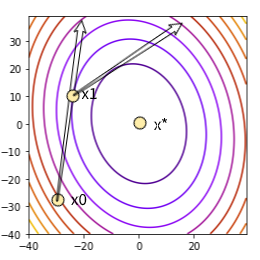

# Introduction to Unconstrained Optimization

This chapter introduces what exactly an unconstrained optimization problem is. A detailed discussion of Taylor's Theorem is provided and has been use to study the first order and second order necessary and sufficient conditions for local minimizer in an unconstrained optimization tasks. Examples have been supplied too in view of understanding the necessary and sufficient conditions better. The Python package `scipy.optimize`, which will form an integral part in solving many optimization problems in the later chapters of this book, is introduced too. The chapter ends with an overview of how an algorithm to solve unconstrained minimization problem works, covering briefly two procedures: **line search descent method** and **trust region method**.

---

## The Unconstrained Optimization Problem

As we have discussed in the first chapter, an unconstrained optimization problem deals with finding the local minimizer $\mathbf{x}^*$ of a real valued and smooth objective function $f(\mathbf{x})$ of $n$ variables, given by $f: \mathbb{R}^n \rightarrow \mathbb{R}$, formulated as,

\begin{equation}
    \underset{\mathbf{x} \in \mathbb{R}^n}{\min f(\mathbf{x})} (\#eq:1)
\end{equation}
with no restrictions on the decision variables $\mathbf{x}$. We work towards computing $\mathbf{x}^*$, such that $\forall\ \mathbf{x}$ near $\mathbf{x}^*$, the following inequality is satisfied:
\begin{equation}
    f(\mathbf{x}^*) \leq f(\mathbf{x}) (\#eq:2)
\end{equation}

## Smooth Functions

In terms of analysis, the measure of the number of continuous derivative a function has, characterizes the *smoothness* of a function.

```{definition}
A function $f$ is *smooth* if it can be differentiated everywhere, i.e, the function has continuous derivatives up to some desired order over particular domain [Weisstein, Eric W. "Smooth Function." https://mathworld.wolfram.com/SmoothFunction.html].
```

Some examples of smooth functions are , $f(x) = x$, $f(x)=e^x$, $f(x)=\sin(x)$, etc. To study the local minima $\mathbf{x}^*$ of a smooth objective function $f(\mathbf{x})$, we emphasize on *Taylor's theorem for a multivariate function*, thus  focusing on the computations of the gradient vector $\nabla f(\mathbf{x})$ and the Hessian matrix $\mathbf{H} f(\mathbf{x})$.

## Taylor's Theorem

```{theorem}
For a smooth function of a single variable given by $f: \mathbb{R} \rightarrow \mathbb{R}$, $m(\geq 1)$ times differentiable at the point $p \in \mathbb{R}$, there exists a function $j_m: \mathbb{R} \rightarrow \mathbb{R}$, such that the following equations are satisfied:
\begin{align}
    f(x) &= f(p) + (x - p)f^{'}(p) + \frac{(x-p)^2}{2!}f^{''}(p) + \ldots \\ &+ \frac{(x-p)^m}{m!}f^m(p) + (x-p)^m j_m(x) (\#eq:3)
\end{align}
and 
\begin{equation}
    \lim_{x \to p}j_m(x)=0 (\#eq:4)
\end{equation}
```

The $m-$th order Taylor polynomial of the function $f$ around the point $p$ is given by:
\begin{align}
    P_m(x)&=f(p) + (x - p)f^{'}(p) + \frac{(x-p)^2}{2!}f^{''}(p) + \ldots \\ &+ \frac{(x-p)^m}{m!}f^m(p) (\#eq:5)
\end{align}

Now let $f$ be a smooth, continuously differentiable function that takes in multiple variables, i.e, $f: \mathbb{R}^n \rightarrow \mathbb{R}$ and $\mathbf{x}, \mathbf{p}, \mathbf{\delta} \in \mathbb{R}^n$, where $\mathbf{\delta}$ is the direction in which the line $\mathbf{x} = \mathbf{p}+\alpha \mathbf{\delta}$ passes through the point $\mathbf{p}$ [*Snyman, Jan A. Practical mathematical optimization. Springer Science+ Business Media, Incorporated, 2005.*]. Here, $\alpha \in [0,1]$. We have,
\begin{equation}
    f(\mathbf{x}) = f(\mathbf{p} + \alpha \mathbf{\delta}) (\#eq:6)
\end{equation}

From the definition of the *directional derivative*, we get,
\begin{equation}
    \frac{df(\mathbf{x})}{d\alpha}|\mathbf{\delta} = \nabla^T f(\mathbf{x})\mathbf{\delta}=\hat{f}(\mathbf{x}) (\#eq:7)
\end{equation}
Again, differentiating $\hat{f}(\mathbf{x})$ with respect to $\alpha$.

\begin{equation}
    \frac{d \hat{f}(\mathbf{x})}{d \alpha}|\mathbf{\delta} = \frac{d^2 f(\mathbf{x})}{d \alpha^2}=\nabla^T\hat{f}(\mathbf{x})\mathbf{\delta}=\mathbf{\delta}^T\mathbf{H}f(\mathbf{x})\mathbf{\delta} (\#eq:8)
\end{equation}

So, using equations \@ref(eq:5) and \@ref(eq:6) we can generate the Taylor expansion for a multivariable function at a point $\mathbf{p}$. So, around $\alpha = 0$, we get,
\begin{equation}
    f(\mathbf{x}) = f(\mathbf{p}+\alpha \mathbf{\delta}) = f(\mathbf{p}) + \nabla^Tf(\mathbf{p})\alpha \mathbf{\delta} + \frac{1}{2}\alpha \mathbf{\delta}^T\mathbf{H} f(\mathbf{p})\alpha \mathbf{\delta} + \ldots (\#eq:9)
\end{equation}

The truncated Taylor expansion of the multivariable function, where the higher order terms are ignored, can be written as,
\begin{equation}
    f(\mathbf{x}) = f(\mathbf{p}+\alpha \mathbf{\delta}) = f(\mathbf{p}) + \nabla^Tf(\mathbf{p})\alpha \mathbf{\delta} + \frac{1}{2}\alpha \mathbf{\delta}^T\mathbf{H} f(\mathbf{p}+\beta\mathbf{\delta})\alpha \mathbf{\delta} (\#eq:10) 
\end{equation}
where, $\beta \in [0,1]$.

## Necessary and Sufficient Conditions for Local Minimizer in Unconstrained Optimization

### First-Order Necessary Condition

If there exists a local minimizer $\mathbf{x}^*$ for a real-valued smooth function $f(\mathbf{x}): \mathbb{R}^n \rightarrow \mathbb{R}$, in an open neighborhood $\subset \mathbb{R}^n$ of $\mathbf{x}^*$ along the direction $\mathbf{\delta}$, then the *first order necessary condition* for the minimizer is given by:
\begin{equation}
    \nabla^Tf(\mathbf{x}^*)\mathbf{\delta}=0\ \forall\ \mathbf{\delta} \neq 0 (\#eq:11)
\end{equation}
i.e, the *directional derivative* is $0$, which ultimately reduces to the equation:
\begin{equation}
    \nabla f(\mathbf{x}^*)=0 (\#eq:12)
\end{equation}

```{proof}
Let a real-valued smooth function $f(\mathbf{x})$ be differentiable at the point $\mathbf{x}^* \in \mathbb{R}^n$. Using the *Taylor expansion*, we can write:

\begin{equation}
    f(\mathbf{x})=f(\mathbf{x}^*) + \nabla^T f(\mathbf{x}^*) (\mathbf{x} - \mathbf{x}^*)+\sum_{|\gamma|\leq m}\frac{\mathfrak{D}^{\gamma}f(\mathbf{x}^*)}{\gamma!}(\mathbf{x}-\mathbf{x}^*)^{\gamma} + \sum_{|\gamma|=m}j_{\gamma}(\mathbf{x})(\mathbf{x} - \mathbf{x}^*)^{\gamma} (\#eq:13)
\end{equation}

where $\mathfrak{D}$ represents the differential and $m$ is the smoothness of the objective function $f$. Also $\lim_{\mathbf{x} \to \mathbf{x}^*}j_{\gamma(\mathbf{X})}=0$. Clubbing together the higher order terms, we can write Eq.\@ref(eq:13) as,
\begin{equation}
    \label{eq:2.14}
    f(\mathbf{x})=f(\mathbf{x}^*) + \nabla^T f(\mathbf{x}^*) (\mathbf{x} - \mathbf{x}^*)+ \mathcal{O}(\|\mathbf{x} - \mathbf{x}^*\|) (\#eq:14)
\end{equation}

In this case,
\begin{equation}
\lim_{\mathbf{x} \to \mathbf{x}^*}\frac{\mathcal{O}(\|\mathbf{x} - \mathbf{x}^*\|)}{\|\mathbf{x} - \mathbf{x}^*\|}=0 (\#eq:15)
\end{equation}
Let us consider, $\mathbf{x} = \mathbf{x}^*-\beta \nabla f(\mathbf{x}^*)$, where $\beta \in [0,1]$. From Eq.\@ref(eq:14) we can write,
\begin{equation}
    f(\mathbf{x}^*-\beta \nabla f(\mathbf{x}^*))=f(\mathbf{x}^*)-\beta\|\nabla f(\mathbf{x}^*)\|^2+\mathcal{O}(\beta\|\nabla f(\mathbf{x}^*)\|) (\#eq:16)
\end{equation}

Now, dividing Eq.\@ref(eq:16)-$f(\mathbf{x}^*)$ by $\beta$, we get,

\begin{equation}
    \frac{f(\mathbf{x}^*-\beta \nabla f(\mathbf{x}^*))-f(\mathbf{x}^*)}{\beta} = -\|\nabla f(\mathbf{x}^*)\|^2 + \frac{\mathcal{O}(\beta \|\nabla f(\mathbf{x}^*)\|)}{\beta} \geq 0 (\#eq:17)
\end{equation}

Now, considering the limit $\beta \to 0^{+}$, we get,
\begin{equation}
    -\|\nabla f(\mathbf{x}^*)\|^2 \leq 0 (\#eq:18)
\end{equation}

Combining which along with Eq.\@ref(eq:18), we get,
\begin{equation}
    0 \leq -\|\nabla f(\mathbf{x}^*)\|^2 \leq 0(\#eq:19)
\end{equation}
This ultimately gives $\nabla f(\mathbf{x}^*)=0$, proving the first-order necessary condition. 
```

```{example}
The **Rosenbrock function** of $n$-variables is given by:
\begin{equation}
    f(\mathbf{x}) = \sum_{i=1}^{n-1}(100(x_{i+1}-x_i^2)^2 + (1-x_i)^2) (\#eq:20)
\end{equation}

where, $\mathbf{x} \in \mathbb{R}^n$. For this example let us consider the *Rosenbrock function* for two variables, given by:
\begin{equation}
    f(\mathbf{x}) = 100(x_2-x_1^2)^2+(1-x_1)^2 (\#eq:21)
\end{equation}

We will show that the first order necessary condition is satisfied for the local minimizer $\mathbf{x^*}=\begin{bmatrix} 1 \\ 1 \end{bmatrix}$. We first check whether $\mathbf{x}^*$ is a minimizer or not. Putting $x_1=x_2=1$ in $f(\mathbf{x})$, we get $f(\mathbf{x})=0$. Now, we check whether the  $\mathbf{x^*}$ satisfies the first order necessary condition. For that we calculate $\nabla f(\mathbf{x}^*)$. 
\begin{equation}
    \nabla f(\mathbf{x}^*) = \begin{bmatrix} -400x_1(x_2-x_1)^2-2(1-x_1) \\ 200(x_2-x_1^2)\end{bmatrix}_{\mathbf{x}^*} = \begin{bmatrix} 0 \\ 0 \end{bmatrix} (\#eq:22)
\end{equation}

So, we see that the first order necessary condition is satisfied. We can do similar analysis using the `scipy.optimize` package in Python. The Scipy official reference states that the `scipy.optimize` package provides the user with many commonly used optimization algorithms and test functions. It packages the following functionalities and aspects:
    
* Minimization of multivariate scalar objective functions covering both the unconstrained and constrained domains, using a range of optimization algorithms,
* Algorithms for minimization of scalar univariate functions,
* A variety of brute-force optimization algorithms, also called global optimization algorithms,
* Algorithms like minimization of least-squares and curve-fitting,
* Root finding algorithms, and
* Algorithms for solving multivariate equation systems.

We will build upon the basic concepts of optimization using this package and cover most of the concepts one by one as we advance in the book. Note that, this is not the only package that we are going to use throughout the book. As we advance, we will be required to look into other Python resources according to our needs. But to keep in mind, `scipy.optimize` is the most important package that we will be using. Now, going back to the example, `scipy.optimize` already provides with the \mathbfit{Rosenbrock} test function, its gradient and its Hessian. We will import them first and check whether the given point $\mathbf{x}^*$ is a minimizer or not:
```

```{python}
import numpy as np
import scipy
# Import the Rosenbrock function, its gradient and Hessian respectively
from scipy.optimize import rosen, rosen_der, rosen_hess
x_m = np.array([1, 1]) #given local minimizer
rosen(x_m) # check whether x_m is a minimizer
```

the result is $0.0$. So $\mathbf{x}^*$ is a minimizer. We then check for the first order necessary condition, using the gradient:

```{python}
rosen_der(x_m) # calculates the gradient at the point x_m
```

This matches with our calculations and also satisfies the first-order necessary condition.

### Second-Order Necessary Conditions

If there exists a local minimizer $\mathbf{x}^*$ for a real-valued smooth function $f(\mathbf{x}): \mathbb{R}^n \rightarrow \mathbb{R}$, in an open neighborhood $\subset \mathbb{R}^n$ of $\mathbf{x}^*$ along the feasible direction $\mathbf{\delta}$, and $\mathbf{H} f(\mathbf{x})$ exists and is continuous in the open neighborhood, then the second order necessary conditions for the minimizer are given by:
\begin{equation}
    \nabla^T f(\mathbf{x}^*)\mathbf{\delta} = 0, \forall\ \mathbf{\delta} \neq 0 (\#eq:23)
\end{equation}
and
\begin{equation}
    \mathbf{\delta}^T\mathbf{H}f(\mathbf{x}^*)\mathbf{\delta} \geq 0, \forall\ \mathbf{\delta} \neq 0 (\#eq:24)
\end{equation}
which reduces to the following:
\begin{equation}
    \nabla f(\mathbf{x}^*) = 0 (\#eq:25)
\end{equation}
and
\begin{equation}
    \mathbf{\delta}\mathbf{H}f(\mathbf{x}^*) \geq 0 (\#eq:26)
\end{equation}
where equation Eq.\@ref(eq:26) means that the Hessian matrix should be positive semi-definite.

```{proof}
From the proof of first order necessary condition, we know that $\nabla f(\mathbf{x}^*) = 0$, which satisfies equation Eq.\@ref(eq:25). Now for proving equation Eq.\@ref(eq:26), we use the Taylor series expansion again. We have,
\begin{equation}
    f(\mathbf{x}) = f(\mathbf{x}^*)+\nabla^T f(\mathbf{x}^*)(\mathbf{x} - \mathbf{x}^*) + \frac{1}{2}\mathbf{H} f(\mathbf{x}^*)(\mathbf{x} - \mathbf{x}^*) + \mathcal{O}(\|\mathbf{x} - \mathbf{x}^*\|^2) (\#eq:27)
\end{equation}

Given, the feasible direction $\mathbf{\delta}$, we take $\beta \in [0,1]$, such that $\mathbf{x} = \mathbf{x}^* + \beta \mathbf{\delta}$. Putting this in Eq.\@ref(eq:27) and rearranging, we get,
\begin{equation}
    f(\mathbf{x}^* + \beta \mathbf{\delta}) - f(\mathbf{x}^*) = \beta \nabla^T f(\mathbf{x}^*)\mathbf{\delta} + \frac{\beta^2}{2}\mathbf{\delta}^T \mathbf{H} f(\mathbf{x}^*)\mathbf{\delta} + \mathcal{O}(\beta^2) (\#eq:28)
\end{equation}

As, $\nabla f(\mathbf{x}^*)=0$, we have 
\begin{equation}
    f(\mathbf{x}^* + \beta \mathbf{\delta}) - f(\mathbf{x}^*) = \frac{\beta^2}{2}\mathbf{\delta}^T \mathbf{H} f(\mathbf{x}^*)\mathbf{\delta} + \mathcal{O}(\beta^2) (\#eq:29)
\end{equation}

Now, dividing Eq.\@ref(eq:29) by $\beta^2$, we have,
\begin{equation}
    \frac{f(\mathbf{x}^* + \beta \mathbf{\delta}) - f(\mathbf{x}^*)}{\beta^2} = \frac{1}{2}\mathbf{\delta}^T \mathbf{H} f(\mathbf{x}^*)\mathbf{\delta} + \frac{\mathcal{O}(\beta^2)}{\beta^2} \geq 0 (\#eq:30)
\end{equation}

Taking the limit $\beta \to 0$, we have,
\begin{equation}
    \mathbf{\delta}^T \mathbf{H} f(\mathbf{x}^*) \mathbf{\delta} \geq 0 (\#eq:31)
\end{equation}
Which ultimately reduces to,
\begin{equation}
    \mathbf{H} f(\mathbf{x}^*) \geq 0 (\#eq:32)
\end{equation}
We see that the Hessian matrix is positive semi-definite. This completes the proof of the second order necessary conditions. [refer to chapter 1, optimality conditions]
```

### Second-Order Sufficient Conditions

For a real-valued smooth objective function $f(\mathbf{x})$, if $\mathbf{x}^*$ is its local minimizer and $\mathbf{H} f(\mathbf{x})$ exists and is continuous in an open neighborhood $\subset \mathbb{R}^n$ of $\mathbf{x}^*$ along the feasible direction $\mathbf{\delta}$, then the conditions:
\begin{equation}
    \nabla^T f(\mathbf{x}^*)\delta = 0 (\#eq:33)
\end{equation}
i.e,
\begin{equation}
    \nabla f(\mathbf{x}^*) = 0 (\#eq:34)
\end{equation}
and 

\begin{equation}
    \mathbf{\delta}^T \mathbf{H} f(\mathbf{x}^*) \mathbf{\delta} > 0 (\#eq:35)
\end{equation}

i.e, a positive definite Hessian matrix imply that $\mathbf{x}^*$ is a strong local minimizer of $f(\mathbf{x})$.

```{proof}
Let $\mathfrak{r} >0$ be a radius such that the Hessian of the objective function, $\mathbf{H} f(\mathbf{x})$ is positive definite $\forall\ \mathbf{x}$ in the open ball defined by $\mathfrak{B} = \{\mathbf{y} \mid \|\mathbf{y} - \mathbf{x}^*\| \leq \mathfrak{r}\}$. This comes from the fact that $\mathbf{H} f(\mathbf{x})$ is positive definite at the local minimizer $\mathbf{x}^*$. Now, considering a nonzero vector $\mathbf{\eta}$, such that $\|\mathbf{\eta}\| < \mathfrak{r}$ and $c \in [0,1]$, we will have, $\mathbf{x}=\mathbf{x}^*+c\mathbf{\eta} \in \mathfrak{B}$. Now, using the Taylor's expansion, i.e, Eq.\@ref(eq:27), we will have, 

\begin{equation}
    f(\mathbf{x}^* + \mathbf{\eta}) = f(\mathbf{x}^*) + c\nabla^Tf(\mathbf{x}^*)\mathbf{\eta} + \frac{c^2}{2}\mathbf{\eta}^T\mathbf{H} f(\mathbf{y})\mathbf{\eta} + \mathcal{O}(c^2) (\#eq:36)
\end{equation}

Since, $\nabla f(\mathbf{x}^*) = 0$, we have,
\begin{equation}
    \frac{f(\mathbf{x}^* + \mathbf{\eta}) - f(\mathbf{x}^*)}{c^2} = \frac{1}{2}\mathbf{\eta}^T\mathbf{H}f(\mathbf{y})\mathbf{\eta}+\frac{\mathcal{O}(c^2)}{c^2} (\#eq:37)
\end{equation}

Here, $\mathbf{y} = \mathbf{x}^* + \beta \mathbf{\eta}$ with $\beta \in [0,1]$. As, $\mathbf{y} \in \mathfrak{B}$, we have, 
\begin{equation}
    \mathbf{\eta}^T\mathbf{H}f(\mathbf{y})\mathbf{\eta} > 0 (\#eq:38)
\end{equation}

So, taking the limit, $c \to 0$, we have, 
\begin{equation}
    f(\mathbf{x}^* + \mathbf{\eta}) - f(\mathbf{x}^*) > 0 (\#eq:39)
\end{equation}

this proves our claim that,
\begin{equation}
    f(\mathbf{x}^* + \mathbf{\eta}) > f(\mathbf{x}^*) (\#eq:40)
\end{equation}
that is, $\mathbf{x}^*$ is a strict local minimizer of the objective function $f(\mathbf{x})$. 
```

```{example}
Let us now work with a new test function called Himmelblau's function, given by,
\begin{equation}
    f(\mathbf{x}) = (x_1^2+x_2-11)^2+(x_1+x_2^2-7)^2 (\#eq:41)
\end{equation}

where, $\mathbf{x} \in \mathbb{R}^2$. We will check whether $\mathbf{x}^*=\begin{bmatrix} 3 \\ 2 \end{bmatrix}$ satisfies the second-order sufficient conditions satisfying the fact that it is a strong local minimizer. We will again use the `autograd` package to do the analyses for this objective function. Let us first define the function and the local minimizer as `x_star` in Python:
```

```{python}
def Himm(x):
    return (x[0]**2 + x[1] - 11)**2 + (x[0] + x[1]**2 - 7)**2

x_star = np.array([3, 2], dtype='float') #local minimizer
```

We then check whether `x_star` is a minimizer.

```{python}
print("function at x_star:", Himm(x_star))
```

Now, we calculate the gradient vector and the Hessian matrix of the function at `x_star` and look at the results,

```{python}
# import the necessary packages
import autograd.numpy as au
from autograd import grad, jacobian

# gradient vector of the Himmelblau's function
Himm_grad=grad(Himm)
print("gradient vector at x_star:", Himm_grad(x_star))

# Hessian matrix of the Himmelblau's function
Himm_hess = jacobian(Himm_grad)
M = Himm_hess(x_star) 
eigs = np.linalg.eigvals(M)
print("The eigenvalues of M:", eigs)

if (np.all(eigs>0)):
    print("M is positive definite")
elif (np.all(eigs>=0)):
    print("M is positive semi-definite")
else:
    print("M is negative definite")
```

We see that `x1` satisfies the second order sufficient conditions and is a strong local minimizer. We wanted to perform the analyses using `autograd` package instead of `scipy.optimize`, because there might be cases when we need to use test functions that are not predefined in `scipy.optimize` package, unlike the `Rosenbrock function`.

## Algorithms for Solving Unconstrained Minimization Tasks

An optimization algorithm for solving an unconstrained minimization problem requires an initial point $\mathbf{x}_0$ to start with. The choice of $\mathbf{x}_0$ depends either on the applicant who has some idea about the data and the task at hand or it can be set by the algorithm in charge. Starting with $\mathbf{x}_0$, the optimization algorithm iterates through a sequence of successive points $\{\mathbf{x}_0, \mathbf{x}_1, \ldots, \mathbf{x}_{\infty}\}$, which stops at the point where all the termination conditions are met for approximating the minimizer $\mathbf{x}^*$. The algorithm generates this sequence taking into consideration the objective function $f(\mathbf{x})$ at a particular point $f(\mathbf{x}_n)$. A new iterate $\mathbf{x}_{n+1}$ is added in the sequence if the condition $f(\mathbf{x}_{n+1}) < f(\mathbf{x}_n)$. Although in many special cases, the algorithm might fail to find a new point in each and every step following the above condition, it must satisfy that after some stipulated number $k$ of steps, the following condition is met: $$f(\mathbf{x}_{n+k}) < f(\mathbf{x}_n)$$. One of the important terminating conditions, for example, is to check whether the first order necessary condition is sufficiently accurate, for a smooth objective function, i.e, $\|\nabla f(\mathbf{x}_{\infty})\| < \epsilon$, where $\epsilon$ is the infinitesimal tolerance value. We will discuss these conditions further in the subsequent chapters.

Fundamentally, there are two approaches available to generate $f(\mathbf{x}_{n+1})$ from $f(\mathbf{x}_n)$:

* **Line Search Descent Method**: Using this method, the optimization algorithm first picks a direction $\mathbf{\delta}_n$ for the $n^{th}$ step and performs a search along this direction from the previous generated iterate $\mathbf{x}_{n-1}$ to find a new iterate $\mathbf{x}_n$ such that the condition $f(\mathbf{x}_n) < f(\mathbf{x}_{n-1})$ is satisfied. A direction $\mathbf{\delta}_n$ is selected for the next iterate if the following condition is satisfied:

    \begin{equation}
        \nabla^T f(\mathbf{x}_{n-1})\mathbf{\delta}_n < 0 (\#eq:42)
    \end{equation}
    
    i.e, if the directional derivative in the direction $\mathbf{\delta}_n$ is negative. Here $f$ is the objective function. In view of that, the algorithm then needs to ascertain a distance by which it has to move along the direction $\mathbf{\delta}_n$ to figure out $\mathbf{x}_n$. The distance $\beta >0$, which is called the *step length*, can be figured out by solving the one-dimensional minimization problem formulated as:
    
    \begin{equation}
        \underset{\beta > 0}{\min} \tilde{f}(\beta) = \underset{\beta > 0}{\min} f(\mathbf{x}_{n-1} + \beta \mathbf{\delta}_n) (\#eq:43)
        
    \end{equation}
    


* **Trust Region Method**: Using this method, the optimization algorithm develops a model function [refer to Nocedal & Wright], $M_n$, such that its behavior inside a boundary set around the current iterate $\mathbf{x}_n$ matches that of the objective function $f(\mathbf{x}_n)$ at that point. The model function is not expected to give a reasonable approximation to the behavior of the objective function at a point $\mathbf{x}_t$ which is far away from $\mathbf{x}_n$, i.e, not lying inside the boundary defined around $\mathbf{x}_n$. As a result, the algorithm obstructs the search for the minimizer of $M_n$ inside the boundary region, which is actually called the *trust region*, denoted by $\mathcal{T}$, before finding the step $\mathbf{\zeta}$, by solving the minimization problem formulated by:

    \begin{equation}
        \underset{\mathbf{\zeta}}{\min\ } M_n(\mathbf{x}_n+\mathbf{\zeta}),\text{ where }\mathbf{x}_n+\mathbf{\zeta}\in \mathcal{T} (\#eq:44)
    \end{equation}
    Using this $\mathbf{\zeta}$, if the decrease in the value of $f(\mathbf{x}_{n+1})$ from $f(\mathbf{x}_n)$ is not sufficient, it can be inferred that the selected trust region is unnecessarily large. The algorithm then reduces the size of $\mathcal{T}$ accordingly and re-solves the problem given by equation Eq.\@ref(eq:44). Most often, the trust region $\mathcal{T}$ is defined by a circle in case of a two dimensional problem or a sphere in case of a three dimensional problem of radius $\mathcal{T_r}>0$, which follows the condition $\|\mathbf{\zeta}\| \leq \mathcal{T_r}$. In special cases, the shape of the trust region might vary. The form of the model function is given by a quadratic function, given by,
\begin{equation}
        M_n(\mathbf{x}_n+\mathbf{\zeta}) = f(\mathbf{x}_n) + \mathbf{\zeta}^T\nabla f(\mathbf{x}_n)+\frac{1}{2}\mathbf{\zeta}^T\mathbf{B} f(\mathbf{x}_n)\mathbf{\zeta} (\#eq:45)
    \end{equation}
    Where, $\mathbf{B}f(\mathbf{x}_n)$ is either the Hessian matrix $\mathbf{H}f(\mathbf{x}_n)$ or an approximation to it.

Before moving into detailed discussions on line search descent methods and trust region methods in the later chapters, we will first deal with solving equation Eq.\@ref(eq:43) in the immediate next chapter, which is itself an unconstrained one dimensional minimization problem, where we have to solve for $$\underset{\beta>0}{\min\ }\tilde{f}(\beta)$$ and deduce the value of $\beta^*$, which is the minimizer for $\tilde{f}(\beta)$.