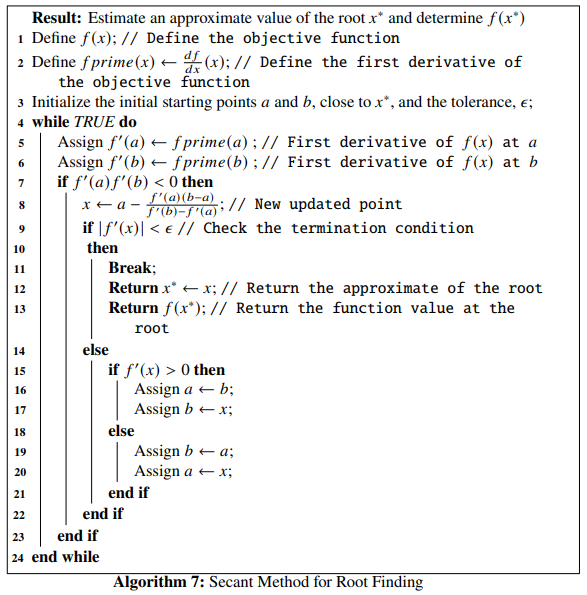

# Solving One Dimensional Optimization Problems

This chapter introduces the detailed study on various algorithms for solving one dimensional optimization problems. The classes of methods that have been discussed are: **Elimination method**, **Interpolation method** and **Direct Root Finding method**. The **Elimination method** covers the **Fibonacci Search method** and the **Golden Section Search method**; the Interpolation method covers **Quadratic Interpolation** and **Inverse Quadratic Interpolation** methods; and the **Direct Root Finding method** covers **Newton's method**, **Halley's method**, **Secant method** and **Bisection method**. Finally a combination of some of these methods called the **Brent's method** has also been discussed. Python programs involving the functions provided by the `scipy.optimize` module for solving problems using the above algorithms have also been provided. For the Fibonacci Search method and the Inverse Quadratic Interpolation method, full Python programs have been written for assisting the readers.

---

## One Dimensional Optimization Problems

The aim of this chapter is to introduce methods for solving one-dimensional optimization tasks, formulated in the following way:
\begin{equation}
    f(x^*)=\underset{x}{\min\ }f(x), x \in \mathbb{R} (\#eq:1)
\end{equation}
where, $f$ is a nonlinear function. The understanding of these optimization tasks and algorithms will be generalized in solving unconstrained optimization tasks involving objective function of multiple variables, in the future chapters.

## What is a Unimodal Function?

```{definition}
A function $f(x)$, where $x \in \mathbb{R}$ is said to be *unimodal* [refer to https://math.mit.edu/~rmd/465/unimod-dip-bds.pdf] if for a value $x^*$ on the real line, the following conditions are satisfied:
* $f$ is monotonically decreasing for  $x \leq v$,
* $f$ is monotonically increasing for $x \geq v$, and
* if the above two conditions are satisfied, then $f(x^*)$ is the minimum value of $f(x)$, and $x^*$ is the minimizer of $f$.
```

Let us have a look into the figure below.

```{python, echo=FALSE, results=FALSE}
import matplotlib.pyplot as plt
import numpy as np

def f(x):
    return 5*x**2 - 3*x + 2
x = np.linspace(-4, 4)
y = f(x)

plt.axvline(x=-4, color='k', linestyle='--')
plt.axvline(x=4, color='k', linestyle='--')
plt.plot(x, y, "-r")
plt.axvline(x=-1, color='k', linestyle='-')
plt.axvline(x=2, color='k', linestyle='-')
plt.axvline(x=0.3, color='k',
linestyle='--')
plt.title("A unimodal quadratic function, showing the minimizer, and the interval of uncertainty", size = 10)
```

We have taken the quadratic function of one variable: $f(x) = 5x^2-3x+2$. It is a nonlinear unimodal function defined over the interval $[-2,2]$, denoted by the dotted lines on either side.. The minimizer $x^*=0.3$ (which can be solved analytically!), given by the middle dotted line, lies inside the interval $[x_l, x_r]=[-2,2]$. We notice that $f(x)$ strictly decreases for $f(x) < f(x^*)$ and strictly increases for $f(x) > f(x^*)$. The interval $[x_l, x_r]$ that has the minimizer within it, is called the *interval of uncertainty* and the goal of an optimization algorithm is to reduce this interval as much as possible to converge towards the minimizer. A good algorithm completes the convergence very fast. In each step of this reduction of the interval, the algorithm finds a new unimodal interval following the following procedures:

* Choose two new points, $x_1 \in [x_l, x^*]$ and another point $x_2 \in [x^*, x_r]$ (denoted by the two filled straight lines in the figure,
* If $f(x_2) > f(x_1)$, the new interval becomes $[x_l, x_2]$ and $x_r$ becomes $x_2$, i.e, $x_r=x_2$,
* Next pick a new $x_2$,
* If condition in step (2) is not satisfied, we set the new interval as $[x_1, x_r]$ directly after step (1) and set $x_l=x_1$, and
* Next pick a new $x_1$.

The given steps continue iteratively until the convergence is satisfied to a given limit of the minimizer. These class of methods is called an *Elimination Method* and we study two categories under this kind:

* **Fibonacci Search**, and
* **Golden Section Search**.

Rao's book *Engineering Optimization* [Rao, Singiresu S. Engineering optimization: theory and practice. John Wiley & Sons, 2019.] also has some detailed studies on these kinds of optimization methods.

## Fibonacci Search Method

Instead of finding the exact minimizer $x^*$ of $f(x)$, the *Fibonacci search strategy* works by reducing the interval of uncertainty in every step, ultimately converging the interval, containing the minimizer, to a desired size as small as possible. One caveat is that, the initial interval containing, such that the interval lies in it, has to be known beforehand. However, the algorithm works on a nonlinear function, even if it is discontinuous. The name comes from the fact that the algorithm makes use of the famous sequence of *Fibonacci numbers* [http://oeis.org/A000045]. This sequence is defined in the following way:

\begin{align}
F_0&=0,F_1=1, \\ 
F_n&=F_{n-1} + F_{n-2},\text{ where }n=2,3,\ldots
\end{align}

We write a Python code to generate the first 16 Fibonacci numbers and display them as a table:

```{python}
import pandas as pd
import numpy as np

def fibonacci(n): # define the  function
    fn = [0, 1,]
    for i in range(2, n+1):
        fn.append(fn[i-1] + fn[i-2])
    return fn


N = np.arange(16)
data = {'n': N, 'Fibonacci(n)': fibonacci(15)}
df = pd.DataFrame(data)
```

`df` looks like this:

```{python, echo=FALSE}
from tabulate import tabulate
print(tabulate(df, headers='keys', tablefmt='psql'))
```

Let $n$ be the total number of experiments to be conducted and $[x_l, x_r]$ be the initial interval the algorithm starts with. Let 
\begin{eqnarray}
L_0 = x_r - x_l (\#eq:2)
\end{eqnarray}
be the initial level of uncertainty and let us define,
\begin{eqnarray}
L_j = \frac{F_{n-2}}{F_n}L_0 (\#eq:3)
\end{eqnarray}
where, $F_{n-2}$ and $F_n$ are the $(n-2)^{th}$ and $n^{th}$ *Fibonacci numbers* respectively. We see from the formulation of the *Fibonacci numbers* that, \@ref(eq:3) shows the following property:
\begin{equation}
    L_j = \frac{F_{n-2}}{F_n}L_0 \leq \frac{L_0}{2} \text{ for } n\geq 2 
\end{equation}
Now, the initial two experiments are set at points $x_1$ and $x_2$, where, $L_j = x_1 - x_l$ and $L_j = x_r - x_2$. So, combining these with Eq.\@ref(eq:3), we have:
\begin{equation}
    x_1 = x_l + \frac{F_{n-2}}{F_n}L_0 (\#eq:4)
\end{equation}
and
\begin{equation}
    x_2 = x_r - \frac{F_{n-2}}{F_n}L_0 (\#eq:5)
    \end{equation}
Now taking into consideration the unimodality assumption, a part of the interval of uncertainty is rejected, shrinking it to a smaller size, given by,
\begin{equation}
    L_i = L_0 - L_j = L_0(1-\frac{F_{n-2}}{F_n}) = \frac{F_{n-1}}{F_n}L_0 (\#eq:6)
\end{equation}
where, we have used the fact that, $F_n - F_{n-2} = F_{n-1}$ from the formulation of the *Fibonacci numbers*. This procedure leaves us with only one experiment, which, from one end, is situated at a distance of
\begin{equation}
  L_j = \frac{F_{n-2}}{F_n}L_0 = \frac{F_{n-2}}{F_{n-1}}L_i (\#eq:7)
\end{equation}
where, we have used Eq.\@ref(eq:3). From the other end, the same experiment point is situated at a distance give by,
\begin{equation}
L_i-L_j = \frac{F_{n-3}}{F_n}L_0 = \frac{F_{n-3}}{F_n}L_0 = \frac{F_{n-3}}{F_{n-1}}L_2 (\#eq:8)
\end{equation}
where, we have again used Eq.\@ref(eq:3). We now place a new experiment point in the interval $L_i$ so that both the present experiment points are situated at a distance given by Eq.\@ref(eq:7). We again reduce the size of the interval of uncertainty using the unimodality conditions. This whole process is continued so that for the $k^{th}$ experiment point, its location is given by,
\begin{equation}
    L_{k[j]} = \frac{F_{n-k}}{F_{n-(k-2)}}L_{k-1} (\#eq:9)
\end{equation}
and the interval of uncertainty is given by,
\begin{equation}
    l_{k[i]} = \frac{F_{n-(k-1)}}{F_n}L_0 (\#eq:10)
\end{equation}
    after $k$ iterations are completed. Now, the *reduction ratio* given by the ratio of the present interval of uncertainty after conduction $k$ iterations out of the $n$ experiments to be performed, $L_{k[i]}$ to the initial interval of uncertainty, $L_0$:
\begin{equation}
    R = \frac{L_{k[i]}}{L_0} = \frac{F_{n-(k-1)}}{F_n} (\#eq:11)
\end{equation}

The purpose of this algorithm is to bring $R \sim 0$. The **Fibonacci Search Algorithm** has been shown below:


We will write a Python function that implements the above algorithm

```{python}
def fib_search(f, xl, xr, n):
    F = fibonacci(n) # Call the fibonnaci number function
    L0 = xr - xl # Initial interval of uncertainty
    R1 = L0 # Initial Reduction Ratio
    Li = (F[n-2]/F[n])*L0 
    
    R = [Li/L0]

    for i in range(2, n+1):
        if Li > L0/2:
            x1 = xr - Li
            x2 = xl + Li
        else:
            x1 = xl + Li
            x2 = xr - Li
            
        f1, f2 = f(x1), f(x2)
        
        if f1 < f2:
            xr = x2
            Li = (F[n - i]/F[n - (i - 2)])*L0 # New interval of uncertainty
        elif f1 > f2:
            xl = x1
            Li = (F[n - i]/F[n - (i - 2)])*L0 # New interval of uncertainty
        else:
            xl, xr = x1, x2
            Li = (F[n - i]/F[n - (i - 2)])*(xr - xl) # New interval of uncertainty
            
        L0 = xr - xl
        R += [Li/R1,] # Append the new reduction ratio
        
    if f1 <= f2:
        return [x1, f(x1), R] # Final result
    else:
        return [x2, f(x2), R] # Final result
```

```{example}
Let an objective function be:
\begin{equation}
    f(x) = x^5 - 5x^3 - 20x + 5 (\#eq:12)
\end{equation}
We will use the **Fibonacci search algorithm** to find the minimizer $x^*$, taking $n=25$ and the initial interval of uncertainty $[-2.5, 2.5]$. Let's write a Python function to define the given objective function and visualize the same:
```

```{python, results=FALSE}
def f(x): # Objective function
    return x**5 - 5*x**3 - 20*x + 5

x = np.linspace(-3, 3, 100)
plt.plot(x, f(x), 'r-')
plt.xlabel('x ->')
plt.ylabel('f(x) ->')
plt.title("Graph of $f(x) =  x^5-5x^3-20x+5$")
plt.show()
```

Now, we consider $n=25$ and use the function `fib_search(f, -2.5, 2.5, 25)` to run the optimization and print the results:

```{python}
Fib = fib_search(f, -2.5, 2.5, 25)
x_star, f_x_star, R = Fib
print ("x*:", x_star)
print ("f(x*):", f_x_star)
print ("Final Reduction Ratio:", R[-1])
```

We see that $x^* \sim 2$, $f(x^*) \sim -43$ and the final *Reduction Ration* is 0. Now, to show the positions of $x^*$ and $f(x^*)$ on the graph of the objective function, we write the following code:

```{python, results=FALSE}
x = np.linspace(-3, 3, 100)
plt.plot(x, f(x), 'r-')
plt.plot([x_star], [f_x_star], 'ko')
plt.axvline(x=x_star, color='b', linestyle='--')
plt.xlabel('x ->')
plt.ylabel('f(x) ->')
plt.title("$x^*$ denoted as broken blue line and $f(x^*)$ denoted as the black dot")
plt.show()
```

We can modify our function in such a way that all the optimization data in every step are collected
and displayed as a `DataFrame`:

```{python}

def fib_search(f, xl, xr, n):    
    F = fibonacci(n)
    L0 = xr - xl
    ini = L0
    Li = (F[n-2]/F[n])*L0
    
    R = [Li/L0]
    a = [xl]
    b = [xr]
    F1 = [f(xl)]
    F2 = [f(xr)]

    for i in range(2, n+1):
        #print("reduction ratio:", Li/ini)
        if Li > L0/2:
            x1 = xr - Li
            x2 = xl + Li
        else:
            x1 = xl + Li
            x2 = xr - Li
            
        f1, f2 = f(x1), f(x2)
        
        if f1 < f2:
            xr = x2
            Li = (F[n - i]/F[n - (i - 2)])*L0
        elif f1 > f2:
            xl = x1
            Li = (F[n - i]/F[n - (i - 2)])*L0
        else:
            xl, xr = x1, x2
            Li = (F[n - i]/F[n - (i - 2)])*(xr - xl)
            
        L0 = xr - xl
        R += [Li/ini,] 
        a += [xl, ]
        b += [xr, ]
        F1 += [f1, ]
        F2 += [f2, ]
        
    data = {'n' : range(0, n),
            'xl': a,
            'xr': b,
            'f(x1)': F1,
            'f(x2)': F2,
            'Reduction Ratio': R}

    df = pd.DataFrame(data, columns = ['n', 'xl', 'xr', 'f(x1)', 'f(x2)', 'Reduction Ratio'])
    return df

df = fib_search(f, -2.5, 2.5, 25)
```

Where `df` looks like this:

```{python, echo=FALSE}
print(tabulate(df, headers='keys', tablefmt='psql'))
```

 The graph of the reduction ratio at each $n$ can be plotted with the following code:

```{python, results=FALSE}
plt.xlabel("n->")
plt.ylabel("Reduction Ratio ->")
plt.plot(range(0, len(df)), df['Reduction Ratio'])
plt.title("Graph of change of reduction ratio at each $n$")
plt.show()
```


## Golden Section Search Method

The **golden section search method** is a modified version of the **Fibonacci search method**. One advantage of the former over the later is that, we do not need to keep a record of the total number of experiment points $n$ beforehand. While selecting $x_1$ and $x_2$ inside the interval of uncertainty, we make use of the golden ratio, $\phi = \frac{\sqrt{5} - 1}{2}$ which is the positive root of the quadratic equation given by:
\begin{equation}
    \phi^2+\phi-1=0 (\#eq:13)
\end{equation}

Given the initial interval $[x_l, x_r]$, we have the initial interval of uncertainty as,
\begin{equation}
L_0 = x_r - x_l (\#eq:14)
\end{equation}

The new interior points $x_1$ and $x_2$ are chosen in such a way that both of them lies at a distance $\phi^2L_0$ from either side, i.e,
\begin{equation}
    x_1-x_l = \phi^2L_0 (\#eq:15)
\end{equation}
and
\begin{equation}
    x_r-x_2 = \phi^2L_0 (\#eq:16)
\end{equation}

Now from Eq.\@ref(eq:13) we know 
\begin{equation}
    L_0 = (\phi^2 + \phi)L_0 (\#eq:17)
\end{equation}

The above computations leave us with:
\begin{equation}
x_r - x_1 = \phi L_0 (\#eq:18)
\end{equation}
and
\begin{equation}
    x_2 - x_l = \phi L_0 (\#eq:19)
\end{equation}

Given, $f(x)$ is the nonlinear objective function, we now check whether $f(x_1) > f(x_2)$. If this is the case, we set $x_l = x_1$, otherwise if $f(x_1) > f(x_2)$, we set $x_r=x_2$. The new interval of uncertainty is set to be $L_i = \phi L_0$ and the previous interval is shrunk. This process of choosing new experimental points and shrinking the interval of uncertainty is continued until the termination condition is satisfied. The termination condition is to check whether the interval of uncertainty is less than a particular tolerance $\epsilon$ usually provided by the user. The *golden section search* algorithm is given below:


```{example}
Let us consider an objective function:
\begin{equation}
    f(x) = \frac{1}{16}x^3 - \frac{27}{4}x (\#eq:20)
\end{equation}

We will use the *golden section search* method to find the minimizer $x^*$ of this function and compute $f(x^*)$. Suppose the initial interval be $[-10, 10]$ and the tolerance for the termination condition for the algorithm be $\epsilon = 10^{-5}$. Let us first define the function in Python:
```

```{python}
def f(x): # objective function
    return x**3/16 - 27*x/4
```

The graph of the objective function:

```{python, results=FALSE}
x = np.linspace(-20, 20, 100)
plt.plot(x, f(x), 'r-')
plt.xlabel('x ->')
plt.ylabel('f(x) ->')
plt.title("Graph of $f(x) = \\frac{1}{16}x^3 - \\frac{27}{4}x$")
plt.show()
```

For tackling this problem, we will not write our own Python function. As already stated in the last chapter, the `scipy.optimize` package too equips us with solvers to solve these tasks. For this problem, we use the `minimize_scalar()` function provided by `scipy.optimize`, which is used for minimization of a scalar function of one variable. The `minimize_scalar()` function provides the user with the following parameter:

* `fun`: The objective function which must be callable,
* `bracket`: This is an optional parameter and defines the bracketing interval. This is a sequence, and consists of either three points $(x_a, x_b, x_c)$, such that $x_a < x_b < x_c$ and $f(x_b) < f(x_a), f(x_c)$, or two points $(x_a, x_b)$ that are considered as the starting interval for any elimination search method,
* `bounds`: This is an optional parameter too (important for our analysis!) and is a sequence. This defines the optimization bound, i.e, the initial interval of uncertainty, $[x_l, x_r]$, 
* `args`: This is a tuple and an optional parameter that defines the extra arguments that might be needed to pass to the objective function,
* `method`: This is the most important parameter that defines the various solvers provided by `minimize_scalar()`. This should be either a string (`str`) or a callable object. As of writing this book, the solvers that `minimize_scalar()` provides are:
  - `'golden'`: Uses the *golden section search* method for finding the local minimum,
  - `'brent'`: Uses the *Brent's algorithm* (will be discussed in the next section) for finding the local minimum,
  - `'bounded'`: For performing bounded minimization and uses the `Brent's algorithm` to find the local minima specified in the `'bounds'` parameter. The `method` parameter is optional too, and if not provided, the `minimize_scalar()` function uses the `'brent'` method by default. The user can also write and pass a custom solver which must be a Python callable object.
* `tol`: This parameter represents the tolerance ($\epsilon$) of the optimization algorithm. This must be a `float` and is optional too, and
* `options`: This is an optional parameter and is a Python dictionary which specifies the solver options:
  - `maxiter`: This is an `int` object and denotes the maximum number of iterations to be performed by the solver,
  - `disp`: This must be a boolean (`bool`) object, and if set to `True`, prints a detailed information about the convergence of the algorithm
  
The `minimize_scalar()` function returns the optimization result as a specific Python object designed specifically for the `scipy.optimize` module called, `OptimizeResult`. It has the following important attributes:

* `x`: The solution ($x^*$) of the optimization. This is a *numpy array* object, i.e, `ndarray` and can return a scalar or a vector,
* `success`: This is a `bool` object and states whether the optimization process has completed successfully or not,
* `fun, jac, hess`: Provides the objective function, Jacobian and the Hessian matrix at the solution $x^*$ as `ndarray` objects,
* `nfev, njev, nhev`: Provides the number of evaluations of the objective function, its Jacobian and Hessian matrix during the running of the optimization solver and are `int` objects,
* This is an `int` object and states the number of iterations that have been performed by the solver, and
* `maxcv`: This is a `float` object and represents the maximum constraint evaluation.

Now returning back to our example, we have $f(x)$ defined by Eq.\@ref(eq:20), we use the *golden section search method* to find its minimizer. Using the `minimize_scalar()` function and setting parameters `method = 'golden'`, `bounds = (-10, 10)` and `tol = 10**-5` we can get our solution. We see that the initial interval has been set to $[-10, 10]$ and the tolerance $\epsilon$ has been set $10^{-5}$. We write the Python code:

```{python}
from scipy.optimize import minimize_scalar
result = minimize_scalar(f, bounds = (-10, 10), method = 'golden', tol = 10**-5)
print(result)
```

We notice that $x^* \sim 6$, $f(x^*) \sim -27$, the number of iterations it took to converge to $x^*$ is 26 and other attributes that have been listed methodically. With some little extra Python codes, the user can also collect the data of the optimization steps, given below:

```{python, echo=FALSE}
L = []
def F(x): # objective function
    L.append(x)
    return x**3/16 - 27*x/4

from scipy.optimize import minimize_scalar
result = minimize_scalar(F, bounds = (-10, 10), method = 'golden', tol = 10**-5)

fL = []
for i in L:
    fL += [f(i), ]
data = {'x' : L,
        'f(x)': fL}
        

df = pd.DataFrame(data, columns = ['x', 'f(x)'])

print(tabulate(df, headers='keys', tablefmt='psql'))
```

The optimization steps can be plotted too. The graph with all the function evaluations along with the minimizer $f(x^*)$ at $x^*$ has been denoted as a blue dotted line in the below figure which can be generated using the following Python code:

```{python, results=FALSE}
plt.plot(np.linspace(-20, 20, 100), f(np.linspace(-20, 20, 100)), 'r-')
plt.plot(df['x'], df['f(x)'], 'ko-')
plt.axvline(x=result.x, color='b', linestyle='--')
plt.axhline(y=result.fun, color='g', linestyle='--')
plt.xlabel('x ->')
plt.ylabel('f(x) ->')
plt.title("optimization of $f(x) = \\frac{1}{16}x^3 - \\frac{27}{4}x$")
```

If we analyse closely the optimization data in the dataframe and look at the third, fourth and fifth steps, we see that $f(x[3]) ~\sim -16.55$, $f(x[4]) \sim 120.1$ and again $f(x[5]) ~\sim -16.55$. This interesting overshooting can be also seen in the visualization given by the above figure.

We next discuss *interpolation* methods to find the minimum of a nonlinear unimodal objective function. This methods use polynomial approximation for modeling the objective function. We will study two methods under this class of methods:

* **Powell's quadratic interpolation method**, and
* **Inverse quadratic interpolation method**

## Powell's Quadratic Interpolation Method

Suppose, the objective function is $f(x), x\in \mathbb{R}$ and the minimizer is $x^*$. Powell's method use successive quadratic interpolation curves for fitting to the objective function data. This gives a sequence of approximations to $x^*$, denoted by $x_t$.

Initially three data points $x_0, x_1, x_2 \in \mathbb{R}$ are provided. The interpolating quadratic polynomial through these data points $P(x)$ is as followed:
\begin{equation}
    P(x) = f(x_0) + (x - x_0)f[x_0, x_1] + (x-x_0)(x-x_1)f[x_0, x_1, x_2] (\#eq:21)
\end{equation}
where,
\begin{equation}
    f[x, y] = \frac{f(y) - f(x)}{y - x} (\#eq:22)
\end{equation}
is the first order forward divided difference, and
\begin{equation}
    f[x, y, z] = \frac{f[y, z] - f[x, y]}{z - x} (\#eq:23)
\end{equation}
is the second order forward divided difference. $x_t$ is the point where the slope of $P(x)$ curve is $0$. To find it, we set,
\begin{align}
& \frac{dP(x)}{dx} = 0 \\
&\Rightarrow f[x_0, x_1] + f[x_0, x_1, x_t](2x_t - x_0 - x_1) = 0 (\#eq:24)
\end{align}
So we end up with $x_t$,
\begin{equation}
    x_t = \frac{f[x_0, x_1, x_2](x_0, x_1) - f[x_0, x_1]}{2f[x_0, x_1, x_2]} (\#eq:25)
\end{equation}
For $x_t$ to be minimum, the following condition regarding the second order forward divided difference should be satisfied,
\begin{equation}
    f[x_0, x_1, x_2] > 0 (\#eq:26)
\end{equation}

We can now say that $x_t$ is a good approximation to $x^*$. The algorithm for *Powell's quadratic interpolation method* is given below:


```{example}
Let us consider an objective function:
\begin{equation}
    f(x) = x^4 - 2x^2 + \frac{1}{4} (\#eq:27)
\end{equation}
We will use *Powell's quadratic interpolation method* to find out the minimizer $x^*$ and the function value at this point, $f(x^*)$. Let the initial starting point be $x=0.5$, the discrete step size be $s=10^{-3}$, the maximum step size be $m=30$ and the tolerance be $\epsilon = 10^{-5}$. To start with the optimization process, let us first define the objective function given by Eq.\@ref(eq:27)in Python and plot the function:
```

```{python, results = FALSE}
def f(x): # define the objective function
    return x**4 - 2*x**2 + 1/4
    
l = np.linspace(-2, 2, 100)
plt.plot(l, f(l), 'r-')
plt.xlabel('x ->')
plt.ylabel('f(x) ->')
plt.title("Graph of $f(x) =  x^4 - 2x^2 + \\frac{1}{4}$")
plt.show()
```

We will now write functions for the first order forward divided difference and the second order forward divided difference given by Eq.\@ref(eq:22) and Eq.\@ref(eq:22).

```{python}
def f1(x, y): # First order forward divided difference
    return (f(y) - f(x)) / (y - x)

def f2(x, y, z): # Second order forward divided difference
    return (f1(y, z) - f1(x, y))/(z - x)
```

Next, we write a function to find out the nearest value to a number `n` from a list, `seq` and a function to find out the furthest value to a number `n` from a list, `seq`.

```{python}
def nearest_to(seq, n): # Picks the nearest value to a number entered from a list
    return min(seq, key = lambda x: abs(x - n))
                
def furthest_to(seq, n): # Picks the furthest value to a number entered from a list
    return max(seq, key = lambda x: abs(x - n))
```

Let us consider a list be $L = \{1.1, 2.7, 3.3, 3.2, 1.8, -0.9, -0.5, -6.33\}$ and a number be $0.7$, we need to find the nearest value to $0.7$ from $L$ and the furthest value to $0.7$ from $L$. We use the functions:

```{python}
L = [1.1, 2.7, 3.3, 3.2, 1.8, -0.9, -0.5, -6.33]
n = 0.7

print("The nearest value to", n, "from ", L, ":", nearest_to(L, n))

print("The furthest value to", n, "from ", L, ":", furthest_to(L, n))
```

We now require to write a function that returns the element from a list that has the maximum value of $f(x)$ where $f$ is the objective function.

```{python}
def maximum_fvalue(seq):
    fu = f(np.array(seq)) # Converts a Python list to a ndarray object 
    return seq[np.where(fu==np.amax(fu))[0][0]] # Picks up the index from the ndarray sequence, the element at which has the maximum f(x) value and returns the element from the sequence
```

Let us use the same sequence and find out the element from it that fas the maximum value of $f$,

```{python}
L = [1.1, 2.7, 3.3, 3.2, 1.8, -0.9, -0.5, -6.33]
print(f(np.array(L))) # Prints the f(x)'s at all the x's from the sequence 
print(maximum_fvalue(L)) # Prints the element with the highest f(x) value  
```

We see that from the sequence $-6.33$ has the highest $f$ value, that is $f(-6.33) = 1.52562895\times 10^3$ is the maximum value as can be seen in the printed `ndarray`. We finally write the function that implements **Powell's Quadratic Interpolation Algorithm" and name it `powell_quad()` with the parameters `x, s, m,` and `tol`:

```{python}
def powell_quad(x, s, m, tol):
    if f(x) < f(x + s):
        x0 = x - s
        x1 = x
        x2 = x + s
    else:
        x0 = x
        x1 = x + s
        x2 = x + 2 * s

    L = [x0, x1, x2] # Set x0, x1 and x2
    XT = []  
    while True:
        M = f2(L[0], L[1], L[2])
        xt = (M * (L[0] + L[1]) - f1(L[0], L[1]))/(2 * M) # The approximate minimizer 
        xn = nearest_to(L, xt) # Picks the point from [x0, x1, x2] which is the nearest to xt
        xf = furthest_to(L, xt) # Picks the point from [x0, x1, x2] which is the furthest to xt
        if M > 0 and abs(xt - xn) > m: # Checks for equation 3.26 
            L.remove(xf) # Remove xf from [x0, x1, x2]
            value = min(L) + m 
            L += [value, ]
            L.sort() # Take a step of size m towards the direction of descent from the point with the lowest value
        elif M < 0 :
            L.remove(xn) # Remove xn from [x0, x1, x2]
            value = min(L) + m
            L += [value, ]
            L.sort() # Take a step of size m towards the direction of descent from the point with the lowest value
        else:
            # print((xt + xn) / 2, f((xt + xn) / 2)) # If the user wants to print the steps at all function evaluations at the approximate minimizers, uncomment the command
            XT += [(xt + xn) / 2, ]
            if abs(xt - xn) < tol: # Check for the terminating condition
                return [(xt + xn) / 2, f((xt + xn) / 2), XT] # Return the results
            else:
                mx = maximum_fvalue(L) 
                L.remove(mx)
                L += [xt, ]
                L.sort() # Replace the element from [x0, x1, x2] having the maximum function value with xt
```

Now returning back to our original example problem, we have $x = 0.5$, $s=10^{-3}$, $m=30$ and $\epsilon=10^{-5}$. We will use these values as parameter values for our function `powell_quad()` and check the result:

```{python}
res = powell_quad(0.5, 10**-3, 30, 10**-5)
x_star = res[0]
f_x_star = res[1]

print('x*:', x_star)
print('f(x*):', f_x_star)
```

Now let us collect the optimization data and store in a dataframe `df`:

```{python}
XT = np.array(res[2])
F = f(XT)

data = {'xt': XT, 'f(xt)': F}
df = pd.DataFrame(data, columns=['xt', 'f(xt)'])
```

The last few rows of `df` looks like:

```{python, echo=FALSE}
print(tabulate(df.tail(10), headers='keys', tablefmt='psql'))
```

To plot the optimization data, type:

```{python, results=FALSE}
plt.plot(np.linspace(-2, 2, 100), f(np.linspace(-2, 2, 100)), 'r-')
plt.plot(df['xt'], df['f(xt)'], 'ko-')
plt.axvline(x=x_star, color='b', linestyle='--')
plt.axhline(y=f_x_star, color='g', linestyle='--')
plt.xlabel('x ->')
plt.ylabel('f(x) ->')
plt.xlim(-2, 2)
plt.ylim(-2, 10)
plt.title("optimization of $f(x) =  x^4 - 2x^2 + \\frac{1}{4}$")
plt.show()
```

We notice that the blue dashed line gives the position of $x^*$ and the green dashed line gives the corresponding $f(x^*)$ value. 

Now, we change our original problem a little bit and consider the initial starting point to be $x=-0.5$ and reduce the maximum step size to $m=10$ , keeping all the other parameters same.

```{python}
res = powell_quad(-0.5, 10**-3, 10, 10**-5)
x_star = res[0]
f_x_star = res[1]

print('x*:', x_star)
print('f(x*):', f_x_star)
```

Now let us collect the optimization data and store in a dataframe `df`:

```{python}
XT = np.array(res[2])
F = f(XT)

data = {'xt': XT, 'f(xt)': F}
df = pd.DataFrame(data, columns=['xt', 'f(xt)'])
```

The last few rows of `df` looks like:

```{python, echo=FALSE}
print(tabulate(df.tail(10), headers='keys', tablefmt='psql'))
```

To plot the optimization data, type:

```{python, results=FALSE}
plt.plot(np.linspace(-2, 2, 100), f(np.linspace(-2, 2, 100)), 'r-')
plt.plot(df['xt'], df['f(xt)'], 'ko-')
plt.axvline(x=x_star, color='b', linestyle='--')
plt.axhline(y=f_x_star, color='g', linestyle='--')
plt.xlabel('x ->')
plt.ylabel('f(x) ->')
plt.xlim(-2, 2)
plt.ylim(-2, 10)
plt.title("optimization of $f(x) =  x^4 - 2x^2 + \\frac{1}{4}$")
plt.show()
```

We have $x^* \sim -1$ and $f(x^*) \sim -0.75$, i.e, now the $x^*$ converges to the local minimum on the left side.

## Inverse Quadratic Interpolation Method

The main motivation of using the **inverse quadratic interpolation method** [refer to *An Introduction to Numerical Methods and Analysis* by *James F. Epperson*] is to use the quadratic interpolation method to find the inverse of the objective function $f(x)$. This algorithm forms an integral part of the *Brent's method* for optimization, which we will study later in this chapter. In this method, we have three initial points to start with, given by, $x_0, x_1, x_2 \in \mathbb{R}$. Our aim is to find the polynomial $q(f(x))$, such that,
\begin{equation}
    q(f(x_j)) = x_j (\#eq:28)
\end{equation}
which identifies,
\begin{equation}
    q = f^{-1} (\#eq:29)
\end{equation}

Now, using the divided difference forms we can write,
\begin{align}
    q(y) &= f^{-1}(y_0) + (y - y_0)\frac{f^{-1}(y_1) - f^{-1}(y_0)}{y_1 - y_0}\\ 
    &+ \frac{(y-y_0)(y-y_1)}{(y_2-y_0)}(\frac{f^{-1}(y_2) - f^{-1}(y_1)}{y_2 - y_1} - \frac{f^{-1}(y_1) - f^{-1}(y_0)}{y_1 - y_0})\\
    &= x_0 + (y-y_0) \frac{(x-x_0}{(y_1-y_0)}\\ &+\frac{(y-y_0)(y-y_1)}{(y_2-y_0)}(\frac{(x_2 - x_1)}{(y_2-y_1)} - \frac{(x_1-x_0)}{(y_1-y_0)}) (\#eq:30)
\end{align}

where,
\begin{equation}
    y_j = f(x_j) (\#eq:31)
\end{equation}

Now, the approximate minimizer $x_t$ is the value $q(0)=x_t$, i.e, at $y=0$. Putting $y=0$ in Eq.\@ref(eq:30), we have,

\begin{equation}
    x_t = q(0) = x_0 - y_0 \frac{(x_1 - x_0)}{(y_1 - y_0)} + \frac{y_0y_1}{(y_2 - y_0)}(\frac{(x_2 - x_1)}{(y_2 - y_1)} - \frac{(x_1 - x_0)}{(y_1 - y_0)}) (\#eq:32)
\end{equation}

$x_t$ can be considered as a good approximate of $x^*$ after satisfactory number of optimizations steps of the algorithm. The algorithm for *inverse quadratic interpolation method* is given  below:


The above alogorithm looks very simple and it will be left as an exercise for the reader to implement this using Python. An objective function $f(x)$ can be selected to test the results using this algorithm. Let 
\begin{equation}
    f(x) = 2 - e^x (\#eq:33)
\end{equation}
One can take the initial experimental point to be $x=1$, the step size to be $s=10^{-5}$ and the tolerance to be $\epsilon=10^{-8}$. 
\end{example}

In the next section we discuss two direct root finding methods:

* **Newton's method**,
* **Halley's method**, 
* **Secant Method**, and
* **Bisection Method**

## Newton's Method

For a given objective function $f(x), x\in \mathbb{R}$, the necessary condition for it to contain a minimizer $x^*$, is that $\frac{df}{dx}(x^*)=0$. The aim of these direct root-finding methods is thus to obtain the solution of the equation,
\begin{equation}
    \frac{df}{dx}(x)=0 (\#eq:34)
\end{equation}

At point $x_j$, the Taylor's expansion of the objective function, up to the second order terms is given by,
\begin{equation}
    f(x) = f(x_j) + (x - x_j)\frac{df}{dx}(x_j) + \frac{1}{2}(x - x_j)^2\frac{d^2f}{dx^2}(x_j) (\#eq:35)
\end{equation}

Now, 
\begin{equation}
    \frac{df}{dx}(x_j) = 0 (\#eq:36)
\end{equation}
so, 

Eq.\@ref(eq:35) reduces to 
\begin{equation}
    f(x) = f(x_j) + \frac{1}{2}(x - x_j)^2\frac{d^2f}{dx^2}(x_j) (\#eq:37)
\end{equation}

Here $\frac{d^2f}{dx^2}(x_j)$ is a constant. Now, we find the derivative of Eq.\@ref(eq:37) and set it to $0$ following Eq.\@ref(eq:34)
\begin{align}
\frac{df}{dx}(x) &= 0 \\
\frac{df}{dx}(x_j) + (x - x_j)\frac{d^2f}{dx^2}(x_j) &= 0 (\#eq:38)
\end{align}

We get,
\begin{equation}
    x = x_j - \frac{\frac{df}{dx}(x_j)}{\frac{d^2f}{dx^2}(x_j)} (\#eq:39)
\end{equation}

$x_j$ denotes an approximation to the minimizer $x^*$ of $f(x)$. An improved approximation in the form of an iterative process can be given using Eq.\@ref(eq:39),
\begin{equation}
    x_{j+1} = x_j - \frac{\frac{df}{dx}(x_j)}{\frac{d^2f}{dx^2}(x_j)} (\#eq:40)
\end{equation}

The termination condition for convergence after a sufficient number of large iterations to $x^*$ is given by:
\begin{equation}
    |\frac{df}{dx}(x_{j+1})| \leq \epsilon (\#eq:41)
\end{equation}

where, $\epsilon$ is the tolerance set by the user for the optimization algorithm. In numerical analysis literature, the *Newton's method* is also sometimes called the *Newton-Raphson method*, because it was originally designed by Newton and was later improved by Raphson. The *Newton's method* has a fast convergence property called the *quadratic convergence*.

```{definition}
For a twice differentiable objective function $f(x)$, assuming that its minimizer $x^*$ lies in the interval $(x_l, x_r)$, with $\frac{df}{dx}(x^*) \neq 0$ and $f(x^*) = 0$, for the Newton's iteration, if $x_j$ converges to $x^*$ for a large number of iterations, $j \to \infty$, $x_j$ is said to be *quadratically convergent* to $x^*$ if the following condition is satisfied:
\begin{equation}
    |x_{j+1} - x^*| \leq M|x_j - x^*|^2, \text{ if } M > \frac{|\frac{d^2f}{dx^2}(x^*)|}{2|\frac{df}{dx}(x^*)|} (\#eq:42)
\end{equation}
```

```{proof}
Let us consider
\begin{equation}
    \epsilon_j = x_j - x^* (\#eq:43)
\end{equation}
Now, using Taylor's expansion up to the linear term, we can write,
\begin{equation}
    f(x) = f(x_j) + (x - x_j) \frac{df}{dx}(x_j) (\#eq:44)
\end{equation}
As $f(x) = 0$, we have,
\begin{eqnarray}
0 &=& f(x_j) + (x - x_j) \frac{df}{dx}(x_j) \nonumber \\
x &=& x_j - \frac{f(x_j)}{\frac{df}{dx}(x_j)} (\#eq:45)
\end{eqnarray}
This can be written in term of an iteration method:
\begin{equation}
    x_{j+1} =  x_j - \frac{f(x_j)}{\frac{df}{dx}(x_j)} (\#eq:46)
\end{equation}
Now using Taylor's expansion around the point $x^*$,
\begin{equation}
    f(x^*) = f(x_j - \epsilon_j) = f(x_j) - \epsilon_j\frac{df}{dx}(x_j) + \frac{\epsilon_j^2}{2!}\frac{d^2f}{dx^2}(\beta_j) (\#eq:47)
\end{equation}
where, $\beta_j \in (x_j, x^*)$. Along with the fact $f(x^*) = 0$, we use Eq.\@ref(eq:43) in Eq.\@ref(eq:44) and get,
\begin{equation}
    0 = f(x_j) - (x_j - x^*)\frac{df}{dx}(x_j) + \frac{\epsilon_j^2}{2}\frac{d^2f}{dx^2}(\beta_j) (\#eq:48)
\end{equation}
As we know, $\frac{df}{dx}$ is continuous and $\frac{df}{dx}(x^*) \neq 0$, the value $\frac{df}{dx}(x_j) \neq 0$ for those values of $x_j$ where $x_j$ is very close to $x^*$. Dividing Eq.\@ref(eq:45) with $\frac{df}{dx}(x_j)$, we have,
\begin{equation}
    0 = \frac{f(x_j)}{\frac{df}{dx}(x_j)} - (x_j -  x^*) + \frac{\epsilon_j^2}{2}\frac{\frac{d^2f}{dx^2}(\beta_j)}{\frac{df}{dx}(x_j)} (\#eq:49)
\end{equation}
Now using Eq.\@ref(eq:46), 
\begin{eqnarray}
    0 &=& (x_j - x_{j+1}) - (x_j - x^*) + \frac{\epsilon_j^2}{2}\frac{\frac{d^2f}{dx^2}(\beta_j)}{\frac{df}{dx}(x_j)} \nonumber \\
    x_{j+1} - x^* &=&  \frac{\epsilon_j^2}{2}\frac{\frac{d^2f}{dx^2}(\beta_j)}{\frac{df}{dx}(x_j)} = \frac{1}{2}\frac{\frac{d^2f}{dx^2}(\beta_j)}{\frac{df}{dx}(x_j)}(x_j - x^*)^2 \nonumber \\
    |x_{j+1} - x_j| &\leq& \frac{1}{2}\frac{\frac{d^2f}{dx^2}(\beta_j)}{\frac{df}{dx}(x_j)}|x_j - x^*|^2 (\#eq:50)
\end{eqnarray}
Now, $\frac{df}{dx}(x_j)$ converges to $\frac{df}{dx}(x^*)$ due to continuity of $f(x)$. $\beta_j$, lying between $x_j$ and $x^*$ converges to $x^*$ too, resulting in the convergence of $\frac{d^2f}{dx^2}(\beta_j)$ to $\frac{d^2f}{dx^2}(x^*)$. So, As $j \to \infty$, we have
\begin{equation}
    |x_{j+1} - x^*| \leq M|x_j - x^*|^2, \text{ if } M > \frac{|\frac{d^2f}{dx^2}(x^*)|}{2|\frac{df}{dx}(x^*)|} (\#eq:51)
\end{equation}
This completes our proof of *quadratic convergence* for the *Newton's method*. [refer *quadratic convergence of Newton's method*, Michael Overton]
```

The algorithm for the *Newton's method* is given below:


```{example}
Let us consider the objective function,
\begin{equation}
    f(x) = x^3 + x^2 - 1 (\#eq:52)
\end{equation}
We will use the *Newton's method* to find the root $x^*$ of the objective function, along with the function value $f(x^*)$ at this point. Let the initial experimental point of the iteration be $x_j = 2.0$ and the tolerance be $\epsilon = 10^{-6}$. In the algorithm aboave we see that we have to define two functions besides the objective function. They are `fprime()` for $\frac{df}{dx}$, i.e, the first derivative and `fprime2()` for $\frac{d^2f}{dx^2}$, i.e, the second derivative. We will use the `autograd` package we discussed before, to define the derivative functions. Let us start with defining the objective function first:
```

```{python, results=FALSE}
def f(x): # objective function
    return x**3 + x**2 -1

l = np.linspace(-2, 2, 100)
plt.plot(l, f(l), 'r-')
plt.xlabel('x ->')
plt.ylabel('f(x) ->')
plt.title("Graph of $f(x) =  x^3 + x^2 - 1$")
plt.show()
```

We now define the functions for the first derivative and the second derivative of $f(x)$:

```{python, echo=FALSE}
import autograd.numpy as au
from autograd import grad, jacobian
```

```{python}
fprime = grad(f) # first derivative of f(x)
fprime2 = grad(fprime) # second derivative of f(x)
```

To find the value of these derivatives at a given point, we write our code in the following way:


```{python}
print(fprime(0.)) # first derivative of f(x) at point x=0
print(fprime2(0.75)) # second derivative of f(x) at point 0.75
```

Now, to implement *Newton's method*, we will first introduce the `root_scalar()` function of the `scipy.optimize` package, which is used for direct root finding for scalar nonlinear objective functions. We will now discuss the parameters of the `root_scalar()` function:

* `f`: This is the objective function whose root we need to find, and should be a `callable` Python data type. It can also be a function returning the objective function and its derivatives.
* `x0`: This is the initial experimental point of the optimization process. This is an optional parameter and is a `float`.
* `x1`: This is the second experimental point of the optimization process. This is an optional parameter and is a `float` too.
* `fprime`: This is an optional parameter and can be of two data types:
  * `callable`: If `fprime` is a `callable` function, it should return the first derivative of the objective function, and must accept the same arguments as the objective function, 
  * `bool`: If `fprime` is a Boolean data type, `f` should return the objective function and its first derivative.
* `fprime2`:This is an optional parameter and can be of two data types:
  * `callable`: If `fprime2` is a `callable` function, it should return the second derivative of the objective function, and must accept the same arguments as the objective function,
  * `bool`: If `fprime` is a Boolean data type, `f` should return the objective function and both its first and second derivatives.
* `xtol`: This is the absolute tolerance value for termination of the optimization process. This is an optional parameter and is a `float`.
* `rtol`: This is the relative tolerance value for termination of the optimization process. This is an optional parameter and is a `float`.
* `maxiter`: This indicates the maximum number of of iterations the optimization process should run before termination. This is an optional parameter and is an `int`,
* `args`: This is a `tuple` of the extra arguments that can be passed to the objective function and its derivatives. This is an optional parameter too,
* `bracket`: This is an optional parameter which indicates an interval that brackets the root of the objective function and is a sequence of two floats,
* `method`: Although an optional parameter, the `method` parameter is one of the most important parameters that indicate the specific solver that we are going to use for our optimization task. This is a `str` data type and has the following solvers predefined in it:
  * `'newton'`: This is *Newton's method* for root finding,
  * `'halley'`: This is *Halley's method* for root finding,
  * `'secant'`: This is the *Secant method* for root finding,
  * `'bisect'`: This is the *bisection method* for root finding,
  * `'brentq'`: This is the method to find the root of an objective function $f(x)$ using the classic *Brent's method*, in a bracketing interval,
  * `'brenth'`: This is used for finding the root of an objective function in a bracketing interval using *Brent's method* with hyperbolic extrapolation,
  * `'ridder'`: This is the *Ridder's method* of root finding, and
  * `'toms748'`: This is the implementation of the root finding algorithm designed by Alefed, Potro and Shi , called *Algorithm 748*.
* `options`: This is an optional parameter and is a Python dictionary which specifies the solver options given by the following parameters:
  * `solver`: This is a `str` and specifies the type of optimization solver, for example, `'minimize_scalar'`, `'root_scalar'`, etc.
  * `method`: This is a `str` and is an optional parameter. If not provided, it shows all the methods available for a selected solver,
  * `disp`: This is a `bool` and is an optional parameter too. If selected `True`, all the results are printed instead of returning.

The `root_scalar()` function returns the solution as `RootResults` object. The important attributes of the `RootResults` object is defined as:

* `root`: This is the approximate value of the root of the objective function and is a `float`,
* `iterations`: This indicates the number of iterations the optimization process takes to determine the root of the objective function and is an `int`,
* `function_calls`: This indicates the total number of function evaluations during the optimization process and is an `int`,
* `converged`: This is a `bool` and denotes whether the optimization routine has converged or not,
* `flag`: This is a `str` and gives a description of the cause of termination of the optimization process.

Now, returning back to the original problem, where we intend to find the root of the objective function given by Eq.\@ref(eq:52), using the *Newton's method*, and using the given value of the initial experimental point and the tolerance, we write the following Python code:

```{python}
from scipy import optimize
def FP(x): # Returns the objective function, its first and second derivative at the point x
    return f(x), fprime(x), fprime2(x)

sol = optimize.root_scalar(FP, x0=2., fprime=True, fprime2=True, xtol=10**-6, method='newton') # The solver code, using the method = 'newton'
print(sol) # Prints the results
```

We see the root is approximately $0.75$, the convergence was successful and there have been $6$ iterations in the optimization process and the function has been evaluated $6$ times too. The optimization data has been collected and is shown below:

```{python, echo=FALSE}
L = []
def F(x): # objective function
    L.append(x)
    return x**3 + x**2 -1

def FP(x): # Returns the objective function, its first and second derivative at the point x
    return F(x), fprime(x), fprime2(x)

sol = optimize.root_scalar(FP, x0=2., fprime=True, fprime2=True, xtol=10**-6, method='newton')

fL = []
for i in L:
    fL += [f(i), ]
data = {'x' : L,
        'f(x)': fL}
        

df = pd.DataFrame(data, columns = ['x', 'f(x)'])

print(tabulate(df, headers='keys', tablefmt='psql'))
```

The optimization steps can be plotted too. The graph with all the function evaluations along with the minimizer $f(x^*)$ at $x^*$ has been denoted as a blue dotted line in the below figure which can be generated using the following Python code:

```{python, results=FALSE}
plt.plot(np.linspace(-2, 2, 100), f(np.linspace(-2, 2, 100)), 'r-')
plt.plot(df['x'], df['f(x)'], 'ko-')
plt.axvline(x=sol.root, color='b', linestyle='--')
plt.axhline(y=f(sol.root), color='g', linestyle='--')
plt.xlabel('x ->')
plt.ylabel('f(x) ->')
plt.title("optimization of $f(x) = x^3 + x^2 - 1$")
```

## Halley's Method

For the objective function $f(x), x\in \mathbb{R}$, the necessary condition that the minimizer $x^*$ exists is that $\frac{df}{dx}(x^*)=0$. At point $x_j$, the Taylor's expansion of the objective function upto the second order term is given by Eq.  \@ref(eq:35). A root of $f(x)$ satisfies $f(x)= 0$, so , we will have,

\begin{align}
    0 &= f(x_j) + (x - x_j)\frac{df}{dx}(x_j) + \frac{1}{2}(x - x_j)^2\frac{s^2f}{dx^2}(x_j) \nonumber \\
    &= f(x_j) + (x - x_j)[\frac{df}{dx}(x_j) +\frac{1}{2} (x - x_j)\frac{d^2f}{dx^2}(x_j)] (\#eq:53)
\end{align}

This gives,
\begin{equation}
    x - x_j = -\frac{f(x_j)}{\frac{df}{dx}(x_j) + \frac{1}{2}(x - x_j)\frac{d^2f}{dx^2}(x_j)} (\#eq:54)
\end{equation}

Now, using the fact from *Newton's iteration* that,

\begin{equation}
    x - x_j = -\frac{f(x_j)}{\frac{df}{dx}(x_j)} \nonumber
\end{equation}
we can re-write Eq. \@ref(eq:54) as,

\begin{align}
    x &= x_j - \frac{f(x_j)}{\frac{df}{dx}(x_j) - \frac{1}{2}\frac{f(x_j) \frac{d^2f}{dx^2}(x_j)}{\frac{df}{dx}(x_j)}} \nonumber \\
    &= x_j - \frac{2f(x_j)\frac{df}{dx}(x_j)}{2[\frac{df}{dx}(x_j)]^2 - f(x_j)\frac{d^2f}{dx^2}(x_j)} (\#eq:55)
\end{align}

The iterative method [ref, wolfram mathworld, Halley's method] can be thus written as
\begin{equation}
    x_{j+1} = x_j - \frac{2f(x_j)\frac{df}{dx}(x_j)}{2[\frac{df}{dx}(x_j)]^2 - f(x_j)\frac{d^2f}{dx^2}(x_j)} (\#eq:56)
\end{equation} 

The termination condition for convergence after a sufficient number of large iterations to $x^*$ is given by:
\begin{equation}
    |\frac{df}{dx}(x_{j+1})| \leq \epsilon (\#eq:57)
\end{equation}
where, $\epsilon$ is the tolerance set by the user for the optimization algorithm. The *Halley's method* has a fast convergence property called the *cubic convergence*.

```{definition}
For a thrice differentiable objective function $f(x)$, assuming that its minimizer $x^*$ lies in the interval $(x_l, x_r)$, with $\frac{df}{dx}(x^*) \neq 0$ and $f(x^*) = 0$, for the Halley's iteration, if $x_j$ converges to $x^*$ for a large number of iterations, $j \to \infty$, $x_j$ is said to show *cubic convergence* to $x^*$ if the following condition is satisfied:
\begin{align}
    |x_{j+1} - x^*| \leq K|x_j - x^*|^3, \text{ if } K > -\frac{2\frac{df}{dx}(x_j)\frac{d^3f}{dx^3}(\alpha) - 3\frac{d^2f}{dx^2}(x_j)\frac{d^2f}{dx^2}(\beta)}{6(2[\frac{df}{dx}(x_j)]^2 - f(x_j)\frac{d^2f}{dx^2}(x_j))} (\#eq:58)
\end{align}
```

```{proof}
Assuming that the third derivative of the objective function exists and is continuous in a neighborhood of $x^*$ and $x_j$ lies in that neighborhood, using the Taylor's expansion up to the third order term, we get,
\begin{align}
    & &f(x^*) = f(x_j) + (x^* - x_j)\frac{df}{dx}(x_j) + \frac{1}{2!}(x^* - x_j)^2\frac{d^2f}{dx^2}(x_j)\nonumber \\ & &+ \frac{1}{3!}(x^* - x_j)^3\frac{d^3f}{dx^3}(\alpha) \nonumber \\
    &\implies& 0 = f(x_j) + (x^* - x_j)\frac{df}{dx}(x_j) + \frac{1}{2}(x^* - x_j)^2\frac{d^2f}{dx^2}(x_j)\nonumber \\ & &+ \frac{1}{6}(x^* - x_j)^3\frac{d^3f}{dx^3}(\alpha) (\#eq:59)
\end{align}
And also, using Taylor's theorem up to second order terms,
\begin{align}
    & &f(x^*) = f(x_j) + (x^* - x_j)\frac{df}{dx}(x_j) + \frac{1}{2!}(x^* - x_j)^2\frac{d^2f}{dx^2}(\beta) \nonumber \\
    &\implies&f(x^*) = f(x_j) + (x^* - x_j)\frac{df}{dx}(x_j) + \frac{1}{2}(x^* - x_j)^2\frac{d^2f}{dx^2}(\beta) (\#eq:60)
\end{align}
Here, $\alpha, \beta \in [x^*, x_j]$. Now, (Eq. \@ref(eq:59) $\times 2 \frac{df}{dx}(x_j) -$ (Eq. \@ref(eq:60)) $\times (x^* - x_j)\frac{d^2f}{dx^2}(x_j)$ gives, 
                          
\begin{align}
0 &=& 2f(x_j)\frac{df}{dx}(x_j) + 2(x^* - x_j)[\frac{df}{dx}(x_j)]^2 + \frac{1}{3}(x^* - x_j)^3\frac{df}{dx}(x_j)\frac{d^3f}{dx^3}(\alpha) \nonumber \\
&-& (x^*-x_j)f(x_j)\frac{d^2f}{dx^2}(x_j) - \frac{1}{2}(x^* - x_J)^3\frac{d^2f}{dx^2}(x_j)\frac{d^2f}{dx^2}(\beta) \nonumber \\
&=& 2f(x_j)\frac{df}{dx}(x_j) + (x^* - x_j)(2[\frac{df}{dx}(x_j)]^2 - f(x_j)\frac{d^2f}{dx^2}(x_j)) \nonumber \\
&+& (x^* - x_J)^3(\frac{1}{3}\frac{df}{dx}(x_j)\frac{d^3f}{dx^3}(\alpha) - \frac{1}{2}\frac{d^2f}{dx^2}(x_j)\frac{d^2f}{dx^2}(\beta)) (\#eq:61)
\end{align}

Now, dividing Eq. \@ref(eq:61) with $(2[\frac{df}{dx}(x_j)]^2 - f(x_j)\frac{d^2f}{dx^2}(x_j))$, we have,
\begin{align}
x^* - x_j &=& -\frac{2f(x_j)\frac{df}{dx}(x_j)}{2[\frac{df}{dx}(x_j)]^2 - f(x_j)\frac{d^2f}{dx^2}(x_j)} \nonumber \\ &-& (x^* - x_j)^3 \frac{2\frac{df}{dx}(x_j)\frac{d^3f}{dx^3}(\alpha) - 3\frac{d^2f}{dx^2}(x_j)\frac{d^2f}{dx^2}(\beta)}{6(2[\frac{df}{dx}(x_j)]^2 - f(x_j)\frac{d^2f}{dx^2}(x_j))}(\#eq:62)
\end{align}

Now subtracting Eq. \@ref(eq:56) from Eq. \@ref(eq:62), we have,
\begin{align}
x^* - x_{j+1} = - (x^* - x_j)^3 \frac{2\frac{df}{dx}(x_j)\frac{d^3f}{dx^3}(\alpha) - 3\frac{d^2f}{dx^2}(x_j)\frac{d^2f}{dx^2}(\beta)}{6(2[\frac{df}{dx}(x_j)]^2 - f(x_j)\frac{d^2f}{dx^2}(x_j))} (\#eq:63)
\end{align}

which can be written as,
\begin{align}
& &x_{j+1} - x^* = - (x_j - x^*)^3 \frac{2\frac{df}{dx}(x_j)\frac{d^3f}{dx^3}(\alpha) - 3\frac{d^2f}{dx^2}(x_j)\frac{d^2f}{dx^2}(\beta)}{6(2[\frac{df}{dx}(x_j)]^2 - f(x_j)\frac{d^2f}{dx^2}(x_j))} \nonumber \\
& &|x_{j+1} - x^*| \leq -\frac{2\frac{df}{dx}(x_j)\frac{d^3f}{dx^3}(\alpha) - 3\frac{d^2f}{dx^2}(x_j)\frac{d^2f}{dx^2}(\beta)}{6(2[\frac{df}{dx}(x_j)]^2 - f(x_j)\frac{d^2f}{dx^2}(x_j))} |(x_j - x^*)|^3 (\#eq:64)
\end{align}

Now, $\frac{df}{dx}(x_j)$ converges to $\frac{df}{dx}(x^*)$ and $\frac{d^2f}{dx^2}(x_j)$ converges to $\frac{d^2f}{dx^2}(x^*)$ due to continuity of $f(x)$. $\beta, \alpha$, lying between $x_j$ and $x^*$ converges to $x^*$ too, resulting in the convergence of $\frac{d^2f}{dx^2}(\beta)$ to $\frac{d^2f}{dx^2}(x^*)$ and $\frac{d^3f}{dx^3}(\alpha)$ to $\frac{d^3f}{dx^3}(x^*)$. So, As $j \to \infty$, we have

\begin{equation}
    |x_{j+1} - x^*| \leq K |x_j - x^*|^3, \text{ if }K > -\frac{2\frac{df}{dx}(x_j)\frac{d^3f}{dx^3}(\alpha) - 3\frac{d^2f}{dx^2}(x_j)\frac{d^2f}{dx^2}(\beta)}{6(2[\frac{df}{dx}(x_j)]^2 - f(x_j)\frac{d^2f}{dx^2}(x_j))} (\#eq:65)
\end{equation}
This completes our proof of *cubic convergence* for *Halley's method*.
```

The algorithm of the *Halley's method* is given below:


```{example}
Let us consider the objective function,
\begin{equation}
    f(x) = x^3 -6x^2+11x-6 (\#eq:66)
\end{equation}
We will use the *Halley's method* to find the root $x^*$ of the objective function, along with the function value $f(x^*)$ at this point. Let the initial experimental point of the iteration be $x_0 = 3.7$ and the tolerance be $\epsilon = 10^{-6}$. We define the objective function, and its derivatives in the similar way in Python as we did for the *Newton's method*
```

```{python}
def f(x): # Objective function
    return x**3 - 6*x**2 + 11*x - 6

fprime = grad(f) # First derivative of the objective function
fprime2 = grad(fprime) # Second derivative of the objective function 
```

Next, we  use the `root_scalar()` function of the `scipy.optimize` module and set the attributes `x0=3.7`, `method = 'halley'`, `xtol=10**-6` and so on, according to our need.

```{python}
def FP(x): # Returns the objective function and its derivatives
    return f(x), fprime(x), fprime2(x)

sol = optimize.root_scalar(FP, x0=3.7, fprime=True, fprime2=True, xtol=10**-6, method='halley')
print(sol)
```

where, we notice that the root is $\sim 3$. The optimization data has been collected and is shown below:

```{python, echo=FALSE}
L = []
def F(x): # objective function
    L.append(x)
    return x**3 - 6*x**2 + 11*x - 6

def FP(x): # Returns the objective function and its derivatives
    return F(x), fprime(x), fprime2(x)

sol = optimize.root_scalar(FP, x0=3.7, fprime=True, fprime2=True, xtol=10**-6, method='halley')

fL = []
for i in L:
    fL += [f(i), ]
data = {'x' : L,
        'f(x)': fL}
        

df = pd.DataFrame(data, columns = ['x', 'f(x)'])

print(tabulate(df, headers='keys', tablefmt='psql'))
```

The plot of the optimization steps showing the convergence of the root, along with the root being denoted by the vertical broken blue line and its corresponding function value denoted by horizontal broken green line has been shown below:

```{python, results=FALSE}
plt.plot(np.linspace(2, 5, 100), f(np.linspace(2, 5, 100)), 'r-')
plt.plot(df['x'], df['f(x)'], 'ko-')
plt.axvline(x=sol.root, color='b', linestyle='--')
plt.axhline(y=f(sol.root), color='g', linestyle='--')
plt.xlabel('x ->')
plt.ylabel('f(x) ->')
plt.title("optimization of $f(x) = x^3-6x^2+11x-6$")
```

## Secant Method

The formulation of the *secant method* looks similar to that of \@ref(eq:38). 

\begin{equation}
\frac{df}{dx}(x_j) + s\frac{d^2f}{dx^2}(x_j) = 0 (\#eq:67)
\end{equation}

Where, $s$ is the slope of the line connecting the points $(a, \frac{df}{dx}(a))$ and $(b, \frac{df}{dx}(b))$ on the $x-\frac{df}{dx}$ plane. $a$ and $b$ are two different approximations to the root of the objective function. We know the equation for the slope,
\begin{align}
s = \frac{\frac{df}{dx}(b) - \frac{df}{dx}(a)}{b - a} (\#eq:68)
\end{align}

So, \@ref(eq:67) can be written as:
\begin{eqnarray}
    x &-& x_j = -\frac{\frac{df}{dx}(x_j)}{s} \nonumber \\
    x &=& x_j - \frac{\frac{df}{dx}(a)(b - a)}{\frac{df}{dx}(b) - \frac{df}{dx}(a)} = a - \frac{\frac{df}{dx}(a)(a - b)}{\frac{df}{dx}(a) - \frac{df}{dx}(b)} (\#eq:69)
\end{eqnarray}

The iterative process, known as the *secant method* is thus given by,
\begin{equation}
    x_{j+1} = x_j - \frac{\frac{df}{dx}(x_j)(x_j - x_{j-1})}{\frac{df}{dx}(x_j) - \frac{df}{dx}(x_{j+1})} (\#eq:70)
\end{equation}

The *secant* of a curve is a line that intersects the curve at minimum of two distinct points. As $b \to a$, the secant approaches $\frac{d^2f}{dx^2}(a)$. Due to this reason, the *secant method* is also called the *quasi-Newton method*. The root $x^*$ lies between the points $a$ and $b$ if the following condition is satisfied:

\begin{equation}
    \frac{df}{dx}(a)\frac{df}{dx}(b) < 0 (\#eq:71)
\end{equation}

As we have seen, the iteration process demands two initial points to start with, i.e, $a$ and $b$. The iterates $x_j$ converges to the root of the objective function when $a$ and $b$ are close to the root. The order of convergence for the process is given by the number $\phi=\frac{\sqrt{5}+1}{2} \approx 1.618$, which is the golden ratio, i.e, the *secant method* has a *superlinear convergence*, unlike a quadratic or a cubic convergence.

The algorithm of the *secant method* is given below:


```{example}
Let us consider an objective function given by,
\begin{equation}
    f(x) = x\cos(x^2 - 7x) - 2x (\#eq:72)
\end{equation}
We will find the root of this objective function, given the two starting points are $a=-1.5$ and $b=1$ and the tolerance $\epsilon = 10^{-7}$.
```

The plot for this objective function can be generated in the following way:

```{python, results=FALSE}
def f(x): return x*au.cos(x**2-7*x)-2*x
l = np.linspace(-3, 3., 1000)
plt.plot(l, f(l), 'r-')
plt.xlabel('x->')
plt.ylabel('f(x)->')
plt.show()
```

The corresponding $x-\frac{df}{dx}(x)$ plot is given below:

```{python, results=FALSE}
def f(x): return x*au.cos(x**2-7*x)-2*x
l = np.linspace(-3, 3., 1000)
G = grad(f)
h=[]
for i in l:
    h+=[G(i),]
h = np.array(h)
plt.plot(l, h, 'b-')
plt.xlabel('x->')
plt.ylabel('$\\frac{df}{dx}(x)$->')
plt.show()
```

The objective function and its first derivative can be defined in Python:

```{python}
def f(x): # Objective function
    return x*au.cos(x**2 - 7*x) - 2*x
    
fprime = grad(f) # First derivative of the objective function
```

Now, the function that returns both the objective function and its first derivative at a particular point can be defined as:

```{python}
def FP(x):
    return f(x), fprime(x)
```

We now write the solver code with the `root_scalar()` function where the parameters are set to be `method='secant'`, `x0=-1.5`, `x1=1.`, `xtol=10**-7` and so on. 

```{python}
sol = optimize.root_scalar(FP, x0=-1.5, x1=1., fprime=True, xtol=10**-7, method='secant')
print(sol) # Print the solution results
```

The optimization data has been collected and is shown below:

```{python, echo=FALSE}
L = []
def F(x): # objective function
    L.append(x)
    return x*au.cos(x**2 - 7*x) - 2*x

def FP(x): # Returns the objective function and its derivatives
    return F(x), fprime(x)

sol = optimize.root_scalar(FP, x0=-1.5, x1=1., fprime=True, xtol=10**-7, method='secant')

fL = []
fL2 = []
for i in L:
    fL += [f(i), ]
    fL2 += [fprime(i), ]
data = {"x" : L,
        "f(x)": fL,
        "f'(x)": fL2}
        

df = pd.DataFrame(data, columns = ['x', 'f(x)', "f'(x)"])

print(tabulate(df, headers='keys', tablefmt='psql'))
```

The plot of the optimization steps showing the convergence of the root, along with the root being denoted by the vertical broken blue line and its corresponding function value denoted by horizontal broken green line has been shown below:

```{python, results=FALSE}
plt.plot(np.linspace(-3, 3, 100), f(np.linspace(-3, 3, 100)), 'r-')
plt.plot(df['x'], df['f(x)'], 'ko-')
plt.axvline(x=sol.root, color='b', linestyle='--')
plt.axhline(y=f(sol.root), color='g', linestyle='--')
plt.xlabel('x ->')
plt.ylabel('f(x) ->')
plt.title("optimization of $f(x) = x\cos(x^2 - 7x) - 2x$")
```

A similar kind of plot is shown for the $x-\frac{df}{dx}(x)$ plane:


```{python, results=FALSE}
l = np.linspace(-3, 3., 1000)
G = grad(f)
h=[]
for i in l:
    h+=[G(i),]
h = np.array(h)
plt.plot(l, h, 'b-')
plt.plot(df['x'], df["f'(x)"], 'ko-')
plt.axvline(x=sol.root, color='b', linestyle='--')
plt.axhline(y=G(f(sol.root)), color='g', linestyle='--')
plt.xlabel('x ->')
plt.ylabel('$\\frac{df}{dx}(x)$ ->')
plt.title("Visualizing the root and the $\\frac{df}{dx}(x)$ value")
```

## Bisection Method

The bisection method starts with the continuous objective function with an initial interval provided, given by $[x_l, x_r]$ such that the root lies in between them and the following condition is satisfied:

\begin{equation}
    f(x_l)f(x_r) < 0 (\#eq:73)
\end{equation}

The method works by iteratively bisecting the interval and selecting the subinterval where Eq. \@ref(eq:73) is satisfied for the newly chosen points. A new point $x_j \in [x_l, x_r]$ is chosen according to the following:
\begin{equation}
    x_j = \frac{x_l+x_r}{2} (\#eq:74)
\end{equation}

The algorithm of the *bisection method* is given below:


The *bisection method* forms an integral part of the *Brent's method* for root finding, which we will be discussing in the next section.

```{example}
Let us consider an objective function, given by,
\begin{equation}
    f(x) = x^3 - 2x - 2 (\#eq:75)
\end{equation}

We will find the root of this objective function using *bisection method*, given the initial interval is $[-1, 2]$ and the tolerance is $\epsilon=10^{-7}$. Let us first define the objective function and its first derivative in Python:
```

```{python}
def f(x):
    return x**3 - 2*x - 2

fprime = grad(f)
```

The solver code looks similar like the previous solver codes and is written as:

```{python}
def FP(x):
    return f(x), fprime(x)

sol = optimize.root_scalar(FP, bracket=[-1., 2.], fprime=True, xtol=10**-7, method='bisect')
print(sol)
```

We have set our initial interval as asked, by setting the parameter `bracket=[-1., 2.]`. The root is $\sim 1.77$. The optimization data has been collected and is shown below:

```{python, echo=FALSE}
L = []
def F(x): # objective function
    L.append(x)
    return x**3 - 2*x - 2

def FP(x): # Returns the objective function and its derivatives
    return F(x), fprime(x)

sol = optimize.root_scalar(FP, bracket=[-1., 2.], fprime=True, xtol=10**-7, method='bisect')

fL = []
for i in L:
    fL += [f(i), ]
data = {"x" : L,
        "f(x)": fL}
        
df = pd.DataFrame(data, columns = ['x', 'f(x)'])

print(tabulate(df, headers='keys', tablefmt='psql'))
```

The plot of the optimization steps showing the convergence of the root, along with the root being denoted by the vertical broken blue line and its corresponding function value denoted by horizontal broken green line has been shown below:

```{python, results=FALSE}
plt.plot(np.linspace(-2, 2, 100), f(np.linspace(-2, 2, 100)), 'r-')
plt.plot(df['x'], df['f(x)'], 'ko-')
plt.axvline(x=sol.root, color='b', linestyle='--')
plt.axhline(y=f(sol.root), color='g', linestyle='--')
plt.xlabel('x ->')
plt.ylabel('f(x) ->')
plt.title("optimization of $f(x) = x^3 - 2x - 2$")
```

Next we discuss the *Brent's method* for root finding.

## Brent's Method

Originally developed by van Wijngaarden, Dekker, and others, the root finding algorithm was later improved by Brent and is called *Brent's method* or more originally, *Van Wijngaarden-Dekker-Brent method*. This algorithm takes into account the concepts from root bracketing, the *bisection method* and the *inverse quadratic polynomial interpolation method*. For the initial three points given by $a, b, c \in \mathbb{R}$, and the nonlinear objective function given by $f(x)$, we can write the interpolation formula [refer Press et al, numerical recipes] as,

\begin{align}
    x &=& \frac{(y - f(a))(y - f(b))c}{(f(c) - f(a))(f(c) - f(b))} + \frac{(y - f(b))(y-f(c))a}{(f(a) - f(b))(f(a) - f(c))} \nonumber \\
    &+& \frac{(y-f(c))(y-f(a))b}{(f(b) - f(c))(f(b) - f(a))} (\#eq:76)
\end{align}

If $y$ is set to $0$, the next root can be estimated. This can be written as,
\begin{equation}
    x = b + p/q (\#eq:77)
\end{equation}

where,
\begin{equation}
    p = s(t(r - t)(c - b) - (1-r)(b-a)) (\#eq:78)
\end{equation}
and
\begin{equation}
    q=(t-1)(r-1)(s-1) (\#eq:79)
\end{equation}
We have,
\begin{equation}
    r = \frac{f(b)}{f(c)} (\#eq:80)
\end{equation}

\begin{equation}
    s = \frac{f(b)}{f(a)} (\#eq:81)
\end{equation}
\begin{equation}
    t = \frac{f(a)}{f(c)} (\#eq:82)
\end{equation}

In Eq.\@ref(eq:77), $b$ is the present best estimate of the root and $\frac{p}{q}$ is an infinitesimal correction. The algorithm of the *Brent's method* is given below:


```{example}
Let an objective function be:
\begin{equation}
    f(x) = (x+3)(x-1)^2 (\#eq:83)
\end{equation}
```

We use *Brent's method* for root finding to find the root of the objective function, given that, the initial interval is $[-4, \frac{4}{3}]$ and the tolerance is $\epsilon = 10^{-7}$. At first we define the objective function in Python and then write the solver code where the parameter `method='brentq'` should be set for the `root_scalar()` function and then we print the result.

```{python}
def f(x):
    return (x+3)*(x-1)**2

fprime = grad(f)

def FP(x):
    return f(x), fprime(x)
    
sol = optimize.root_scalar(FP, bracket=[-4., 4/3], fprime=True, xtol=10**-7, method='brentq')
print(sol)
```

We see that the root is $\sim -3$. The optimization data has been collected and is shown below:


```{python, echo=FALSE}
L = []
def F(x): # objective function
    L.append(x)
    return (x+3)*(x-1)**2

def FP(x): # Returns the objective function and its derivatives
    return F(x), fprime(x)

sol = optimize.root_scalar(FP, bracket=[-4., 4/3], fprime=True, xtol=10**-7, method='brentq')

fL = []
for i in L:
    fL += [f(i), ]
data = {"x" : L,
        "f(x)": fL}
        
df = pd.DataFrame(data, columns = ['x', 'f(x)'])

print(tabulate(df, headers='keys', tablefmt='psql'))
```

The plot of the optimization steps showing the convergence of the root, along with the root being denoted by the vertical broken blue line and its corresponding function value denoted by horizontal broken green line has been shown below:

```{python, results=FALSE}
plt.plot(np.linspace(-5, 2, 100), f(np.linspace(-5, 2, 100)), 'r-')
plt.plot(df['x'], df['f(x)'], 'ko-')
plt.axvline(x=sol.root, color='b', linestyle='--')
plt.axhline(y=f(sol.root), color='g', linestyle='--')
plt.xlabel('x ->')
plt.ylabel('f(x) ->')
plt.title("optimization of $f(x) = x^3 - 2x - 2$")
```

The readers are encouraged to try out the remaining solvers that will not be discussed further, but are provided by the `root_scalar()` function. This includes `'brenth'`, `'ridder'` and `'toms748'`. These method might come handy for those who want to explore more. In the next chapter, we will be discussing *line search descent methods* for solving unconstrained minimization tasks involving multivariate nonlinear objective functions.
