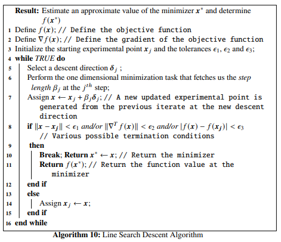
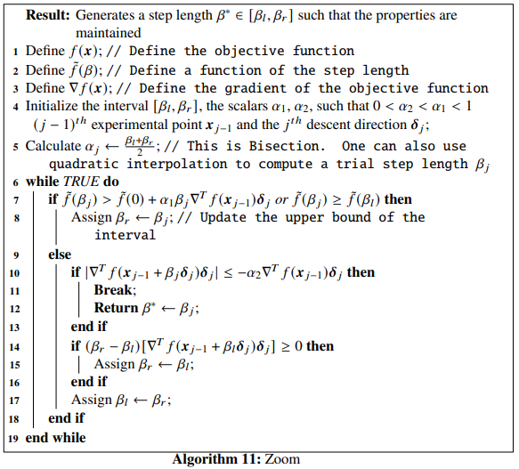
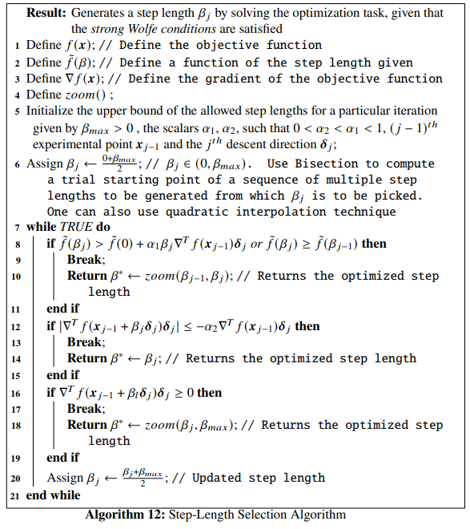
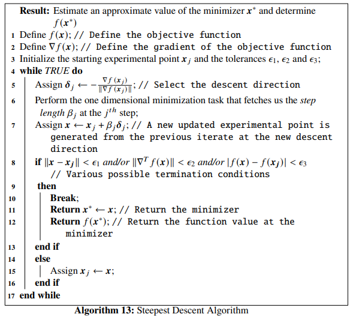
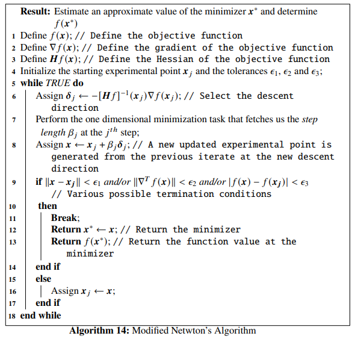
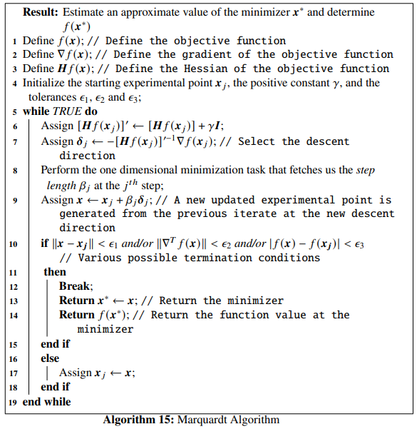

# Line Search Descent Methods

This chapter starts with an outline of a simple **line-search descent algorithm**, before introducing the **Wolfe conditions** and how to use them to design an algorithm for selecting a step length at a chosen descent direction at each step of the line search algorithms. Then a first order line search descent algorithm called the **Steepest Descent Algorithm** and a second order line search descent algorithm, called the **Modified Newton Method** have been discussed. Examples, Python programs and proofs accompanying each section of the chapter have been provided, wherever required. Finally, before ending the chapter with **Marquardt method**, motivations to study **Conjugate Gradient Methods** and **Quasi-Newton Methods** have been explored, which will be introduced in detailed manner in the next and later chapters.

---

## Introduction to Line Search Descent Methods for Unconstrained Minimization

In the *line search descent methods*, the optimization technique picks a direction $\mathbb{\delta_j}$ to begin with, for the $j^{th}$ step and carries out a search along this direction from the previous experimental point, to generate a new iterate. The iterative process looks like:
\begin{equation}
    \mathbb{x}_j = \mathbb{x}_{j-1}+\beta_{j}\mathbb{\delta}_j, \mathbb{x} \in \mathbb{R}^n (\#eq:1)
\end{equation}

Here, $\beta_j$ is a positive scalar number at the $j^{th}$ step , called the *step length*. The performance of a line search descent algorithm depends on the selection of both the *step length* $\beta_j$ and the descent direction $\mathbb{\delta}_j$. The condition for selecting the direction $\mathbb{\delta}_j$for the next iterate :

\begin{equation}
\nabla^T f(\mathbb{x}_{j-1})\mathbb{\delta}_j < 0 (\#eq:2)
\end{equation}
i.e, the directional derivative in the direction $\mathbb{\delta}_j$ should be negative. The step length $\beta_j$ is computed by solving the one dimensional optimization problem formulated as:
\begin{equation}
    \underset{\beta_j > 0}{\min} \tilde{f}(\beta_j) = \underset{\beta_j > 0}{\min} f(\mathbb{x}_{j-1} + \beta_j \mathbb{\delta}_j) (\#eq:3)
\end{equation}

The general algorithm for a line search descent method is given below:



## Selection of Step Length

While finding a suitable step length $\beta_j$ at the $j^{th}$ iteration, we should keep in mind that the choice should be such that there is an acceptable reduction in the objective function value. We work towards solving a minimization task formulated as:

\begin{equation}
    \tilde{f}(\beta) = f(\mathbb{x}_{j-1} + \beta\mathbb{\delta}_j),\ \  \beta > 0 (\#eq:4)
\end{equation}

The algorithm should be designed in such a way that too many computations of the objective function and its gradient should be avoided. This can be achieved by performing *inexact* line searches, to compute the local minimizer of $\tilde{f}$. As we discussed earlier, there should be a condition for choosing $\beta_j$ at each iterate. The condition:

\begin{equation}
    f(\mathbb{x}_j) > f(\mathbb{x}_{j-1} + \beta_j\mathbb{\delta}_j) (\#eq:5)
\end{equation}

does not suffice alone. We need to have a sufficient decrease condition known as the *wolfe conditions*.

### The Wolfe Conditions

The step length $\beta_j$, chosen at each iteration, must result in a *sufficient decrease* in the objective function $f(\mathbb{x})$ given by:

\begin{equation}
    f(\mathbb{x}_{j-1} +\beta_j\mathbb{\delta}_j) \leq f(\mathbb{x}_j) + \alpha_1 \beta_j\nabla^Tf(\mathbb{x}_j)\mathbb{\delta}_j,\ \ \ \ \alpha_1 \in (0, 1) (\#eq:6)
\end{equation}

This is also called the *Armijo condition*. Practically, the value of $\alpha_1$ should be very small, for example in the order of $10^{-4}$. But the *Armijo condition* itself is not enough to guarantee a reasonable progress in the algorithm. To avoid unacceptably short step lengths, there is another condition given by:
\begin{equation}
    \nabla^Tf(\mathbb{x}_{j-1} + \beta_j\mathbb{\delta}_j)\mathbb{\delta}_j \geq \alpha_2\nabla^Tf(\mathbb{x}_{j-1})\mathbb{\delta}_j,\ \ \ \ \alpha_2 \in (\alpha_1, 1) (\#eq:7)
\end{equation}

This is also called the *curvature condition*. Practically $\alpha_2$ is chosen between $0.1 - 0.9$ depending on the algorithms we consider. Eq. \@ref(eq:6) and Eq. \@ref(eq:7) together form the *Wolfe conditions*. Further more, the *curvature condition* can be modified to steer away from cases where a step length might satisfy the *Wolfe conditions* without being close to the minimizer of $\tilde{f}(\beta)$. The modified version of Eq. \@ref(eq:7) can be written as:
\begin{equation}
    |\nabla^Tf(\mathbb{x}_{j-1} + \beta_j\mathbb{\delta}_j)\mathbb{\delta}_j| \leq \alpha_2|\nabla^Tf(\mathbb{x}_{j-1})\mathbb{\delta}_j| (\#eq:8)
\end{equation}
So, Eq. \@ref(eq:6) and Eq. \@ref(eq:7) together form the *strong Wolfe conditions*. For the *strong Wolfe conditions* the term $\nabla^Tf(\mathbb{x}_{j-1} + \beta_j\mathbb{\delta}_j)\mathbb{\delta}_j$ is no longer ``too positive'' unlike the case for the *Wolfe conditions*.

### An Algorithm for the Strong Wolfe Conditions

Before moving on to the line search algorithm for the *strong wolfe conditions*, we discuss a straightforward algorithm called *zoom* which takes in two values $\beta_l$ and $\beta_r$ that bounds the interval $[\beta_l, \beta_r]$ containing the step lengths that satisfy the *strong Wolfe conditions*. This algorithm has been originally introduced in the classic book by Nocedal and Wright. The purpose of this algorithm is to generate an iterate $\beta_j \in [\beta_l, \beta_r]$ at each step and replaces either $\beta_l$ or $\beta_r$ with $\beta_j$ in such a way that the following properties are maintained:

* The step length $\beta_j$ satisfying the *strong Wolfe conditions* lies in the interval $[\beta_l, \beta_r]$,
* $\beta_l$ is the step length which after a particular iteration gives the lowest function value besides satisfying the *Armijo conditions*,
* $\beta_r$ is chosen such that the following condition is satisfied:
\begin{equation}
        (\beta_r -\beta_l)[\nabla^Tf(\mathbb{x}_{j-1} + \beta_l\mathbb{\delta}_j)\mathbb{\delta}_j] < 0 (\#eq:9)
\end{equation}

The algorithm for *zoom* is given below:



Now, we describe the algorithm for finding an optimized step length $\beta_j$ at the $j^{th}$ iterate in a line search algorithm, solving the minimization task formulated by Eq. \@ref(eq:3). The *step-length selection algorithm* satisfying the *strong Wolfe conditions* is given below:



The first part of the above algorithm, starts with a trial estimate of the step length and keeps on increasing it at each step until it finds either an acceptable length or an interval bracketing the optimized step lengths. The *zoom()* function , given by **Algorithm 11**, is called in the second part which reduces the size of this interval until the optimized step length is reached.

```{example}
Let us consider the *Himmelblau's function* as the objective function, given by,
\begin{equation}
    f(x_1, x_2) = (x_1^2 + x_2 - 11)^2 + (x_1 + x_2^2 - 7)^2 (\#eq:10)
\end{equation}
```

Let the starting point be $\mathbb{x}=\begin{bmatrix}-2.5 \\ 2.8 \end{bmatrix}$, the descent direction be $\mathbb{\delta}=\begin{bmatrix}-2.5 \\ -1 \end{bmatrix}$, $\alpha_1$ and $\alpha_2$ be $10^{-4}$ and $0.325$ respectively, and the upper bound be $\beta_{max}=0.6$. For this descent direction, we will compute the step length for generating the next iterate from the starting point using **Algorithm 11**. The *step-length selection algorithm* solves the optimization problem given by Eq. \@ref(eq:4) for the parameters provided in this example. Let us first define the objective function and its gradient using Python.

```{python}
# First let us import all the necessary packages
import matplotlib.pyplot as plt
import numpy as np
import autograd.numpy as au
from autograd import grad, jacobian
import scipy

def himm(x): # Objective function
    return (x[0]**2 + x[1] - 11)**2 + (x[0] + x[1]**2 - 7)**2

grad_himm = grad(himm) # Gradient of the objective function
```

We will now plot the objective function. 

```{python, results=FALSE}
x = np.linspace(-6, 6, 100)
y = np.linspace(-6, 6, 100)
z = np.zeros(([len(x), len(y)]))
for i in range(0, len(x)):
    for j in range(0, len(y)):
        z[j, i] = himm([x[i], y[j]])

contours=plt.contour(x, y, z, 100, cmap=plt.cm.gnuplot)
plt.clabel(contours, inline=1, fontsize=10)

plt.show()
```

We will use the `line_search()` function from the `scipy.optimize` module which is a Python implementation of the *step-length selection algorithm*. The attributes for the `line_search()` function are:

* `f`: This is the objective function, which is a callable datatype,
* `myfprime`: This is the gradient of the objective function and is callable,
* `xk`: This is the starting iterate, given by an `ndarray` datatype,
* `pk`: This is the descent direction given by $\mathbb{\delta}$, used for generating the next iterate point from a given starting point. This is also given by an `ndarray` datatype,
* `c1`: This is the $\alpha_1$ value from the *Armijo condition* given by Eq. \@ref(eq:6). This is an optional datatype and is a `float`,
* `c2`: This is the $\alpha_2$ value from the *curvature condition* given by Eq. \@ref(eq:7). This is an optional datatype and is a `float`,
* `amax`: This is the upper bound set for the step lengths, given by $\beta_{max}$ in *step-length selection algorithm*. This is an optional datatype and is a `float`.

There are other attributes that one can pass to the function, but they are less important but can provide with more flexibilities if provided. These are:

* `gfk`: Gives the gradient value at the current iterate point, $\mathbb{x}_j$. This is an optional parameter and is a `float`,
* `old_fval`: This gives the function value at the current iterate point, $\mathbb{x}_j$. The parameter is optional and is a `float`,
* `old_old_fval`: This gives the function value at the point preceding the current iterate point,i.e, $\mathbb{x}_{j-1}$. This is optional and is a `float`, 
* `args`: These are the additional arguments that might be passed to the objective function. This is optional and is a Python `tuple`,
* `maxiter`: This is the maximum number of iterations that are needed to be performed by the optimization algorithm. This is optional too and is an `int` datatype, and
* `extra_condition`: This is a callable function having the following form: `extra_condition(beta, current_iterate, function, gradient)`. The step length `beta` is accepted if only this function returns `True`, otherwise the algorithm continues with the new iterates. This callable function is only invoked for those iterates which satisfy the *strong Wolfe conditions*.

The `scipy.optimize.line_search()` method returns the following:

* The optimized step length $\beta$ solving Eq. \@ref(eq:3) for the next iterate from the current iterate. This will either be a `float` or a `None`,
* The number of function evaluations made. This is an `int`,
* The number of gradient evaluations made. This is an `int`,
* The function value given by Eq. \@ref(eq:4) with the computed step length. This will be a `float` if the algorithm converges, otherwise this will be a `None`,
* The function value at the starting point, the algorithm starts with. This is a `float` too, and
* The local slope along the descent direction at the new value. This will be a `float` if the algorithm converges, otherwise, this will be a `None`.

Now, for our example, we enter the values of the starting point, the descent direction, the constants $\alpha_1$ and $\alpha_2$ and the upper bound on the step lengths for the `scipy.optimize.line_search()` and print the results.

```{python}
from scipy.optimize import line_search

start_point = np.array([-2.5, 2.8])
delta = np.array([-2.5, -1])
alpha_1 = 10**-4
alpha_2 = 0.325
beta_max = 0.6

res=line_search(f = himm, myfprime = grad_himm, xk = start_point, pk = delta, c1 = alpha_1, c2 = alpha_2, amax = beta_max)
res
```

We see that the optimized step length is $\sim 0.04$, the number of function evaluations made is $4$, the number of gradient evaluations made is $1$, the function value at the new step length is $\tilde{f(\beta)}\sim 6.11$, the function value at the starting point is $\sim 6.56$ and the local slope along the descent direction is $\sim \begin{bmatrix} 11.13 \\ -25 \end{bmatrix}$.

## First Order Line Search Gradient Descent Method: The Steepest Descent Algorithm

Optimization methods that use the gradient vector $\nabla^Tf(\mathbb{x})$ to compute the descent direction $\mathbb{\delta}_j$ at each iteration, are referred to as the *first order line search gradient descent methods*. We will discuss the *steepest descent algorithm* that falls under this category. It is also called the *Cauchy method*, as it was first introduced by the french mathematician Cauchy in 1847.

Now, we explore, how to select the direction of the *steepest descent algorithm*. At the iterate $\mathbb{x}_{j-1}$, the direction of the steepest descent, given by the unit vector $\mathbb{\delta}_j$ is chosen, such that the directional derivative $\nabla^Tf(\mathbb{x}_{j-1})\mathbb{\delta}_j$ takes a minimum value for all possible values of $\mathbb{\delta}_j$ at $\mathbb{x}_{j-1}$. Now, using Schwartz's inequality,
\begin{equation}
    \nabla^Tf(\mathbb{x}_{j-1})\mathbb{\delta}_j \geq - \|\nabla^Tf(\mathbb{x}_{j-1})\|\|\mathbb{\delta}_j\| \geq - \|\nabla^Tf(\mathbb{x}_{j-1})\| (\#eq:11)
\end{equation}

The value $- \|\nabla^Tf(\mathbb{x}_{j-1})\|$ is the minimum value. Now, from the first and the third terms in the Eq. \@ref(eq:11), we can write,
\begin{equation}
    \mathbb{\delta}_j = -\frac{\nabla f(\mathbb{x}_{j-1})}{\|\nabla f(\mathbb{x}_{j-1})\|} (\#eq:12)
\end{equation}

The expression in Eq. \@ref(eq:12) is the *normalised direction of the steepest descent algorithm*. The *Steepest Direction Algorithm* is given below:



```{example}
Let us again consider Himmelblau's function as the objective function, given by,
\begin{equation}
    f(x_1, x_2) = (x_1^2 + x_2 - 11)^2 + (x_1 + x_2^2 - 7)^2 \nonumber
\end{equation}
```

The function has four local minima:

* $f(3., 2.) = 0$,
* $f(-2.8051, 3.1313) = 0$,
* $f(-3.7793, -3.2831) = 0$, and
* $f(3.5844, -1.8481) = 0$.

We will find one of these local minima of Himmelblau's function, using the *steepest descent algorithm* in Python. Let the starting iterate be $\mathbb{x}_j = \begin{bmatrix}1.1 \\ 2.2\end{bmatrix}$, the tolerances be $\epsilon_1 = \epsilon_2 = \epsilon_3 = 10^{-5}$, and the constants to be used in determining the step length using the *strong Wolfe conditions* be $\alpha_1 = 10^{-4}$ and $\alpha_2=0.212$. Let us rewrite Himmelblau's function and its gradient in Python:

```{python}
def func(x): # Objective function (Himmelblau's function)
    return (x[0]**2 + x[1] - 11)**2 + (x[0] + x[1]**2 - 7)**2

Df = grad(func) # Gradient of the objective function
```

We will use `numpy`'s `linalg.norm()` function for calculating the norm of a vector or a matrix.

```{python}
NORM = np.linalg.norm
```

Suppose, we want to calculate the norm of the vector, $v = \begin{bmatrix}-1.1 \\ 2.3 \\ 0.1 \end{bmatrix}$. We use the `NORM()` function we just defined:

```{python}
v = np.array([-1.1, 2.3, 0.1])
```

Next, we visualize the objective function on a two dimensional space identical to the one that we already generated above, for setting up an environment to visualize the trajectory of the optimization. And finally, we write the Python function `steepest_descent()` implementing the *steepest descent algorithm*:

```{python, results=FALSE}

x1 = np.linspace(-6, 6, 100)
x2 = np.linspace(-6, 6, 100)
z = np.zeros(([len(x1), len(x2)]))
for i in range(0, len(x1)):
    for j in range(0, len(x2)):
        z[j, i] = func([x1[i], x2[j]])

contours=plt.contour(x1, x2, z, 100, cmap=plt.cm.gnuplot)
plt.clabel(contours, inline=1, fontsize=10)
plt.xlabel("$x_1$ ->")
plt.ylabel("$x_2$ ->")


def steepest_descent(Xj, tol_1, tol_2, tol_3, alpha_1, alpha_2):
    x1 = [Xj[0]]
    x2 = [Xj[1]]
    while True:
        D = Df(Xj)
        delta = - D / NORM(D) # Selection of the direction of the steepest descent
        
        start_point = Xj # Start point for step length selection 
        beta = line_search(f=func, myfprime=Df, xk=start_point, pk=delta, c1=alpha_1, c2=alpha_2)[0] # Selecting the step length
        if beta!=None:
            X = Xj+ beta*delta
        if NORM(X - Xj) < tol_1 and NORM(Df(X)) < tol_2 or abs(func(X) - func(Xj)) < tol_3:
            x1 += [X[0], ]
            x2 += [X[1], ]
            plt.plot(x1, x2, "rx-", ms=5.5) # Plot the final collected data showing the trajectory of optimization
            plt.show()
            return X, func(X)
        else:
            Xj = X
            x1 += [Xj[0], ]
            x2 += [Xj[1], ]
```

According to our example, we set our parameter values and pass them to the `steepest_descent()` function:

```{python}
steepest_descent(np.array([1.1, 2.2]), 10**-5, 10**-5, 10**-5, 10**-4, 0.212)
```

We see that for our choice of parameters, the algorithm has converged to the minimizer $\mathbb{x}^* \sim \begin{bmatrix} 3 \\ 2 \end{bmatrix}$ for our objective function, where the function value is $0$. The optimization data has been collected and shown below:

```{python, echo=FALSE}
import pandas as pd
from tabulate import tabulate

def steepest_descent(Xj, tol_1, tol_2, tol_3, alpha_1, alpha_2):
    x1 = [Xj[0]]
    x2 = [Xj[1]]
    F = [func(Xj)]
    DF = [NORM(Df(Xj))]
    while True:
        #print("X =", Xj, "f(X)=", f(Xj), "Df(X)=", Df(Xj))
        D = Df(Xj)
        delta = - D / NORM(D) # Selection of the direction of the steepest descent
        
        start_point = Xj # Start point for step length selection 
        beta = line_search(f=func, myfprime=Df, xk=start_point, pk=delta, c1=alpha_1, c2=alpha_2)[0] # Selecting the step length
        if beta!=None:
            X = Xj+ beta*delta
        if NORM(X - Xj) < tol_1 and NORM(Df(X)) < tol_2 or abs(func(X) - func(Xj)) < tol_3:
            x1 += [X[0], ]
            x2 += [X[1], ]
            F += [func(X)]
            DF += [NORM(Df(X))]
            data = {'x_1': x1,
            'x_2': x2,
            'f(X)': F,
            '||grad||': DF}
            return data
        else:
            Xj = X
            x1 += [Xj[0], ]
            x2 += [Xj[1], ]
            F += [func(Xj)]
            DF += [NORM(Df(Xj))]
            d1 = - Df(Xj) / NORM(Df(Xj))

                                                           
#steepest_descent(np.array([5., -2.1]), 10**-5, 10**-5, 10**-5, 10**-4, 0.325)
data = steepest_descent(np.array([1.1, 2.2]), 10**-5, 10**-5, 10**-5, 10**-4, 0.212)
#steepest_descent(np.array([-6., 4.1]), 10**-5, 10**-5, 10**-5, 10**-4, 0.5)

df = pd.DataFrame(data, columns = ['x_1', 'x_2', 'f(X)', '||grad||'])
print(tabulate(df, headers='keys', tablefmt='psql'))
```

We can further experiment by changing the parameters, for example, the initial iterate and/or the constants for the *strong Wolfe conditions* and try to visualize the optimization steps and check for any errors that might arise.

```{theorem}
For a sequence of line search descent directions $\mathbb{\delta}_i$, where, $i = 1, \ldots, n$, the successive directions are orthogonal to each other.
```

```{proof}
Suppose, the line search at iterate $\mathbb{x}_{j-1}$ gives a descent direction $\mathbb{\delta}_j$, which yields us the next iterate $\mathbb{x}_j$. The descent direction $\mathbb{\delta}_j$ is an optimum value, if the following condition is satisfied:
\begin{equation}

    \nabla^Tf(\mathbb{x}_j)\mathbb{\delta}_j = 0 (\#eq:13)
\end{equation}

Also, from Eq. \@ref(eq:12), we have,
\begin{equation}
    \mathbb{\delta}_{j+1} = - \frac{\nabla f(\mathbb{x}_j)}{\|\nabla f(\mathbb{x}_j)\|} (\#eq:14)
\end{equation}

Now, multiplying Eq. \@ref(eq:13) and Eq. \@ref(eq:14), we get,
\begin{equation}
    \mathbb{\delta_{j+1}}^T\mathbb{\delta_j} = 0 (\#eq:15)
\end{equation}

Eq.\@ref(eq:15) tells us that the successive search directions are orthogonal to each other. This completes our proof of **Theorem 4.1**.
```

We will now look into the rate of convergence of the *steepest descent algorithm*.

```{theorem}
Given a nonlinear objective function $f(\mathbb{x}), \mathbb{x} \in \mathbb{R}^n$, the steepest descent algorithm that computes its minimizer, exhibits a linear convergence in the function values for a constant $\Delta <1$ such that the following condition for the experiments, is satisfied:
\begin{equation}
    \frac{f(\mathbb{x}_j) - f(\mathbb{x}^*)}{f(\mathbb{x}_{j-1})-f(\mathbb{x}^*)} \leq \Delta \nonumber 
\end{equation}
where, $j$ is sufficiently large and $\mathbb{x}^*$ denotes the minimizer
```

```{proof}
For the proof, let us consider the ideal case where the objective function is quadratic, i.e, 
\begin{equation}
    f(\mathbb{x}) = \frac{1}{2}\mathbb{x}^T\mathbb{A}\mathbb{x} + \mathbb{b}^T\mathbb{x} (\#eq:16)
\end{equation}

Here, $\mathbb{A}$ is a positive definite symmetric matrix. The optimum solution of $f(\mathbb{x})$ is computed as:
\begin{equation}
    -\mathbb{A}\mathbb{x}^*= \mathbb{b} (\#eq:17)
\end{equation}

This yields us,
\begin{equation}
    f(\mathbb{x}^*) = -\frac{1}{2}\mathbb{b}^T\mathbb{A}^{-1}\mathbb{b} (\#eq:18)
\end{equation}

Let the direction of steepest descent be,
\begin{equation}
    \mathbb{\delta} = -\nabla^Tf(\mathbb{x}) = -\mathbb{A}\mathbb{x} - \mathbb{b} (\#eq:19)
\end{equation}

letting $\mathbb{x}$ be the current iterate and $\beta$ be the step length, we have,
\begin{align}
    f(\mathbb{x} + \beta \mathbb{\delta}) &= \frac{1}{2}(\mathbb{x} + \beta \mathbb{\delta})^T\mathbb{A}(\mathbb{x} + \beta \mathbb{\delta}) + \mathbb{b}^T(\mathbb{x} + \beta \mathbb{\delta}) (\#eq:20)\\
    &= \frac{1}{2}\mathbb{x}^T\mathbb{A}\mathbb{x} + \mathbb{\beta}\mathbb{\delta}^T\mathbb{A}\mathbb{x} + \frac{1}{2}\beta^2\mathbb{\delta}^T\mathbb{A}\mathbb{\delta}+\mathbb{b}^T\mathbb{x} + \beta\mathbb{b}^T\mathbb{\delta} (\#eq:21)
\end{align}

Now from Eq. \@ref(eq:16), we can write Eq. \@ref(eq:21) as,
\begin{align}
    f(\mathbb{x} + \beta\mathbb{\delta}) &= f(\mathbb{x}) + \frac{1}{2}\beta^2\mathbb{\delta}^T\mathbb{A}\mathbb{\delta}+ \beta\mathbb{\delta}^T\mathbb{A}\mathbb{x} + \beta\mathbb{b}^T\mathbb{\delta} (\#eq:22)
\end{align}
    
We see that using Eq. \@ref(eq:19), we can write,
\begin{align}
    \beta\mathbb{\delta}^T\mathbb{A}\mathbb{x} + \beta\mathbb{b}^T\mathbb{\delta} = \beta\mathbb{\delta}^T\mathbb{A}\mathbb{x} + \beta\mathbb{\delta}^T\mathbb{b}= - \beta\mathbb{\delta}^T\mathbb{\delta} (\#eq:23)
\end{align}

So using Eq. \@ref(eq:23) in Eq. \@ref(eq:22), we will have,
\begin{equation}
    f(\mathbb{x} + \beta\mathbb{\delta})=f(\mathbb{x})-\beta\mathbb{\delta}^T\mathbb{\delta}+\frac{1}{2}\beta^2\mathbb{\delta}^T\mathbb{A}\mathbb{\delta} (\#eq:24)
\end{equation}

Now differentiating Eq. \@ref(eq:24) with respect to $\beta$ and setting it equal to $0$, we have,
\begin{align}
\frac{\partial f(\mathbb{x} + \beta\mathbb{\delta})}{\partial \beta} = -\mathbb{\delta}^T\mathbb{\delta} + \beta\mathbb{\delta}^T\mathbb{A}\mathbb{\delta}=0 (\#eq:25)
\end{align}
This gives, 
\begin{equation}
    \beta = \frac{\mathbb{\delta}^T\mathbb{\delta}}{\mathbb{\delta}^T\mathbb{A}\mathbb{\delta}} (\#eq:26)
\end{equation}

Let the next iterate the algorithm generates from $\mathbb{x}$ be $\mathbb{x}'$, given by,
\begin{equation}
    \mathbb{x}' = \mathbb{x} + \frac{\mathbb{\delta}^T\mathbb{\delta}}{\mathbb{\delta}^T\mathbb{A}\mathbb{\delta}}\mathbb{\delta} (\#eq:27)
\end{equation}

So,
\begin{align}
    f(\mathbb{x}') = f(\mathbb{x} + \beta\mathbb{\delta}) &=& f(\mathbb{x}) - \beta\mathbb{\delta}^T\mathbb{\delta}+\frac{1}{2}\beta^2\mathbb{\delta}^T\mathbb{A}\mathbb{\delta} \nonumber \\
    &=& f(\mathbb{x}) - \beta^2\mathbb{\delta}^T\mathbb{A}\mathbb{\delta} + \frac{1}{2}\beta^2\mathbb{\delta}^T\mathbb{A}\mathbb{\delta} (\#eq:28)
\end{align}

We get the above equation, using the fact from Eq. \@ref(eq:26) that 
\begin{equation}
    \mathbb{\delta}^T\mathbb{\delta} = \beta\mathbb{\delta}^T\mathbb{A}\mathbb{\delta} (\#eq:29)
\end{equation}
So, Eq. \@ref(eq:28) reduces to,
\begin{align}
    f(\mathbb{x}') &= f(\mathbb{x}) - \frac{1}{2}\beta^2\mathbb{\delta}^T\mathbb{A}\mathbb{\delta} \nonumber \\
    &= f(\mathbb{x}) - \frac{1}{2}\frac{(\mathbb{\delta}^T\mathbb{\delta})^2}{\mathbb{\delta}^T\mathbb{A}\mathbb{\delta}} (\#eq:30)
\end{align}

Therefore, we have,
\begin{align}
    \frac{f(\mathbb{x}')-f(\mathbb{x}^*)}{f(\mathbb{x}) - f(\mathbb{x}^*)} &= \frac{f(\mathbb{x}) - \frac{1}{2}\frac{(\mathbb{\delta}^T\mathbb{\delta})^2}{\mathbb{\delta}^T\mathbb{A}\mathbb{\delta}}-f(\mathbb{x}^*)}{f(\mathbb{x}) - f(\mathbb{x}^*)} (\#eq:31)
\end{align}

Now, using Eq. \@ref(eq:16) and Eq. \@ref(eq:18), we have,
\begin{equation}
    \frac{f(\mathbb{x}')-f(\mathbb{x}^*)}{f(\mathbb{x}) - f(\mathbb{x}^*)} = 1 - \frac{\frac{1}{2}\frac{(\mathbb{\delta}^T\mathbb{\delta})^2}{\mathbb{\delta}^T\mathbb{A}\mathbb{\delta}}}{\frac{1}{2}\mathbb{x}^T\mathbb{A}\mathbb{x} + \mathbb{b}^T\mathbb{x}+\frac{1}{2}\mathbb{b}^T\mathbb{A}^{-1}\mathbb{b}} (\#eq:32)
\end{equation}

As $\mathbb{A}$ is symmetric, $\mathbb{A}^T = \mathbb{A}$. Also, from the property of dot product, we know that $\mathbb{b}^T\mathbb{x} = \mathbb{x}^T\mathbb{b}$. We now use these properties to simplify the denominator of the second element of Eq. \@ref(eq:32).

\begin{align}
    \frac{1}{2}\mathbb{x}^T\mathbb{A}\mathbb{x} + \mathbb{b}^T\mathbb{x}+\frac{1}{2}\mathbb{b}^T\mathbb{A}^{-1}\mathbb{b} &= \frac{1}{2}[\mathbb{x}^T\mathbb{A}\mathbb{x} + \mathbb{x}^T\mathbb{b} + \mathbb{b}^T\mathbb{x} + \mathbb{b}^T\mathbb{A}^{-1}\mathbb{b}] \nonumber \\
    &= \frac{1}{2}[(\mathbb{x}^T\mathbb{A}+\mathbb{b}^T)(\mathbb{x}+\mathbb{A}^{-1}\mathbb{b})] \nonumber \\
    &= \frac{1}{2}[(\mathbb{x}^T\mathbb{A}^T+\mathbb{b}^T)(\mathbb{x}+\mathbb{A}^{-1}\mathbb{b})] \nonumber \\
    &= \frac{1}{2}(\mathbb{A}\mathbb{x} + \mathbb{b})^T(\mathbb{x}+\mathbb{A}^{-1}\mathbb{b}) \nonumber \\
    &= \frac{1}{2}(\mathbb{A}\mathbb{x} + \mathbb{b})^T\mathbb{A}^{-1}(\mathbb{A}\mathbb{x} + \mathbb{b}) (\#eq:33)
\end{align}

Therefore, we can modify Eq. \@ref(eq:32) as,
\begin{equation}
    \frac{f(\mathbb{x}')-f(\mathbb{x}^*)}{f(\mathbb{x}) - f(\mathbb{x}^*)} = 1 - \frac{\frac{1}{2}\frac{(\mathbb{\delta}^T\mathbb{\delta})^2}{\mathbb{\delta}^T\mathbb{A}\mathbb{\delta}}}{\frac{1}{2}(\mathbb{A}\mathbb{x} + \mathbb{b})^T\mathbb{A}^{-1}(\mathbb{A}\mathbb{x} + \mathbb{b})} (\#eq:34)
\end{equation}

Now, using Eq.\@ref(eq:19) we can write,
\begin{eqnarray}
    \frac{f(\mathbb{x}')-f(\mathbb{x}^*)}{f(\mathbb{x}) - f(\mathbb{x}^*)} = 1 - \frac{(\mathbb{\delta}^T\mathbb{\delta})^2}{(\mathbb{\delta}^T\mathbb{A}\mathbb{\delta})(\mathbb{\delta}^T\mathbb{A}^{-1}\mathbb{\delta})} = 1 - \frac{1}{\zeta} (\#eq:35)
\end{eqnarray}

where, 
\begin{equation}
    \zeta = \frac{(\mathbb{\delta}^T\mathbb{A}\mathbb{\delta})(\mathbb{\delta}^T\mathbb{A}^{-1}\mathbb{\delta})}{(\mathbb{\delta}^T\mathbb{\delta})^2} (\#eq:36)
\end{equation}

We want $\zeta$ to be small such that we get a fast linear convergence for the algorithm. To compute an upper bound on the value of $\zeta$, we use the *Kantorovich Inequality*, [ref, lecture note by Robert M. Freund, The steepest descent algorithm for Unconstrained Optimization and a Bisection Line-search Method, MIT] (look into the lecture note for the derivation of the Kantorovich inequality], given by:
\begin{equation}
    \zeta \leq \frac{(\lambda_{max} + \lambda_{min})^2}{4\lambda_{max}\lambda_{min}} (\#eq:37)
\end{equation}

where, $\lambda_{max}$ and $\lambda_{min}$ are the largest and the smallest eigenvalues of the matrix $\mathbb{A}$. Using Eq. \@ref(eq:37) in Eq. \@ref(eq:35), we have,

\begin{align}
    \frac{f(\mathbb{x}')-f(\mathbb{x}^*)}{f(\mathbb{x}) - f(\mathbb{x}^*)} &= 1 - \frac{1}{\zeta} \nonumber \\
    &\leq 1 - \frac{(\lambda_{max} + \lambda_{min})^2}{4\lambda_{max}\lambda_{min}} \nonumber \\
    &= \frac{(\lambda_{max} - \lambda_{min})^2}{(\lambda_{max} + \lambda_{min})^2}\nonumber \\ 
    &= \frac{(\frac{\lambda_{max}}{\lambda_{min}}-1)^2}{(\frac{\lambda_{max}}{\lambda_{min}}+1)^2} \nonumber \\
    &= \Delta (\#eq:38)
\end{align}

$\Delta$is called the *convergence constant*. The eigenvalues of $A$ follows the following chain of inequalities:
\begin{equation}
    \lambda_{max} = \lambda_1 \geq \lambda_2 \geq \ldots \geq \lambda_n = \lambda_{min}>0 (\#eq:39)
\end{equation}

From Eq. \@ref(eq:39) we can say that $\frac{\lambda_{max}}{\lambda_{min}}$ is at least $1$. There arises two conditions:

* If $\frac{\lambda_{max}}{\lambda_{min}}$ is small, then $\Delta$ will be much less than $1$,
* If $\frac{\lambda_{max}}{\lambda_{min}}$ is large, then $\Delta$ will be only slightly less than 1.
```


## Conjugate Gradient Methods
The performance of the *steepest descent algorithm* is often not up the mark, generating a zigzag path of steps decreasing in size. This leads to a slow convergence of the problem at hand when the decision variables are poorly scaled. The algorithm might not always efficiently converge within a finite number of steps. This inefficient convergence also happens when the algorithm works on a positive-definite quadratic objective functions for some starting points $\mathbb{x}_0$. To overcome the mentioned inefficiencies, we will introduce another class of first order line search gradient descent algorithms called the *conjugate gradient algorithms*, which will always converge to the minimizer of the given objective function within finite number of iterations, irrespective of the scaling of the decision variables. The *conjugate gradient methods* form an important class of algorithms and we will dedicate our next chapter discussing this class of methods.

## Second Order Line Search Gradient Descent Method
In **Section 4.3** we have introduced the *first order line search gradient descent method*. We will now study methods which uses the Hessian of the objective function, $\mathbb{H}f(\mathbb{x})$, to compute the line search. At each step, the search is given by,

\begin{equation}
    \mathbb{\delta} = -[\mathbb{H}f]^{-1}(\mathbb{x})\nabla f(\mathbb{x}) (\#eq:40)
\end{equation}

The *Newton's method* for a nonlinear objective function of a single variable has already been introduced in **Section 3.7**, as given by Eq. \@ref(eq:40). So, for a multivariate objective function, it modifies to 
\begin{equation}
    \mathbb{x}_j = \mathbb{x}_{j-1} - [\mathbb{H}f]^{-1}(\mathbb{x}_{j-1})\nabla f(\mathbb{x}_{j-1}),\ j=1, 2, \ldots (\#eq:41)
\end{equation}

This is used for solving the problem $\nabla f(\mathbb{x})=0$ iteratively, given the starting iterate $\mathbb{x}_0$ is provided. As we have already discussed in the last chapter, the *Newton's method* follows quadratic convergence. But convergence is not always guaranteed even from an iterate close to the minimizer, since the Hessian given by $\mathbb{H}f(\mathbb{x})$ may not always be positive definite. Now, to overcome this problem, the search given by Eq. \@ref(eq:40) is instead used as a descent direction in our *line search descent direction*. At the $j^{th}$ step, the descent direction is thus given by,
\begin{equation}
    \mathbb{\delta}_j = -[\mathbb{H}f]^{-1}(\mathbb{x}_{j-1})\nabla f(\mathbb{x}_{j-1}) (\#eq:42)
\end{equation}

Finally, the step length $\beta_j$ is selected after solving the one dimensional optimization task given by Eq. \@ref(eq:3). This modified version is known as the *modified Newton's method*. The algorithm describing the *modified Newton's method* is given below:



```{example}
Let us consider Beale's function as the objective function, having the form,
\begin{equation}
    f(x_1, x_2) = (1.5 - x_1(1-x_2))^2 + (2.25 - x_1(1-x_2^2))^2 + (2.625 - x_1(1-x_2^3))^2 (\#eq:43)
\end{equation}

The function has one global minimizer, $f(3, 0.5) = 0$. We will implement the *modified Newton algorithm* in Python and figure out the minimizer of the objective function for some input parameters. Let the starting iterate be $\mathbb{x}_j = \begin{bmatrix}1.8 \\ 0.8 \end{bmatrix}$ , the tolerances be $\epsilon_1=\epsilon_2=\epsilon_3=10^{-5}$ and the constants to be used in determining the step length using the *strong Wolfe conditions* be $\alpha_1=10^{-4}$ and $\alpha_2=0.25$. First we define Beale's function, its gradient and its Hessian using Python's `autograd` package.
```

```{python}
def func(x): # Objective function (Beale's function)
    return (1.5 - x[0]*(1-x[1]))**2 + (2.25-x[0]*(1-x[1]**2))**2+(2.625-x[0]*(1-x[1]**3))**2
Df = grad(func) # Gradient of the objective function
Hf = jacobian(Df) # Hessian of the objective function
```

Now, we define the Python function `modified_newton()`.

```{python}
def modified_newton(Xj, tol_1, tol_2, tol_3, alpha_1, alpha_2):
    x1 = [Xj[0]]
    x2 = [Xj[1]]
    while True:
        D = Df(Xj)
        inv_hess = np.linalg.inv(Hf(Xj)) # Compute the inverse of the Hessian at the given iterate
        delta = -inv_hess.dot(D) # Selection of the direction of the steepest descent
        
        
        start_point = Xj # Start point for step length selection 
        beta = line_search(f=func, myfprime=Df, xk=start_point, pk=delta, c1=alpha_1, c2=alpha_2)[0] # Selecting the step length
        if beta!=None:
            X = Xj+ beta*delta
        if NORM(X - Xj) < tol_1 and NORM(Df(X)) < tol_2 or abs(func(X) - func(Xj)) < tol_3:
            x1 += [X[0], ]
            x2 += [X[1], ]
            return X, func(X)
        else:
            Xj = X
            x1 += [Xj[0], ]
            x2 += [Xj[1], ]
```

According to our example, we set our parameter values and pass them to the `modified_newton()` function:

```{python}
modified_newton(np.array([1.8, 0.8]), 10**-5, 10**-5, 10**-5, 10**-4, 0.25)
```

We notice that, for our choice of parameters, the algorithm has converged to the minimizer $\mathbb{x}^* \sim \begin{bmatrix}3 \\ 0.5\end{bmatrix}$ and the function value at the minimizer is $\sim 0$. The optimization data has been collected and shown below:

```{python, echo=FALSE}
from scipy.optimize import line_search
NORM = np.linalg.norm # Function that gives norm of a vector

def func(x): # Objective function (Beales's function)
    return (1.5 - x[0]*(1-x[1]))**2 + (2.25-x[0]*(1-x[1]**2))**2+(2.625-x[0]*(1-x[1]**3))**2
    
Df = grad(func) # Gradient of the objective function
Hf = jacobian(Df)

def modified_newton(Xj, tol_1, tol_2, tol_3, alpha_1, alpha_2):
    x1 = [Xj[0]]
    x2 = [Xj[1]]
    F = [func(Xj)]
    DF = [NORM(Df(Xj))]
    while True:
        D = Df(Xj)
        inv_hess = np.linalg.inv(Hf(Xj))
        delta = -inv_hess.dot(D) # Selection of the direction of the steepest descent
        
        
        start_point = Xj # Start point for step length selection 
        beta = line_search(f=func, myfprime=Df, xk=start_point, pk=delta, c1=alpha_1, c2=alpha_2)[0] # Selecting the step length
        if beta!=None:
            X = Xj+ beta*delta
        if NORM(X - Xj) < tol_1 and NORM(Df(X)) < tol_2 or abs(func(X) - func(Xj)) < tol_3:
            x1 += [X[0], ]
            x2 += [X[1], ]
            F += [func(X)]
            DF += [NORM(Df(X))]
            data = {'n':range(1, len(x1)+1),
            'x_1': x1,
            'x_2': x2,
            'f(X)': F,
            '||grad||': DF}
            return data
        else:
            Xj = X
            x1 += [Xj[0], ]
            x2 += [Xj[1], ]
            F += [func(Xj)]
            DF += [NORM(Df(Xj))]

data=modified_newton(np.array([1.8, 0.8]), 10**-5, 10**-5, 10**-5, 10**-4, 0.25)

df = pd.DataFrame(data, columns = ['x_1', 'x_2', 'f(X)', '||grad||'])
print(tabulate(df, headers='keys', tablefmt='psql'))
```

We notice that in *Newton method* and the *modified Newton method*, there are requirements to compute the Hessian matrix $\mathbb{H}f(\mathbb{x})$ and also solve a $n \times n$ linear system of equations: $\mathbb{H}f(\mathbb{x})(\mathbb{x}_j - \mathbb{x}_{j-1}) = -\nabla f(\mathbb{x})$ at each iterate $j$. These will lead to computationally expensive evaluations for large $n$, the reason being that an order $n^3$ multiplication computations are required during numerically solving the system of equations. To avoid these computational difficulties methods called *quasi-Newton methods* have been developed which takes into account approximations of the inverse of the Hessian rather than the original inverse at each step. We will dedicate a separate chapter too in studying *quasi-Newton* methods.

## Marquardt Method

The *Marquardt method* is an amalgamation of the *steepest descent algorithm* and the *Newton method*. At each step $j$, the *Marquardt method* modifies the diagonal elements of the Hessian matrix in the following way:
\begin{equation}
    [\mathbb{H}f(\mathbb{x}_j)]' = [\mathbb{H}f(\mathbb{x}_j)] + \gamma\mathbb{I} (\#eq:44)
\end{equation}

where, $\gamma$ is a sufficiently large positive constant that guarantees the positive definiteness of $[\mathbb{H}f(\mathbb{x}_j)]'$ when $[\mathbb{H}f(\mathbb{x}_j)]$ is not positive definite, and $\mathbb{I}$ is the identity matrix. The descent direction in the algorithm is given by:
\begin{equation}
    \mathbb{\delta}_j = -[\mathbb{H}f(\mathbb{x}_j)]'^{-1}\nabla f(\mathbb{x}_j) (\#eq:45)
\end{equation}

The algorithm describing *Marquardt method* is given below:



```{example}
We will work on Himmelblau's function once again and try to find one of the local minima using *Marquardt algorithm*. Let the starting iterate be, $\mathbb{x}_j = \begin{bmatrix}-2 \\ -2.1 \end{bmatrix}$, the positive constant be $\gamma = 10^3$, the tolerances be $\epsilon_1=\epsilon_2 = \epsilon_3=10^{-5}$, and the constants to be used in determining the step length using the *strong Wolfe conditions* be $\alpha_1=10^{-4}$ and $\alpha_2=0.25$. The whole Python program along with the function `marquardt()` that implements the *Marquardt algorithm* is given below:
```

```{python, results=FALSE}
from scipy.optimize import line_search
NORM = np.linalg.norm # Function that gives norm of a vector

def func(x): # Objective function (Himmelblau's function)
    return (x[0]**2 + x[1] - 11)**2 + (x[0] + x[1]**2 - 7)**2
    
Df = grad(func) # Gradient of the objective function
Hf = jacobian(Df) # Hessian of the objective function

x1 = np.linspace(-6, 6, 100)
x2 = np.linspace(-6, 6, 100)
z = np.zeros(([len(x1), len(x2)]))
for i in range(0, len(x1)):
    for j in range(0, len(x2)):
        z[j, i] = func([x1[i], x2[j]])

contours=plt.contour(x1, x2, z, 100, cmap=plt.cm.gnuplot)
plt.clabel(contours, inline=1, fontsize=10)
plt.xlabel("$x_1$ ->")
plt.ylabel("$x_2$ ->")

def marquadt(Xj, gamma, tol_1, tol_2, tol_3, alpha_1, alpha_2):
    x1 = [Xj[0]]
    x2 = [Xj[1]]
    I = np.eye(len(Xj)) #Set the identity matrix with equal dimensions as that of the Hessian matrix
    while True:
        D = Df(Xj)
        Hess_tilde = Hf(Xj) + gamma*I # Diagonal elements of the Hessian modified
        inv_hess = np.linalg.inv(Hess_tilde) # Inverse of the modified Hessian
        delta = -inv_hess.dot(D) # Selection of the direction of the steepest descent
        
        
        start_point = Xj # Start point for step length selection 
        beta = line_search(f=func, myfprime=Df, xk=start_point, pk=delta, c1=alpha_1, c2=alpha_2)[0] # Selecting the step length
        if beta!=None:
            X = Xj+ beta*delta
        if NORM(X - Xj) < tol_1 and NORM(Df(X)) < tol_2 or abs(func(X) - func(Xj)) < tol_3:
            x1 += [X[0], ]
            x2 += [X[1], ]
            plt.plot(x1, x2, "rx-", ms=5.5) # Plot the final collected data showing the trajectory of optimization
            plt.show()
            return X, func(X)
        else:
            Xj = X
            x1 += [Xj[0], ]
            x2 += [Xj[1], ]
```

We set the parameter values according to what we have set in our example and pass them to the `marquardt()` function:

```{python}
marquadt(np.array([-2., -2.1]), 10**3, 10**-5, 10**-5, 10**-5, 10**-4, 0.25)
```

We see that, for our choice of parameters, the algorithm has correctly converged to the minimizer $\mathbb{x}^* \sim \begin{bmatrix}-3.7793 \\ -3.2831 \end{bmatrix}$, where the function value is $0$.

The optimization data has been collected and shown below:

```{python, echo=FALSE}
from scipy.optimize import line_search
NORM = np.linalg.norm # Function that gives norm of a vector

def func(x): # Objective function (Beale's function)
    #return (1.5 - x[0]*(1-x[1]))**2 + (2.25-x[0]*(1-x[1]**2))**2+(2.625-x[0]*(1-x[1]**3))**2
    return (x[0]**2 + x[1] - 11)**2 + (x[0] + x[1]**2 - 7)**2
    
Df = grad(func) # Gradient of the objective function
Hf = jacobian(Df) # Hessian of the objective function

def marquadt(Xj, gamma, tol_1, tol_2, tol_3, alpha_1, alpha_2):
    x1 = [Xj[0]]
    x2 = [Xj[1]]
    F = [func(Xj)]
    DF = [NORM(Df(Xj))]
    I = np.eye(len(Xj))
    while True:
        D = Df(Xj)
        Hess_tilde = Hf(Xj) + gamma*I # Diagonal elements of the Hessian modified
        inv_hess = np.linalg.inv(Hess_tilde) # Inverse of the modified Hessian
        delta = -inv_hess.dot(D) # Selection of the direction of the steepest descent
        
        
        start_point = Xj # Start point for step length selection 
        beta = line_search(f=func, myfprime=Df, xk=start_point, pk=delta, c1=alpha_1, c2=alpha_2)[0] # Selecting the step length
        if beta!=None:
            X = Xj+ beta*delta
        if NORM(X - Xj) < tol_1 and NORM(Df(X)) < tol_2 or abs(func(X) - func(Xj)) < tol_3:
            x1 += [X[0], ]
            x2 += [X[1], ]
            F += [func(X)]
            DF += [NORM(Df(X))]
            data = {'x_1': x1,
            'x_2': x2,
            'f(X)': F,
            '||grad||': DF}
            return data
        else:
            Xj = X
            x1 += [Xj[0], ]
            x2 += [Xj[1], ]
            F += [func(Xj)]
            DF += [NORM(Df(Xj))]
                                                
#marquadt(np.array([1.8, 0.8]), 10**-5, 10**-5, 10**-5, 10**-4, 0.25)
data=marquadt(np.array([-2., -2.1]), 10**3, 10**-5, 10**-5, 10**-5, 10**-4, 0.25)
df = pd.DataFrame(data, columns = ['x_1', 'x_2', 'f(X)', '||grad||'])
print(tabulate(df, headers='keys', tablefmt='psql'))
```

We now move on to the next chapter where we study *conjugate gradient methods* in more detail.