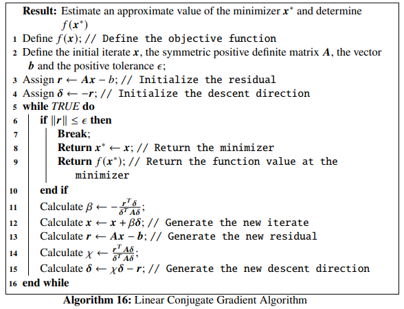
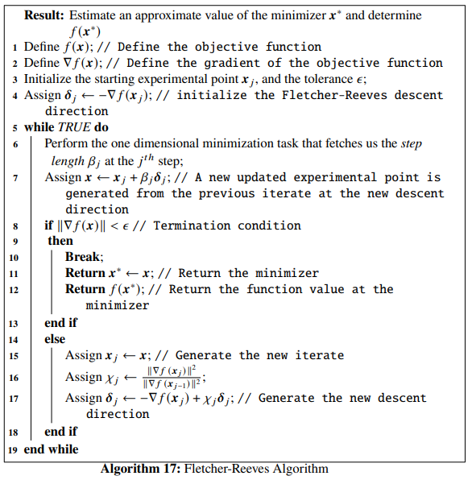
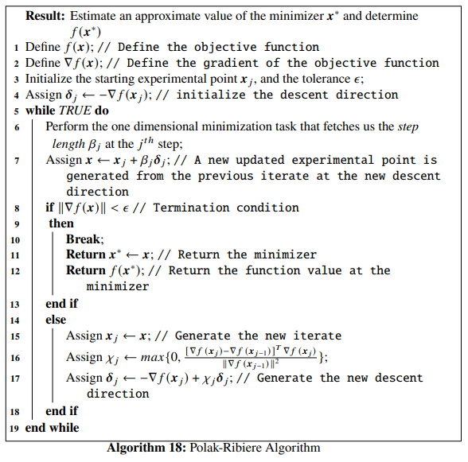
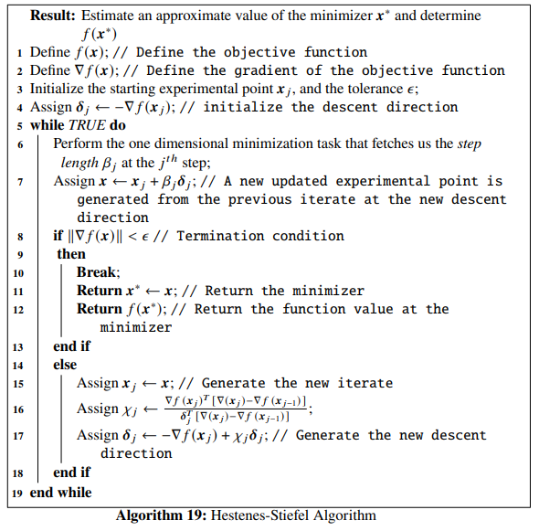
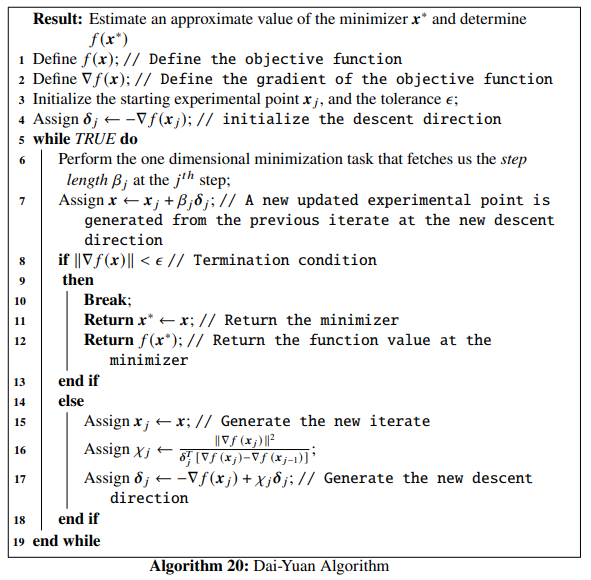
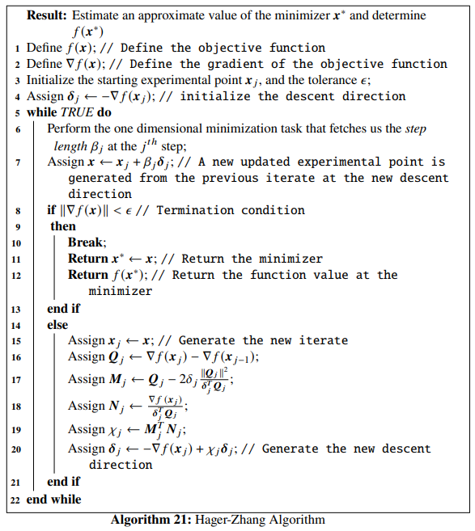

# Conjugate Gradient Methods

This chapter is dedicated to studying the *Conjugate Gradient Methods* in detail. The Linear and Non-linear versions of the CG methods have been discussed with five sub classes falling under the nonlinear CG method class. The five nonlinear CG methods that have been discussed are: *Flethcher-Reeves method*, *Polak-Ribiere method*, *Hestenes-Stiefel method*, *Dai-Yuan method* and *Hager-Zhang method*. Mathematical proofs have been provided wherever necessary. Python implementations of the algorithms have been included along with optimization examples. The chapter ends with introducing a specific Python function called the `scipy.optimize.minimize()` function that can be used to work with the *Polak-Ribiere* CG method.

---

## Introduction to Conjugate Gradient Methods

The *conjugate gradient methods* are frequently used for solving large linear systems of equations and also for solving nonlinear optimization problems. This let us characterize the *conjugate gradient methods* into two classes:

* **Linear Conjugate Gradient Method**: This is an iterative method to solve large linear systems where the coefficient matrices are positive definite. This can be treated as a replacement of the *Gaussian elimination method* in numerical analysis.
* **nonlinear Conjugate Gradient method**: This is used for solving nonlinear optimization problems. We will study five methods under this class:
  * *Fletcher-Reeves algorithm*,
  * *Polak-Ribiere algorithm*,
  * *Hestenes-Stiefel algorithm*,
  * *Dai-Yuan algorithm*, and
  * *Hager-Zhang algorithm*.
  
## Linear Conjugate Gradient Algorithm

Suppose we want to find the minimizer of an objective function, having the quadratic form:
\begin{equation}
    f(\mathbb{x}) = \frac{1}{2}\mathbb{x}^T\mathbb{A}\mathbb{x} - \mathbb{b}^T\mathbb{x} (#eq:1)
\end{equation}
where, $\mathbb{A}$ is a $n \times n$ symmetric positive definite matrix.The problem can be formulated as:
\begin{equation}
    \underset{\mathbb{x}\in \mathbb{R}^n}{\min} f(\mathbb{x}) = \frac{1}{2}\mathbb{x}^T\mathbb{A}\mathbb{x} - \mathbb{b}^T\mathbb{x} (#eq:2)
\end{equation}

Eq. \@ref(eq:2) can be equivalently stated as the problem of solving the linear system of equations given by:
\begin{equation}
    \mathbb{A}\mathbb{x} = \mathbb{b} (#eq:3)
\end{equation}

We use the *linear conjugate gradient method* to solve Eq. \@ref(eq:3).


The *residual* of a linear system of equations, given by Eq. \@ref(eq:3) is defined as:
\begin{equation}
    r(\mathbb{x}) = \mathbb{A}\mathbb{x} - \mathbb{b} (#eq:4)
\end{equation}


```{theorem}
The gradient of the objective function given by Eq. \@ref(eq:1) is equal to the residual of the linear system given by Eq. \@ref(eq:4).
```

```{proof}
From Eq. \@ref(eq:1), we see that the gradient of the objective function is:
\begin{equation}
    \nabla f(\mathbb{x}) = \mathbb{A}\mathbb{x} - \mathbb{b} = r(\mathbb{x}) (#eq:5)
\end{equation}
This proves the theorem.
```

### Mutual Conjugacy


For a given symmetric positive definite matrix $\mathbb{A}$, two vectors $\mathbb{v}, \mathbb{w} \neq \mathbb{0} \in \mathbb{R}^n$ are defined to be *mutually conjugate* if the following condition is satisfied:
\begin{equation}
    \mathbb{v}^T\mathbb{A}\mathbb{w} = 0 (#eq:6)
\end{equation}

```{theorem}
A set of *mutually conjugate* vectors $\mathbb{v}_j, j=1, 2, \ldots$ with respect to a positive definite symmetric matrix $\mathbb{A}$, forms a basis in $\mathbb{R}^n$, i.e., the set is linearly independent.
```

```{proof}
Above theorem equivalently states that, for $\mathbb{x} \in \mathbb{R}^n$, the following condition is satisfied:
\begin{equation}
    \mathbb{x} = \sum_{j=1}^n\lambda_j\mathbb{v}_j (#eq:7)
\end{equation}
where,
\begin{equation}
    \lambda_j = \frac{\mathbb{v}_j^T\mathbb{A}\mathbb{x}}{\mathbb{v}_j^T\mathbb{A}\mathbb{v}_j} (#eq:8)
\end{equation}
 Let us consider the linear combination,
\begin{equation}
    \sum_{j=1}^n c_j\mathbb{v}_j = \mathbb{0} (#eq:9)
\end{equation}
 Multiplying the above equation with the matrix $\mathbb{A}$, we have,
 \begin{equation}
    \sum_{j=1}^n c_j \mathbb{A}\mathbb{v}_j=\mathbb{0} (#eq:10)
\end{equation}
Since the vectors $\mathbb{v}_j$ are mutually conjugate with respect to the matrix $\mathbb{A}$, from Eq. \@ref(eq:6), we can write that,
\begin{equation}
    c_j\mathbb{v}_j^T\mathbb{A}\mathbb{v}_j = 0 (#eq:11)
\end{equation}
 
From the facts that $\mathbb{A}$ is positive definite and that $\mathbb{v}_j$ never equals $\mathbb{0}$, from Eq. \@ref(eq:11) we can state that, $c_j=0$ for $j=1, 2, \ldots, n$. This proves the fact that the set of vectors $\mathbb{v}_j$ is linearly independent and may be used as a basis. Therefore, there exists a unique set $\lambda_j, j=1, 2, \ldots, n$ for any $\mathbb{x} \in \mathbb{R}^n$, such that Eq. \@ref(eq:7) is satisfied. The positive definiteness of $\mathbb{A}$ leads to the fact that,
\begin{equation}
    \mathbb{v}_j^T\mathbb{A}\mathbb{x} = \lambda_j\mathbb{v}_j^T\mathbb{A}\mathbb{x} (#eq:12)
\end{equation}
Finally, from Eq. \@ref(eq:12) we can write that,
\begin{equation}
    \lambda_j = \frac{\mathbb{v}_j^T\mathbb{A}\mathbb{x}}{\mathbb{v}_j^T\mathbb{A}\mathbb{v}_j} (#eq:13)
\end{equation}
The proves the theorem.
```

### Conjugate Direction Algorithm

For our optimization task, where we aim to minimize the objective function $f(\mathbb{x})$, where $\mathbb{x} \in \mathbb{R}^n$, let $\mathbb{x}_0$ be the starting iterate and the conjugate directions be set as ${\mathbb{\delta}_j}, j=1, 2, \ldots, n-1$. The successive iterates are generated by following:

\begin{equation}
    \mathbb{x}_j = \mathbb{x}_{j-1}+\beta_j\mathbb{\delta}_j (#eq:14)
\end{equation}

This $\beta_j$ is the minimizer of the function $f(\mathbb{x}_{j-1}+\beta\delta_j)$. We will now find the explicit form of $\beta_j$. From Eq. \@ref(eq:1) we can write that,

\begin{align}
f(x_{j-1}+\beta \mathbb{\delta}_j) &= \frac{1}{2}[(\mathbb{x}_{j-1}+\beta\mathbb{\delta}_j)^T\mathbb{A}(\mathbb{x}_{j-1}+\beta\mathbb{\delta}_j)] - \mathbb{b}^T(\mathbb{x}_{j-1}+\beta\mathbb{\delta}_j) \nonumber \\
&= \frac{1}{2}[\mathbb{x}_{j-1}^T\mathbb{A}\mathbb{x}_{j-1}+2\beta\mathbb{x}_{j-1}^T\mathbb{A}\mathbb{\delta}_j + \beta^2\mathbb{\delta}_j^T\mathbb{A}\mathbb{\delta}_j] - \mathbb{b}^T(\mathbb{x}_{j-1}+\beta\mathbb{\delta}_j) (#eq:15)
\end{align}

Now, differentiating Eq. \@ref(eq:15) with respect to $\beta$ and setting it to $0$, we get,
\begin{align}
& \frac{\partial f(\mathbb{x}_{j-1}+\beta\mathbb{\delta}_j)}{\partial \beta} = 0 (#eq:16) \\
&\implies \mathbb{x}_{j-1}^T\mathbb{A}\mathbb{x}_{j-1} + \beta\mathbb{\delta}_j\mathbb{A}\mathbb{\delta}_j - \mathbb{b}^T\mathbb{\delta}_j = 0 \nonumber \\
&\implies (\mathbb{x}_{j-1}^T\mathbb{A} - \mathbb{b}^T)\mathbb{\delta}_j + \beta\mathbb{\delta}_j^T\mathbb{A}\mathbb{\delta}_j = 0 (#eq:17)
\end{align}

Now, from Eq. \@ref(eq:4) we can write,
\begin{equation}
    \mathbb{r}_j^T=(\mathbb{A}\mathbb{x}_{j-1}-\mathbb{b})^T = \mathbb{x}_{j-1}^T\mathbb{A} - \mathbb{b}^T (#eq:18)
\end{equation}
where, we have used the fact that $\mathbb{A}^T=\mathbb{A}$. So, from Eq. \@ref(eq:17) we can write,
\begin{equation}
    \mathbb{r}_j^T\mathbb{\delta}_j+\beta\mathbb{\delta}_j^T\mathbb{A}\mathbb{\delta}_j = 0 (#eq:19)
\end{equation}

This finally fetches us,
\begin{equation}
    \beta_j = -\frac{\mathbb{r}_j^T\mathbb{\delta}_j}{\mathbb{\delta}_j^T\mathbb{A}\mathbb{\delta}_j} (#eq:20)
\end{equation}
Eq. \@ref(eq:20) is equivalent to the step-length formulation given by Eq. \@ref(eq:26).

```{theorem}
The convergence of the conjugate direction algorithm, given by Eq. \@ref(eq:14) and Eq. \@ref(eq:20), to its solution, takes place in at most $n$ steps, where $\mathbb{x}_0\in \mathbb{R}^n$ is the given initial iterate.
```

```{proof}
The conjugate directions $\mathbb{\delta}$ are linearly independent, and thus for any scalar values $\lambda_i$, we can write,
\begin{align}
    \mathbb{x}^* &= \mathbb{x}_0 + \lambda_1\mathbb{\delta}_1 + \ldots + \lambda_{n-1}\mathbb{\delta}_{n-1} \nonumber \\
    \mathbb{x}^* - \mathbb{x}_0 &=  \lambda_1\mathbb{\delta}_1 + \ldots + \lambda_{n-1}\mathbb{\delta}_{n-1} (#eq:21)
\end{align}

Now, multiplying Eq. \@ref(eq:21) non-commutatively by the preceding factor $\mathbb{\delta}_j^T\mathbb{A}$, and using the mutual conjugacy from Eq. \@ref(eq:6), we will have,

\begin{equation}
    \mathbb{\delta}_j^T\mathbb{A}(\mathbb{x}^*-\mathbb{x}_0) = \lambda_j\mathbb{\delta}_j^T\mathbb{A}\mathbb{\delta}_j^T (#eq:22)
\end{equation}
which ultimately gives us,
\begin{equation}
    \lambda_j = \frac{\mathbb{\delta}_j^T\mathbb{A}(\mathbb{x}^*-\mathbb{x}_0)}{\mathbb{\delta}_j^T\mathbb{A}\mathbb{\delta}_j^T} (#eq:23)
\end{equation}

Now again, using Eq. \@ref(eq:14) we can generate the $j^{th}$ iterate, given by,
\begin{equation}
    \mathbb{x}_j = x_0 + \beta_1\mathbb{\delta}_1 + \beta_2\mathbb{\delta}_2 + \ldots + \beta_{j-1}\mathbb{\delta}_{j-1} (#eq:24)
\end{equation}

Now subtracting Eq. \@ref(eq:24) from the solution $\mathbb{x}^*$, we get,
\begin{equation}
    \mathbb{x}^* - \mathbb{x}_j = \mathbb{x}^* - \mathbb{x}_0 - \beta_1\mathbb{\delta}_1 - \ldots - \beta_{j-1}\mathbb{\delta}_{j-1} (#eq:25)
\end{equation}
fetching us,
\begin{equation}
    \mathbb{x}^* - \mathbb{x}_0 = \mathbb{x}^* - \mathbb{x}_j + \beta_1\mathbb{\delta}_1 - \ldots + \beta_{j-1}\mathbb{\delta}_{j-1} (#eq:26)
\end{equation}
Now, again multiplying Eq. \@ref(eq:26) non-commutatively by the preceding factor $\mathbb{\delta}_j^T\mathbb{A}$, and using the mutual conjugacy from Eq. \@ref(eq:6), we will have,
\begin{equation}
    \mathbb{\delta}_j^T\mathbb{A}(\mathbb{x}^* - \mathbb{x}_0) = \mathbb{\delta}_j^T\mathbb{A}(\mathbb{x}^* - \mathbb{x}_j) (#eq:27)
\end{equation}
 
Using the fact that $\mathbb{A}\mathbb{x}^*=\mathbb{b}$ and also Eq. \@ref(eq:18), we can modify Eq. \@ref(eq:27) in the following way:
\begin{align}
    \mathbb{\delta}_j^T\mathbb{A}(\mathbb{x}^* - \mathbb{x}_0) &= \mathbb{\delta}_j^T(\mathbb{b} - \mathbb{x}_j) \nonumber \\ &= -\mathbb{\delta}_j^T\mathbb{r}_j \nonumber \\ &= -\mathbb{r}_j^T\mathbb{\delta}_j (#eq:28)
\end{align}
 
So, Eq. \@ref(eq:23) becomes,
\begin{equation}
    \lambda_j = -\frac{\mathbb{r}_j^T\mathbb{\delta}_j}{\mathbb{\delta}_j^T\mathbb{A}\mathbb{\delta}_j} (#eq:29)
\end{equation}
 
which is similar to Eq. \@ref(eq:20). So it can be concluded that,
\begin{equation}
    \lambda_j = \beta_j (#eq:30)
\end{equation}
This completes the proof of the theorem.
```

```{theorem}
The residual at the $j^{th}$ iterate can be generated from the residual at the preceding iterate by the following iteration formula:
\begin{equation}
    \mathbb{r}_{j} = \mathbb{r}_{j-1} + \beta_j\mathbb{A}\mathbb{\delta}_j (#eq:31)
\end{equation}
```

```{proof}
Substituting Eq. \@ref(eq:14) in Eq. \@ref(eq:4), we get,
\begin{align}
    \mathbb{r}_j &= \mathbb{A}(\mathbb(x)_{j-1} + \beta_j\mathbb{\delta}_j) - \mathbb{b} \nonumber \\
    &= \mathbb{A}\mathbb{x}_{j-1} + \beta_j\mathbb{A}\mathbb{\delta}_j - b \nonumber \\
    &= (\mathbb{A}\mathbb{x}_{j-1} - b) + \beta_j\mathbb{A}\mathbb{\delta}_j \nonumber \\
    &= \mathbb{r}_{j-1} + \beta_j\mathbb{A}\mathbb{\delta}_j (#eq:32)
\end{align}
This completes the proof.
```

### Preliminary Algorithm

In the linear conjugate gradient method, the direction $\mathbb{\delta}_j$ ix a linear combination of the preceding direction $\mathbb{\delta}_{j-1}$ and the negative of the residual $-\mathbb{r}_j$. So we can write,
\begin{equation}
    \mathbb{\delta}_j = \chi_j \mathbb{\delta}_{j-1} - \mathbb{r}_j (#eq:33)
\end{equation}

Now, to evaluate $\chi_j$, we multiply Eq. \@ref(eq:33) non-commutatively with the preceding factor $\mathbb{\delta}_{j-1}^T\mathbb{A}$ and use the mutual conjugacy condition that $\mathbb{\delta}_{j-1}^T\mathbb{A}\mathbb{\delta}_j=0$. \begin{equation}
    \mathbb{\delta}_{j-1}^T\mathbb{A}\mathbb{\delta}_j = \chi_j\mathbb{\delta}_{j-1}^T\mathbb{A}\mathbb{\delta}_{j-1} - \mathbb{\delta}_{j-1}^T\mathbb{A}\mathbb{r}_j = 0 (#eq:34)
\end{equation}  

So, we see that,
\begin{align}
    \chi_j &= \frac{\mathbb{\delta}_{j-1}^T\mathbb{A}\mathbb{r}_j}{\mathbb{\delta}_{j-1}^T\mathbb{A}\mathbb{\delta}_{j-1}} \nonumber \\
    &= \frac{(\mathbb{A}\mathbb{r}_j)^T\mathbb{\delta}_{j-1}}{\mathbb{\delta}_{j-1}^T\mathbb{A}\mathbb{\delta}_{j-1}} \nonumber \\
    &= \frac{\mathbb{r}_j^T\mathbb{A}^T\mathbb{\delta}_{j-1}}{\mathbb{\delta}_{j-1}^T\mathbb{A}\mathbb{\delta}_{j-1}} \nonumber \\
    &= \frac{\mathbb{r}_j^T\mathbb{A}\mathbb{\delta}_{j-1}}{\mathbb{\delta}_{j-1}^T\mathbb{A}\mathbb{\delta}_{j-1}} (#eq:35)
\end{align}

The *linear conjugate gradient algorithm* is given below:



```{example}
Let us consider an objective function given by:
\begin{equation}
    f(x_1, x_2) = \frac{x_1^2}{2} + x_1x_2 + x_2^2-2x_2 (#eq:36)
\end{equation}
 
Finding the minimizer of this objective function is equivalent to finding the solution to the equation given by $\mathbb{A}\mathbb{x} = \mathbb{b}$, where $\mathbb{A} = \begin{bmatrix} \frac{1}{2} & \frac{1}{2} \\ \frac{1}{2} & 1\end{bmatrix}$, $\mathbb{x} = \begin{bmatrix}x_1 \\ x_2\end{bmatrix}$ and $\mathbb{b} = \begin{bmatrix}0 \\2\end{bmatrix}$. So, we use the *linear conjugate gradient algorithm* to solve
\begin{equation}
    \begin{bmatrix} \frac{1}{2} & \frac{1}{2} \\ \frac{1}{2} & 1\end{bmatrix} \begin{bmatrix}x_1 \\ x_2\end{bmatrix} = \begin{bmatrix}0 \\2\end{bmatrix} (#eq:37)
\end{equation}
 
where, we will consider the starting iterate to be $\begin{bmatrix}-2.3 \\ 2.2 \end{bmatrix}$ tolerance $\epsilon =10^{-5}$. As usual, let us first define the objective function in Python.
```

```{python, echo=FALSE}
import matplotlib.pyplot as plt
import numpy as np
import autograd.numpy as au
from autograd import grad, jacobian
import scipy
```

```{python}
def f(x): # Define the objective function
    return x[0]**2/2 + x[0]*x[1] + x[1]**2 - 2*x[1]
```

Next we define the matrix $\mathbb{A}$ and the vector $\mathbb{b}$ in Python.

```{python}
A = np.array(([1/2, 1/2], [1/2, 1]), dtype=float)
b = np.array([0., 2.])
```

We can make it sure that $\mathbb{A}$ is actually a symmetric positive definite matrix.

```{python}
eigs = np.linalg.eigvals(A)
print("The eigenvalues of A:", eigs)

if (np.all(eigs>0)):
    print("A is positive definite")
elif (np.all(eigs>=0)):
    print("A is positive semi-definite")
else:
    print("A is negative definite")
```

We see that $\mathbb{A}$ is indeed positive definite. To check whether it is symmetric, we can check whether $\mathbb{A}^T$ equals $\mathbb{A}$.

```{python}
if (A.T==A).all()==True: print("A is symmetric")
```

So $\mathbb{A}$ is symmetric too. Now we write the Python function `linear_CG()` that implements the *linear conjugate gradient algorithm*

```{python}
def linear_CG(x, A, b, epsilon):
    res = A.dot(x) - b # Initialize the residual
    delta = -res # Initialize the descent direction
    
    while True:
        
        if np.linalg.norm(res) <= epsilon:
            return x, f(x) # Return the minimizer x* and the function value f(x*)
        
        D = A.dot(delta)
        beta = -(res.dot(delta))/(delta.dot(D)) # Line (11) in the algorithm
        x = x + beta*delta # Generate the new iterate

        res = A.dot(x) - b # generate the new residual
        chi = res.dot(D)/(delta.dot(D)) # Line (14) in the algorithm 
        delta = chi*delta -  res # Generate the new descent direction
```

Finally, we pass the parameters that we consider for this example to the function `linear_CG()`.

```{python}
linear_CG(np.array([2.3, -2.2]), A, b, 10**-5)
```

We see that the solution is $\mathbb{x^*} \sim \begin{bmatrix}-4 \\ 4 \end{bmatrix}$ and the function value at this point is $0$. We can verify the result is correct by following the trivial solution of Eq. \@ref(eq:37):

\begin{align}
    \begin{bmatrix}x_1 \\ x_2\end{bmatrix} &= \begin{bmatrix} \frac{1}{2} & \frac{1}{2} \\ \frac{1}{2} & 1\end{bmatrix}^{-1} \begin{bmatrix}0 \\2\end{bmatrix} \nonumber \\
    &= \begin{bmatrix}-4 \\ 4\end{bmatrix} (#eq:38)
\end{align}

We can even write a Python code to check the above case:

```{python}
np.linalg.inv(A).dot(b)
```

We see that our Python implementation of the *linear conjugate gradient algorithm* works perfectly. We will now discuss *nonlinear conjugate gradient algorithms* in the next section

## Nonlinear Conjugate Gradient Algorithm

We can modify our *conjugate gradient method* to optimize convex nonlinear objective functions. The first method that we study under this class is the *Fletcher-Reeves* method.

### Feltcher-Reeves Algorithm

The first application of the *Conjugate Gradient Method* on nonlinear objective functions was introduced by Fletcher and Reeves. The directions $\mathbb{\delta}_j$ given by Fletcher and Reeves are mutually conjugate with respect to the symmetric positive definite matrix $\mathbb{A}$ in Eq. \@ref(eq:1), where the residual is given by Eq. \@ref(eq:5). The descent direction is given by,

\begin{equation}
    \mathbb{\delta}_{j+1} =
    \begin{cases}
    -\nabla f(\mathbb{x}_j),\ \ j=0 \\
    -\nabla f(\mathbb{x}_j) + \chi_j\mathbb{\delta}_j,\ \ j=1, 2, \ldots, n-1 (#eq:39)
    \end{cases}
\end{equation}

In the above equation,
\begin{equation}
    \mathbb{x}_j = \mathbb{x}_{j-1}+\beta_j\mathbb{\delta}_j (#eq:40)
\end{equation}

where $\beta_j$ is the $j^{th}$ step length. $\chi_j$ in Eq. \@ref(eq:39) is given by,
\begin{equation}
    \chi_j = \frac{\|\nabla f(\mathbb{x}_j)\|^2}{\|\nabla f(\mathbb{x}_{j-1})\|^2} (#eq:41)
\end{equation}

The *Fletcher-Reeves Algorithm* is given below:



```{example}
Let us consider an objective function having the form,
\begin{equation}
    f(x_1, x_2) = x_1^4 - 2x_1^2x_2+x_1^2 + x_2^2-2x_1+1 (#eq:42)
\end{equation}
The function has a local minimizer at $f(1, 1) = 0$. We will implement the *Fletcher-Reeves algorithm* in Python to figure out the minimizer. Let the starting iterate be given by $\mathbb{x}_j = \begin{bmatrix}2 \\ -1.8 \end{bmatrix}$, the tolerance be $\epsilon = 10^{-5}$ and the constants to be used for determining the step length using the *strong Wolfe conditions* be $\alpha_1=10^{-4}$ and $\alpha_2=0.38$. Let us first define the objective function and its gradient in Python.
```

```{python}
def func(x): # Objective function
    return x[0]**4 - 2*x[0]**2*x[1] + x[0]**2 + x[1]**2 - 2*x[0] + 1

Df = grad(func) # Gradient of the objective function
```

Next we define the function `Fletcher_Reeves()` in Python:

```{python}
from scipy.optimize import line_search
NORM = np.linalg.norm

def Fletcher_Reeves(Xj, tol, alpha_1, alpha_2):
    x1 = [Xj[0]]
    x2 = [Xj[1]]
    D = Df(Xj)
    delta = -D # Initialize the descent direction
    
    while True:
        start_point = Xj # Start point for step length selection 
        beta = line_search(f=func, myfprime=Df, xk=start_point, pk=delta, c1=alpha_1, c2=alpha_2)[0] # Selecting the step length
        if beta!=None:
            X = Xj+ beta*delta #Newly updated experimental point
        
        if NORM(Df(X)) < tol:
            x1 += [X[0], ]
            x2 += [X[1], ]
            return X, func(X) # Return the results
        else:
            Xj = X
            d = D # Gradient at the preceding experimental point
            D = Df(Xj) # Gradient at the current experimental point
            chi = NORM(D)**2/NORM(d)**2 # Line (16) of the Fletcher-Reeves algorithm
            delta = -D + chi*delta # Newly updated descent direction
            x1 += [Xj[0], ]
            x2 += [Xj[1], ]
```

According to our example we set our parameter values and pass them to the `Fletcher_Reeves()` function:

```{python}
Fletcher_Reeves(np.array([2., -1.8]), 10**-5, 10**-4, 0.38)
```

We notice that, for our choice of parameters, the algorithm has converged to the minimizer $\mathbb{x}^* \sim \begin{bmatrix} 1 \\ 1 \end{bmatrix}$ with $f(\mathbb{x}^*) \sim 0$. The figure showing the optimization trajectory is shown below:

```{python, echo=FALSE, results=FALSE}
import pandas as pd
from tabulate import tabulate

def func(x): # Objective function
    #return (x[0]**2 + x[1] - 11)**2 + (x[0] + x[1]**2 - 7)**2
    return x[0]**4 - 2*x[0]**2*x[1] + x[0]**2 + x[1]**2 - 2*x[0] + 1

Df = grad(func) # Gradient of the objective function


x1 = np.linspace(-4, 4, 50)
x2 = np.linspace(-4, 4, 50)
z = np.zeros(([len(x1), len(x2)]))
for i in range(0, len(x1)):
    for j in range(0, len(x2)):
        z[j, i] = func([x1[i], x2[j]])

contours=plt.contour(x1, x2, z, 100, cmap=plt.cm.gnuplot)
plt.clabel(contours, inline=1, fontsize=10)
plt.xlabel("$x_1$ ->")
plt.ylabel("$x_2$ ->")


def Fletcher_Reeves(Xj, tol, alpha_1, alpha_2):
    x1 = [Xj[0]]
    x2 = [Xj[1]]
    D = Df(Xj)
    delta = -D
    F = [func(Xj)]
    DF = [NORM(Df(Xj))]
    
    while True:
        start_point = Xj # Start point for step length selection 
        beta = line_search(f=func, myfprime=Df, xk=start_point, pk=delta, c1=alpha_1, c2=alpha_2)[0] # Selecting the step length
        if beta!=None:
            X = Xj+ beta*delta
        
        if NORM(Df(X)) < tol:
            x1 += [X[0], ]
            x2 += [X[1], ]
            F += [func(X)]
            DF += [NORM(Df(X))]
            plt.plot(x1, x2, "rx-", ms=5.5) # Plot the final collected data showing the trajectory of optimization
            plt.show()
            data = {'x_1': x1,
            'x_2': x2,
            'f(X)': F,
            '||grad||': DF}
            return data
        else:
            Xj = X
            d = D
            D = Df(Xj)
            chi = NORM(D)**2/NORM(d)**2
            delta = -D + chi*delta
            x1 += [Xj[0], ]
            x2 += [Xj[1], ]
            F += [func(Xj)]
            DF += [NORM(Df(Xj))]

#data=Fletcher_Reeves(np.array([2., -1.8]), 10**-6, 10**-4, 0.2)
data = Fletcher_Reeves(np.array([2., -1.8]), 10**-5, 10**-4, 0.38)
```

The optimization data for the same is given below:

```{python, echo=FALSE}
df = pd.DataFrame(data, columns = ['x_1', 'x_2', 'f(X)', '||grad||'])
print(tabulate(df, headers='keys', tablefmt='psql'))
```

The algorithm reduces to the *linear conjugate gradient algorithm* if the objective function is chosen to be strongly convex quadratic. We notice that in the algorithm, we just need to compute the objective function and its gradient at each iterate and no Hessian computation is required. Next we discuss the *Polak-Ribiere algorithm*.

### Polak-Ribiere Algorithm

One of the variants of the *Fletcher-Reeves algorithm* is the *Polak-Ribiere algorithm*, where, the $\chi_j$ in Eq. \@ref(eq:39) is given by:
\begin{equation}
    \chi_j = \frac{[\nabla f(\mathbb{x}_j) - \nabla f(\mathbb{x}_{j-1})]^T\nabla f(\mathbb{x}_j)}{\|\nabla f(\mathbb{x}_{j-1})\|^2} (#eq:43)
\end{equation}

One important characteristic to notice here is that, the *strong Wolfe conditions* do not guarantee the direction $\mathbb{\delta}_j$ will always be a descent direction in the *Polak-RIbiere algorithm*. Then, $\chi$ needs to modified in the following way:
\begin{equation}
    \chi_j = \max\{0, \chi_j\} (#eq:44)
\end{equation}

This ensures that the *strong wolfe conditions* guarantee a descent direction . The *Polak-Ribiere algorithm* reduces back to the *Fletcher-Reeves algorithm* if the objective function is strongly convex quadratic, and the line search is exact. The *Polak-Ribiere Algorithm* is given below:



The *polak-Ribiere algorithm* is most often considered as more coherent than the *Fletcher-Reeves algorithm*.

```{example}
Let us again consider an objective function given in Eq. \@ref(eq:42).  We will implement the *Polak-Ribiere algorithm* in Python to figure out the minimizer. Let the starting iterate be given by $\mathbb{x}_j = \begin{bmatrix}-1.7 \\ -3.2 \end{bmatrix}$, the tolerance be $\epsilon = 10^{-6}$ and the constants to be used for determining the step length using the *strong Wolfe conditions* be $\alpha_1=10^{-4}$ and $\alpha_2=0.2$. We define the function `Polak_Ribiere()` in Python:
```

```{python}
def Polak_Ribiere(Xj, tol, alpha_1, alpha_2):
    x1 = [Xj[0]]
    x2 = [Xj[1]]
    D = Df(Xj)
    delta = -D # Initialize the descent direction
    
    while True:
        start_point = Xj # Start point for step length selection 
        beta = line_search(f=func, myfprime=Df, xk=start_point, pk=delta, c1=alpha_1, c2=alpha_2)[0] # Selecting the step length
        if beta!=None:
            X = Xj+ beta*delta # Newly updated experimental point 
        
        if NORM(Df(X)) < tol:
            x1 += [X[0], ]
            x2 += [X[1], ]
            return X, func(X) # Return the results
        else:
            Xj = X
            d = D # Gradient of the preceding experimental point
            D = Df(Xj) # Gradient of the current experimental point
            chi = (D-d).dot(D)/NORM(d)**2 
            chi = max(0, chi) # Line (16) of the Polak-Ribiere Algorithm
            delta = -D + chi*delta # Newly updated direction
            x1 += [Xj[0], ]
            x2 += [Xj[1], ]
```

According to our example we set our parameter values and pass them to the `Polak_Ribiere()` function:

```{python}
Polak_Ribiere(np.array([-1.7, -3.2]), 10**-6, 10**-4, 0.2)
```

We notice that, for our choice of parameters, the algorithm has converged to the minimizer $\mathbb{x}^* \sim \begin{bmatrix} 1 \\ 1 \end{bmatrix}$ with $f(\mathbb{x}^*) \sim 0$. The Figure showing the optimization trajectory is shown below:

```{python, echo=FALSE, results=FALSE}
x1 = np.linspace(-4, 4, 50)
x2 = np.linspace(-4, 4, 50)
z = np.zeros(([len(x1), len(x2)]))
for i in range(0, len(x1)):
    for j in range(0, len(x2)):
        z[j, i] = func([x1[i], x2[j]])

contours=plt.contour(x1, x2, z, 100, cmap=plt.cm.gnuplot)
plt.clabel(contours, inline=1, fontsize=10)
plt.xlabel("$x_1$ ->")
plt.ylabel("$x_2$ ->")


def Polak_Ribiere(Xj, tol, alpha_1, alpha_2):
    x1 = [Xj[0]]
    x2 = [Xj[1]]
    D = Df(Xj)
    delta = -D
    F = [func(Xj)]
    DF = [NORM(Df(Xj))]
    
    while True:
        start_point = Xj # Start point for step length selection 
        beta = line_search(f=func, myfprime=Df, xk=start_point, pk=delta, c1=alpha_1, c2=alpha_2)[0] # Selecting the step length
        if beta!=None:
            X = Xj+ beta*delta
        
        if NORM(Df(X)) < tol:
            x1 += [X[0], ]
            x2 += [X[1], ]
            F += [func(X)]
            DF += [NORM(Df(X))]
            plt.plot(x1, x2, "rx-", ms=5.5) # Plot the final collected data showing the trajectory of optimization
            plt.show()
            data = {'x_1': x1,
            'x_2': x2,
            'f(X)': F,
            '||grad||': DF}
            return data
        else:
            Xj = X
            d = D
            D = Df(Xj)
            chi = (D-d).dot(D)/NORM(d)**2
            chi = max(0, chi)
            delta = -D + chi*delta
            x1 += [Xj[0], ]
            x2 += [Xj[1], ]
            F += [func(Xj)]
            DF += [NORM(Df(Xj))]

data=Polak_Ribiere(np.array([-1.7, -3.2]), 10**-6, 10**-4, 0.2)
```

The optimization data for the same is given in the table below:

```{python, echo=FALSE}
df = pd.DataFrame(data, columns = ['x_1', 'x_2', 'f(X)', '||grad||'])
print(tabulate(df, headers='keys', tablefmt='psql'))
```

Next we study the *Hestenes-Stiefel algorithm*.

### Hestenes-Stiefel Algorithm

In this variant, Eq. \@ref(eq:39) changes to:
\begin{equation}
    \chi_j = \frac{\nabla f(\mathbb{x}_j)^T[\nabla(\mathbb{x}_j) - \nabla f(\mathbb{x}_{j-1})]}{\mathbb{\delta}_j^T[\nabla(\mathbb{x}_j) - \nabla f(\mathbb{x}_{j-1})]} (#eq:45)
\end{equation}

The *Hestenes-Stiefel algorithm* is given below:




The Python implementation is given by the Python function `Hestenes_Stiefel()`.

```{python}
def Hestenes_Stiefel(Xj, tol, alpha_1, alpha_2):
    x1 = [Xj[0]]
    x2 = [Xj[1]]
    D = Df(Xj)
    delta = -D
    
    while True:
        start_point = Xj # Start point for step length selection 
        beta = line_search(f=func, myfprime=Df, xk=start_point, pk=delta, c1=alpha_1, c2=alpha_2)[0] # Selecting the step length
        if beta!=None:
            X = Xj+ beta*delta
        
        if NORM(Df(X)) < tol:
            x1 += [X[0], ]
            x2 += [X[1], ]
            return X, func(X)
        else:
            Xj = X
            d = D
            D = Df(Xj)
            chi = D.dot(D - d)/delta.dot(D - d) # See line (16)
            delta = -D + chi*delta
            x1 += [Xj[0], ]
            x2 += [Xj[1], ]
```

The Python function can be used by the user to optimize and study any objective function provided reasonable parameters are passed to it. The variant that we look into next, is called the *Dai-Yuan algorithm*.

### Dai-Yuan Algorithm

In this variant, Eq. \@ref(eq:39) changes to:
\begin{equation}
    \chi_j = \frac{\|\nabla f(\mathbb{x}_j)\|^2}{\mathbb{\delta}_j^T[\nabla f(\mathbb{x}_j) - \nabla f(\mathbb{x}_{j-1})]} (#eq:46)
\end{equation}

The *Dai-Yuan algorithm* [ref, Dai-Yuan, A nonlinear conjugate gradient method with a strong global convergence property] is given below:



Python implementation is given by the Python function `Dai_Yuan()`:

```{python}
def Dai_Yuan(Xj, tol, alpha_1, alpha_2):
    x1 = [Xj[0]]
    x2 = [Xj[1]]
    D = Df(Xj)
    delta = -D
    
    while True:
        start_point = Xj # Start point for step length selection 
        beta = line_search(f=func, myfprime=Df, xk=start_point, pk=delta, c1=alpha_1, c2=alpha_2)[0] # Selecting the step length
        if beta!=None:
            X = Xj+ beta*delta
        
        if NORM(Df(X)) < tol:
            x1 += [X[0], ]
            x2 += [X[1], ]
            return X, func(X)
        else:
            Xj = X
            d = D
            D = Df(Xj)
            chi = NORM(D)**2/delta.dot(D - d) # See line (16)
            delta = -D + chi*delta
            x1 += [Xj[0], ]
            x2 += [Xj[1], ]
```

The last variant that we will discuss is the *Hager-Zhang algorithm*.

### Hager-Zhang Algorithm

In this variant, Eq. \@ref(eq:39) changes to:
\begin{equation}
    \chi_j = \mathbb{M}_j^T\mathbb{N}_j (#eq:47)
\end{equation}

where,

\begin{equation}
    \mathbb{M}_j = \mathbb{Q}_j - 2\delta_j\frac{\|\mathbb{Q}_j\|^2}{\mathbb{\delta}_j^T\mathbb{Q}_j} (#eq:48)
\end{equation}
and
\begin{equation}
    \mathbb{N}_j = \frac{\nabla f(\mathbb{x}_j)}{\mathbb{\delta}_j^T\mathbb{Q}_j} (#eq:49)
\end{equation}
In the equations above, $\mathbb{Q}_j$ is actually given by 
\begin{equation}
    \mathbb{Q}_j = \nabla f(\mathbb{x}_j) - \nabla f(\mathbb{x}_{j-1}) (#eq:50)
\end{equation}

The *Hager-Zhang algorithm* is given below:



The Python implementation is given by the Python function `Hager_Zhang()`:

```{python}
def Hager_Zhang(Xj, tol, alpha_1, alpha_2):
    x1 = [Xj[0]]
    x2 = [Xj[1]]
    D = Df(Xj)
    delta = -D
    
    while True:
        start_point = Xj # Start point for step length selection 
        beta = line_search(f=func, myfprime=Df, xk=start_point, pk=delta, c1=alpha_1, c2=alpha_2)[0] # Selecting the step length
        if beta!=None:
            X = Xj+ beta*delta
        
        if NORM(Df(X)) < tol:
            x1 += [X[0], ]
            x2 += [X[1], ]
            return X, func(X)
        else:
            Xj = X
            d = D
            D = Df(Xj)
            Q = D - d
            M = Q - 2*delta*NORM(Q)**2/(delta.dot(Q))
            N = D/(delta.dot(Q))
            chi = M.dot(N) # See line (19)
            delta = -D + chi*delta
            x1 += [Xj[0], ]
            x2 += [Xj[1], ]
```

To use the Python function for optimizing any objective function, define an objective function `func()` and its gradient `Df()` first, in the same way that we have been doing till now.

Although *Polak-Ribiere algorithm* most often is more efficient than *Fletcher-Reeves* algorithm, it is not always the case, because more vector storage might be required for the former. The variants by Hager and Zhang are computationally more advanced and the line search methodologies are highly precise unlike the *Fletcher-Reeves algorithm* where the line search technique is inefficient. We will now introduce the `minimize()` function of the `scipy.optimize` module which provides us with multiple optimizers belonging to the *Conjugate Gradient class*, the *Quasi Newton class*, the *Trust Region class*, the *Zero Order Derivative class* and so on.

## The `scipy.optimize.minimize()` Function

The `minimize()` function in the `scipy.optimize` module is used for minimization of objective functions having one or multiple variables. The parameters to be passed to this function are listed below:

* `fun`: This is the objective function that is of `callable` Python data type,
* `x0`: This is the starting iterate and is of `ndarray` datatype,
* `method`: Although optional this is one of the most important parameters. This specifies the optimizer that needs to be used. This is either a `str` or is `callable`. Methods provided are as follows:
  * `'CG'`: This is the `Polak-Ribiere algorithm` under the nonlinear conjugate gradient methods,
  * `'BFGS'`: This is the algorithm by Broyden,Fletcher, Goldferb and Shanno under the *Quasi Newton class* of algorithms and  will be discussed in the next chapter,
  * `'dogleg'`: This is the *dogleg method* under the *trust-region class* of algorithms,
  * `'trust-ncg'`: This is the *Newton Conjugate Gradient method* under the *trust-region class* of algorithms, 
  * `'trust-krylov'`: This is the *Newton Genralised Lanczos method* under the *trust-region class* of algorithms,
  * `'trust-exact'`: This is a *trust region method* to exactly compute the solution of unconstrained quadratic problems,
  * `'Newton-CG'`: This is the *line search Newton-CG method* also known as the *truncated Newton method*,
  * `'Nelder-Mead'`: This is the *downhill simplex method of Nelder and mead* under the *zero-order derivative class* of algorithms,
  * `'Powell'`: This is *derivative free conjugate direction method of Powell* under the *zero-order derivative class* of algorithms,
  * `'TNC'`: This is again the *truncated Newton algorithm* but is used to optimize objective functions with variables subject to bounds,
  * `'L-BFGS-B'`: This is an extension of the *limited-memory BFGS algorithm* used for optimizing objective functions with variables subject to bounds,
  * `'COBYLA'`: This is the *Constrained Optimization by Linear Approximation (COBYLA) method* falling under the *constratined optimization* category of algorithms,
  * `'SLSQP'`: This is the *Sequential Least Squares Programming method* used for minimizing objective functions of multiple variables taking into consideration any combinations of bounds on the variables, any equality or inequality constrains imposed on them,
  * `'trust-constr'`: This is the *trust-region method* for solving constrained optimization tasks, and
  * Any custom optimization method with `callable` datatype can be passed too. 
* `jac`: This is an optional parameter and denotes the gradient of the objective function, to be passed to the `minimize()` function and should either be of `callable` or `bool` datatype,
* `hess`: This is optional too and denotes the Hessian matrix of the objective function, to be passed and should either be of `callable` or `bool` datatype,
* `hessp`: This denotes the Hessian matrix of the objective function multiplied by an arbitrary vector $\mathbb{p}$ used for methods `'Newton-CG'`, `'trust-ncg'`, `'trust-krylov'`, and `'trust-constr'`. This is an optional parameter and is a `callable` datatype,
* `bounds`: This denotes the bounds that are imposed on the methods dedicated to *bound-constrained minimization* techniques like `L-BFGS-B`, `TNC`, etc. This is an optional parameter and can be an instance of `Bounds` class provided by `scipy.optimize` module or a sequence of pairs i.e, `(min, max)` for each element of the iterate $\mathbb{x}$ or can be `None` too, indicating no bounds on the variables,
* `constraints`: This is an optional parameter and represents the constraints required in solving constrained optimization tasks. It is either a Python dictionary or a list of dictionaries and can be used to denote both linear and non-linear constraints. Detailed discussion about these are out of scope of the present book,
* `tol`: This optional parameter represents the termination tolerance value and is of `float` datatype. It is better to provide a solver-specific tolerance value to the `options` filed that we will discuss next,
* `options`: This is an optional parameter and is a dictionary of options that a specific optimizer provides,
* `args`: This is an optional parameter and is a tuple of extra arguments that might be passed to the objective function, its gradient or the Hessian matrix, and
* `callback`: This is an optional parameter too and is called after each iteration in the optimization task. This is of `callable` data type.

The `minimize()` function returns the optimization result as a `OptimizeResult` object similar to the `minimize_scalar()` function mentioned before.

```{example}
Till now we have been considering objective functions of two variables. For this example, let us work with an objective function of four variables, called *Wood's function*. It is defined as:
\begin{align}
    f(x_1, x_2, x_3, x_4) &= 100(x_2-x_1^2)^2+(1-x_1)^2+90(x_4-x_3^2)^2 \nonumber \\
    &+(1-x_3)^2+10(x_2+x_4-2)^2+0.1(x_2-x_4)^2 (#eq:51)
\end{align}
```

The minimizer of the objective function is at $\mathbb{x}^* = \begin{bmatrix} 1 \\ 1 \\ 1\\ 1 \end{bmatrix}$. We will use the `minimize()` function with the `method` parameter set to `'CG'` indicating that we will be finding the minimizer of the objective function using the *Polak-Ribiere conjugate gradient* optimization method. Let the initial point for starting the optimization be $\mathbb{x}_0 = \begin{bmatrix}-3 \\ -1 \\ -3 \\ -1 \end{bmatrix}$ and the tolerance be $10^-6$. Before starting we list down the important solver options that are provided by the `'CG'` method:

* `disp`: This is of `bool` datatype and should be set to `True` to print out the relevant convergence messages,
* `gtol`: This is a `float` and denotes the gradient tolerance
* `return_all`: This is optional and is a `bool`. Should be set to `True` to print out the best solution at each of the optimization steps,
* `maxiter`: This is an `int` and specifies the maximum number of iterations the optimizer needs to perform, and so on.

Let us first define the objective function in Python and its gradient using the `autograd` package:

```{python}
def func(x): # Objective function
    return 100*(x[1] - x[0]**2)**2 + (1 - x[0])**2 + 90*(x[3]- x[2]**2)**2 + (1 - x[2])**2 + 10*(x[1] + x[3] - 2)**2  + 0.1*(x[1] - x[3])**2   

Df = grad(func) # Gradient of the objective function
```

Now use the minimize function and pass the relevant parameters as have been asked in the example to run the optimization:

```{python}
from scipy.optimize import minimize
res=minimize(fun=func, x0=np.array([-3., -1., -3., -1.]), jac=Df, method='CG', options={'gtol':10**-6, 'disp':True, 'return_all':True})
res.x, res.fun, res.jac
```

We notice that the solver was successful in computing the minimizer $\mathbb{x}^* \sim \begin{bmatrix}1 \\ 1\\ 1\\ 1\end{bmatrix}$ and $f(\mathbb{x}^*) \sim 0$. If the user wants to print out the optimization data, just write:

```{python}
for i in res.allvecs: print(i)
```

This completes our discussion of the *conjugate gradient methods* for optimization. In the next chapter we will study the *quasi Newton methods* elaborately. 
