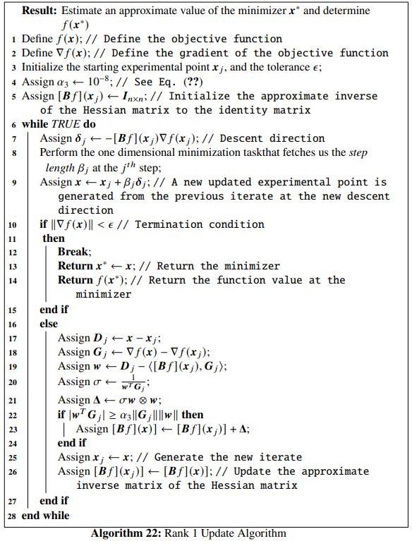
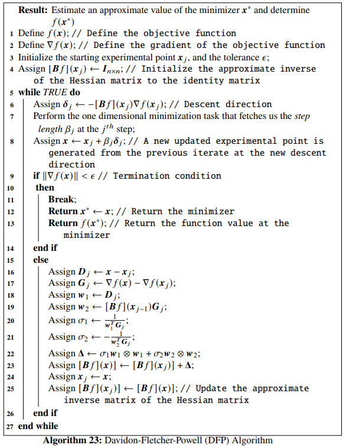
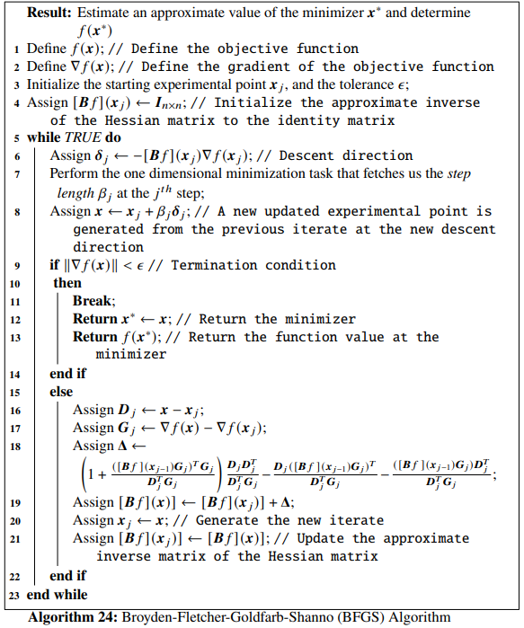
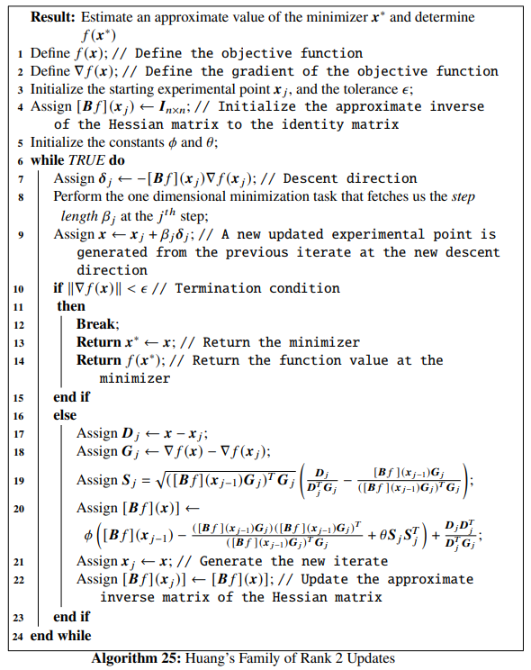

# Quasi-Newton Methods

We introduce the **Quasi-Newton methods** in more detailed fashion in this chapter. We start with studying the **rank 1 update algorithm** of updating the approximate to the inverse of the Hessian matrix and then move on to studying the **rank 2 update algorithms**. The methods covered under the later category are the **Davidon-Fletcher-Powell algorithm**, the **Broyden-Fletcher-Goldfarb-Shanno algorithm** and more generally the **Huang's family of rank2 updates**.

---

## Introduction to Quasi-Newton Methods

In the last part of the last chapter, the motivation to study *quasi-Newton methods* was introduced. To avoid high computational costs, the *quasi-Newton methods* adapt to using the inverse of the Hessian matrix of the objective function to compute the minimizer, unlike the *Newton method* where the inverse of the Hessian matrix is calculated at each iteration. The basic iterative formulation for the Newton's method is given by

\begin{equation}
\mathbb{x}_j = \mathbb{x}_{j-1} - [\mathbb{H}f]^{-1}(\mathbb{x}_{j-1})\nabla f(\mathbb{x}_{j-1}), j = 1, 2, \ldots \nonumber 
\end{equation}

where, the descent direction at the $j^{th}$ step is given by
\begin{equation}
\mathbb{\delta_j} = - [\mathbb{H}f]^{-1}(\mathbb{x}_{j-1})\nabla f(\mathbb{x}_{j-1}) \nonumber
\end{equation}

If $\beta_j$ is the selected step length along the $j^{th}$ descent direction and $\mathbb{B}f(\mathbb{x}_j)$ is the approximation to the inverse of the Hessian, $[\mathbb{H}f(\mathbb{x}_{j})]^{-1}$, then The *Quasi-Newton method* is written as the given iteration formula:
\begin{equation}
    \mathbb{x}_j = \mathbb{x}_{j-1}-\beta_j[\mathbb{B}f](\mathbb{x}_{j-1})\nabla f(\mathbb{x}_{j-1}) (#eq:1)
\end{equation}

where, the descent direction $\mathbb{\delta}_j$ is given by:
\begin{equation}
    \mathbb{\delta_j} = -[\mathbb{B}f](\mathbb{x}_{j-1})\nabla f(\mathbb{x}_{j-1}) (#eq:2)
\end{equation}

Note that,
\begin{equation}
    [\mathbb{B}f](\mathbb{x}) \equiv [\mathbb{H}f]^{-1}(\mathbb{x}) \equiv [\mathbb{H}f(\mathbb{x})]^{-1} (#eq:3)
\end{equation}

## The Approximate Inverse Matrix

Using Taylor's theorem to approximate the gradient of the Objective function, we can write:
\begin{equation}
    \nabla f(\mathbb{x}) \simeq \nabla f(\mathbb{x}_0) + \mathbb{H}f(\mathbb{x})(\mathbb{x} - \mathbb{x}_0) (#eq:4)
\end{equation}

So at iterates $\mathbb{x}_j$ and $\mathbb{x}_{j-1}$ Eq.~\eqref{eq:6.4} can be written as:
\begin{equation}
    \nabla f(\mathbb{x}_j) = \nabla \mathbb{f}(\mathbb{x}_0) + \mathbb{H}f(\mathbb{x}_j)(\mathbb{x}_j - \mathbb{x}_0) (#eq:5)
\end{equation}

and
\begin{equation}
    \nabla f(\mathbb{x}_{j-1}) = \nabla f(\mathbb{x}_0) + \mathbb{H}f(\mathbb{x}_j)(\mathbb{x}_{j-1} - \mathbb{x}_0) (#eq:6)
\end{equation}

So, subtracting Eq. \@ref(eq:6) from Eq. \@ref(eq:5), we get,
\begin{align}
    &&\nabla f(\mathbb{x}_j) - \nabla f(\mathbb{x}_{j-1}) &= \mathbb{H}f(\mathbb{x}_j)(\mathbb{x}_j - \mathbb{x}_{j-1}) \nonumber \\
    &\implies& \mathbb{H}f(\mathbb{x}_j)\mathbb{D}_j &= \mathbb{G}_j \nonumber \\
    &\implies& \mathbb{D}_j &= [\mathbb{H}f(\mathbb{x}_j)]^{-1}\mathbb{G}_j\nonumber\\
    &\implies& \mathbb{D}_j &= [\mathbb{B}f](\mathbb{x}_j)\mathbb{G}_j (#eq:7)
\end{align}

Eq. \@ref(eq:7) is the *secant equation*. Here, $[\mathbb{B}(\mathbb{x}_j)]$ is the approximate to the inverse of the Hessian matrix of the objective function $f$ at the $j^{th}$ iterate. As the iteration of the optimization technique advances in each step, it should be kept in mind that if $\mathbb{B}f(\mathbb{x}_{j-1})$ is symmetric and positive definite, then $\mathbb{B}f(\mathbb{x}_j)$ should be symmetric and positive definite. Various mechanisms have been developed for updating the inverse matrix, generally given by the formula:
\begin{equation}
    [\mathbb{B}f](\mathbb{x}_j) = [\mathbb{B}f](\mathbb{x}_{j-1}) + \mathbb{\Delta} (#eq:8)
\end{equation}

## Rank 1 Update Algorithm

In the *rank 1 update algorithm*, the *update matrix* $\mathbb{\Delta}$ is a rank 1 matrix. the *rank* of a matrix is given by its maximal number of linearly independent columns. To formulate a rank 1 update, we write the *update matrix* as:
\begin{equation}
    \mathbb{\Delta} = \sigma \mathbb{w} \otimes \mathbb{w} = \sigma \mathbb{w}\mathbb{w}^T (#eq:9)
\end{equation}

where, $\otimes$ is the outer product between two matrices/vectors. So, Eq. \@ref(eq:8) becomes:
\begin{equation}
    [\mathbb{B}f](\mathbb{x}_j) = [\mathbb{B}f](\mathbb{x}_{j-1}) + \sigma \mathbb{w}\mathbb{w}^T (#eq:10)
\end{equation}

Our task is to evaluate the explicit forms of the scalar constant $\sigma$ and the vector $\mathbb{w}$, where $\mathbb{w} \in \mathbb{R}^n$. Now, replacing $[\mathbb{B}f](\mathbb{x}_j)$ in Eq.~\eqref{eq:6.8} with the one in Eq.~\eqref{eq:6.10}, we have,
\begin{align}
    \mathbb{D}_j &= ([\mathbb{B}f](\mathbb{x}_{j-1}) + \sigma \mathbb{w}\mathbb{w}^T)\mathbb{G}_j \nonumber \\
    &= [\mathbb{B}f](\mathbb{x}_{j-1})\mathbb{G}_j + \sigma \mathbb{w}(\mathbb{w}^T\mathbb{G}_j) (#eq:11)
\end{align}

This can be rearranged to write,
\begin{equation}
    \sigma \mathbb{w} = \frac{\mathbb{D}_j - [\mathbb{B}f](\mathbb{x}_{j-1})\mathbb{G}_j}{\mathbb{w}^T\mathbb{G}_j} (#eq:12)
\end{equation}

As $\mathbb{w}^T\mathbb{G}_j$ is a scalar, we see that it can be taken to the denominator in Eq. \@ref(eq:12). Now, it is clearly evident that,
\begin{equation}
    \sigma = \frac{1}{\mathbb{w}^T\mathbb{G}_j} (#eq:13)
\end{equation}
and
\begin{equation}
    \mathbb{w} = \mathbb{D}_j - [\mathbb{B}f](\mathbb{x}_{j-1})\mathbb{G}_j (#eq:14)
\end{equation}

So, Eq. \@ref(eq:13) can now be written as:
\begin{equation}
    \sigma = \frac{1}{(\mathbb{D}_j - [\mathbb{B}f](\mathbb{x}_{j-1})\mathbb{G}_j)^T\mathbb{G}_j} (#eq:15)
\end{equation}


Eventually, the *update matrix* $\mathbb{\Delta}$ from Eq. \@ref(eq:9) turns out to be:
\begin{equation}
    \mathbb{\Delta} = \frac{(\mathbb{D}_j - [\mathbb{B}f](\mathbb{x}_{j-1})\mathbb{G}_j)(\mathbb{D}_j - [\mathbb{B}f](\mathbb{x}_{j-1})\mathbb{G}_j)^T}{(\mathbb{D}_j - [\mathbb{B}f](\mathbb{x}_{j-1})\mathbb{G}_j)^T\mathbb{G}_j} (#eq:16)
\end{equation}

So, the rank 1 update formula is given by:
\begin{equation}
    [\mathbb{B}f](\mathbb{x}_j) = [\mathbb{B}f](\mathbb{x}_{j-1}) + \frac{(\mathbb{D}_j - [\mathbb{B}f](\mathbb{x}_{j-1})\mathbb{G}_j)(\mathbb{D}_j - [\mathbb{B}f](\mathbb{x}_{j-1})\mathbb{G}_j)^T}{(\mathbb{D}_j - [\mathbb{B}f](\mathbb{x}_{j-1})\mathbb{G}_j)^T\mathbb{G}_j} (#eq:17)
\end{equation}

In the update formulation of the inverse matrix, most often $[\mathbb{B}f](x_0)$ is considered to be the $n \times n$ identity matrix. The iteration is continued until and unless the convergence criteria are satisfied. If $[\mathbb{B}f](\mathbb{x}_{j-1})$ is symmetric, then Eq. \@ref(eq:17) ensures that $[\mathbb{B}f](\mathbb{x}_j)$ is symmetric too and is then called a *symmetric rank 1 update algorithm* or the *SR1 update algorithm*. Also, it can be seen that the columns of the *update matrix* $\mathbb{\Delta}$ are multiples of each other, making it a rank 1 matrix.

The *rank 1 update algorithm* has an issue with the denominator in Eq. \@ref(eq:17). The denominator can vanish and sometimes there would be no symmetric rank 1 update in the inverse matrix, satisfying the secant equation given by Eq. \@ref(eq:7), even for a convex quadratic objective function. There are three cases that needs to be analyzed for a particular iterate $j$ in the optimization algorithm:

* If $\mathbb{w}^T\mathbb{G}_j \neq 0$, then there is a unique rank 1 update for the inverse matrix, given by Eq. \@ref(eq:17),
* If $\mathbb{D}_j = [\mathbb{B}f](\mathbb{x}_{j-1})\mathbb{G}_j$, then the update given by Eq. \@ref(eq:17) is skipped and we consider $[\mathbb{B}f](\mathbb{x}_j) = [\mathbb{B}f](\mathbb{x}_{j-1})$, and
* if $\mathbb{D}_j \neq [\mathbb{B}f](\mathbb{x}_{j-1})\mathbb{G}_j$ and $\mathbb{w}^T\mathbb{G}_j = 0$, then there is no rank 1 update technique available that satisfies the secant equation given by Eq. \@ref(eq:7).

In view of the second case mentioned above, there is a necessity to introduce a *skipping criterion* which will prevent the *rank 1 update algorithm* from crashing. The update of the inverse matrix at a particular iterate $j$, given by Eq. \@ref(eq:17) must be applied if the following condition is satisfied: 
\begin{equation}
    |\mathbb{w}^T\mathbb{G}_j| \geq \alpha_3\|\mathbb{G}_j\| \|\mathbb{w}\| (#eq:18)
\end{equation}

otherwise no update in the inverse matrix must be made. Here $\alpha_3$ is a very small number usually taken as $\alpha_3 \sim 10^{-8}$. The last case in the above mentioned cases however gives the motivation to introduce a rank 2 update formulation for the inverse matrix, such that the singularity case defining the vanishing of the denominator can be avoided. The *rank 1 update algorithm* is given in below:



```{example}
Let us consider *Branin function* as the objective function, given by:
\begin{equation}
    f(x_1, x_2) = a(x_2 - bx_1^2 + cx_1 - r)^2 + s(1-t)\cos(x_1)+s (#eq:19)
\end{equation}
where $a, b, c, r, s$ and $t$ are constants whose default values are given in the table below:

| Constant | Value |
| --- | --- |
| $a$ | $1$ |
| $b$ | $\frac{5.1}{4\pi^2}$ |
| $c$ | $\frac{5}{\pi}$ |
| $r$ | $6$ |
| $s$ | $10$ |
| $t$ | $\frac{1}{8\pi}$ |

Considering the default constant values, *Branin function* has four minimizers given by:

* $f(-\pi, 12.275) \simeq 0.397887$,
* $f(\pi, 2.275) \simeq 0.397887$,
* $f(3\pi, 2.475) \simeq 0.397887$, and
* $f(5\pi, 12.875) \simeq 0.397887$
  
We will use *Rank 1 update algorithm* to find out one of these four minimizers. Let the starting iterate be $\mathbb{x}_j = \begin{bmatrix}11 \\ 5.75 \end{bmatrix}$, the tolerance be $\epsilon = 10^{-5}$, and the constants to be used in determining the step length using the *strong Wolfe conditions* be $\alpha_1=10^{-4}$ and $\alpha_2=0.24$. Let us define *Branin function* and its gradient in Python:
  
```

```{python}
# import the required packages
import matplotlib.pyplot as plt
import numpy as np
import autograd.numpy as au
from autograd import grad, jacobian
import scipy

def func(x): # Objective function (Branin function)
    return (x[1] - (5.1/(4*au.pi**2))*x[0]**2 + (5/au.pi)*x[0] - 6)**2 + 10*(1 - 1/(8*au.pi))*au.cos(x[0]) + 10
    
Df = grad(func) # Gradient of the objective function
```

We first draw the contour plot of the *Branin function* and then define the Python function `rank_1()` implementing *Rank 1 update algorithm*:

```{python, results=FALSE}
from scipy.optimize import line_search
NORM = np.linalg.norm

x1 = np.linspace(-5, 16, 100)
x2 = np.linspace(-5, 16, 100)
z = np.zeros(([len(x1), len(x2)]))
for i in range(0, len(x1)):
    for j in range(0, len(x2)):
        z[j, i] = func([x1[i], x2[j]])

contours=plt.contour(x1, x2, z, 100, cmap=plt.cm.gnuplot)
plt.clabel(contours, inline=1, fontsize=10)
plt.xlabel("$x_1$ ->")
plt.ylabel("$x_2$ ->")

def rank_1(Xj, tol, alpha_1, alpha_2):
    x1 = [Xj[0]]
    x2 = [Xj[1]]
    Bf = np.eye(len(Xj))
    
    while True:
        Grad = Df(Xj)
        delta = -Bf.dot(Grad) # Selection of the direction of the steepest descent
        
        
        start_point = Xj # Start point for step length selection 
        beta = line_search(f=func, myfprime=Df, xk=start_point, pk=delta, c1=alpha_1, c2=alpha_2)[0] # Selecting the step length
        if beta!=None:
            X = Xj+ beta*delta
        if NORM(Df(X)) < tol:
            x1 += [X[0], ]
            x2 += [X[1], ]
            plt.plot(x1, x2, "rx-", ms=5.5) # Plot the final collected data showing the trajectory of optimization
            plt.show()
            return X, func(X)
        else:
            Dj = X - Xj # See line 17 of the algorithm
            Gj = Df(X) - Grad # See line 18 of the algorithm
            w = Dj - Bf.dot(Gj) # See line 19 of the algorithm
            wT = w.T # Transpose of w
            sigma = 1/(wT.dot(Gj)) # See line 20 of the algorithm
            W = np.outer(w, w) # Outer product between w and the transpose of w
            Delta = sigma*W # See line 21 of the algorithm
            if abs(wT.dot(Gj)) >= 10**-8*NORM(Gj)*NORM(w): # update criterion (See line 22-24)
                Bf += Delta          
            Xj = X # Update to the new iterate
            x1 += [Xj[0], ]
            x2 += [Xj[1], ]
```

Make sure all the relevant Python packages (eg. `autograd` as `au`) have been imported and functions like `NORM()` have been already defined. Now, as asked in our example, we set our parameter values and pass them to the `rank_1()` function:

```{python}
rank_1(np.array([11.8, 5.75]), 10**-5, 10**-4, 0.24)
```

We see that for our choice of parameters, the algorithm has converged to the minimizer $\mathbb{x}^* \sim \begin{bmatrix}3\pi \\ 2.475 \end{bmatrix}$ where the function value is $f(\mathbb{x}^*) \simeq 0.397887$.

```{python, echo=FALSE, results=FALSE}
import pandas as pd
from tabulate import tabulate

def rank_1(Xj, tol, alpha_1, alpha_2):
    x1 = [Xj[0]]
    x2 = [Xj[1]]
    Bf = np.eye(len(Xj))
    F = [func(Xj)]
    DF = [NORM(Df(Xj))]
    
    while True:
        Grad = Df(Xj)
        delta = -Bf.dot(Grad) # Selection of the direction of the steepest descent
        
        
        start_point = Xj # Start point for step length selection 
        beta = line_search(f=func, myfprime=Df, xk=start_point, pk=delta, c1=alpha_1, c2=alpha_2)[0] # Selecting the step length
        if beta!=None:
            X = Xj+ beta*delta
        if NORM(Df(X)) < tol:
            x1 += [X[0], ]
            x2 += [X[1], ]
            F += [func(X)]
            DF += [NORM(Df(X))]
            data = {'x_1': x1,
            'x_2': x2,
            'f(X)': F,
            '||grad||': DF}
            return data
        else:
            Dj = X - Xj # See line 17 of the algorithm
            Gj = Df(X) - Grad # See line 18 of the algorithm
            w = Dj - Bf.dot(Gj) # See line 19 of the algorithm
            wT = w.T # Transpose of w
            sigma = 1/(wT.dot(Gj)) # See line 20 of the algorithm
            W = np.outer(w, w) # Outer product between w and the transpose of w
            Delta = sigma*W # See line 21 of the algorithm
            if abs(wT.dot(Gj)) >= 10**-8*NORM(Gj)*NORM(w): # update criterion (See line 22-24)
                Bf += Delta          
            Xj = X # Update to the new iterate
            x1 += [Xj[0], ]
            x2 += [Xj[1], ]
            F += [func(Xj)]
            DF += [NORM(Df(Xj))]

data =rank_1(np.array([11.8, 5.75]), 10**-5, 10**-4, 0.24)

df = pd.DataFrame(data, columns = ['x_1', 'x_2', 'f(X)', '||grad||'])
```

The optimization data has been collected and shown below:

```{python, echo=FALSE}
print(tabulate(df, headers='keys', tablefmt='psql'))
```

We now discuss the *Sherman-Morrison-Woodbury formula*, which states that, for a square non-singular matrix $\mathbb{M}$ encountering a rank 1 update, given by:
\begin{equation}
    \bar{\mathbb{M}} = \mathbb{M} + \mathbb{a}\mathbb{b}^T (#eq:20)
\end{equation}

where, $\mathbb{M}, \bar{{\mathbb{M}}} \in \mathbb{R}^{n \times n}$ and $\mathbb{a}, \mathbb{b} \in \mathbb{R}^n$, then if $\mathbb{M}$ is nonsingular, the inverse of $\bar{\mathbb{M}}$ will be given by:
\begin{equation}
    \bar{\mathbb{M}}^{-1} = \mathbb{M}^{-1} - \frac{\mathbb{M}^{-1}\mathbb{ab}^T\mathbb{M}^{-1}}{1+\mathbb{b}^T\mathbb{M}^{-1}\mathbb{a}} (#eq:21)
\end{equation}
which is the *Sherman-Morrison-Woodbury formula*.

```{proof}
To prove \@ref(eq:21) we show that $\bar{\mathbb{M}}\bar{\mathbb{M}}^{-1}=\mathbb{I}$. 
\begin{align}
\bar{\mathbb{M}}\bar{\mathbb{M}}^{-1} &= (\mathbb{M} + \mathbb{ab}^T) \left( \mathbb{M}^{-1} - \frac{\mathbb{M}^{-1}\mathbb{ab}^T\mathbb{M}^{-1}}{1+\mathbb{b}^T\mathbb{M}^{-1}\mathbb{a}} \right) \nonumber \\
&= \mathbb{MM}^{-1} + \mathbb{ab}^T\mathbb{M}^{-1} - \frac{\mathbb{MM}^{-1}\mathbb{ab}^T\mathbb{M}^{-1} + \mathbb{ab}^T\mathbb{M}^{-1}\mathbb{ab}^T\mathbb{M}^{-1}}{1+\mathbb{b}^T\mathbb{M}^{-1}\mathbb{a}} \nonumber \\
&= \mathbb{I}+\mathbb{ab}^T\mathbb{M}^{-1} - \frac{\mathbb{ab}^T\mathbb{M}^{-1}\mathbb{ab}^T\mathbb{M}^{-1}\mathbb{ab}^T\mathbb{M}^{-1}}{1+\mathbb{b}^T\mathbb{M}^{-1}\mathbb{a}} \nonumber \\
&= \mathbb{I}+\mathbb{ab}^T\mathbb{M}^{-1} - \frac{\mathbb{a}(\mathbb{b}^T\mathbb{M}^{-1} + \mathbb{b}^T\mathbb{M}^{-1}\mathbb{a}\mathbb{b}^T\mathbb{M}^{-1})}{1+\mathbb{b}^T\mathbb{M}^{-1}\mathbb{a}} \nonumber \\
&= \mathbb{I}+\mathbb{ab}^T\mathbb{M}^{-1} - \frac{\mathbb{a}(1 + \mathbb{b}^T\mathbb{M}^{-1}\mathbb{a})\mathbb{b}^T\mathbb{M}^{-1}}{1+\mathbb{b}^T\mathbb{M}^{-1}\mathbb{a}} \nonumber \\
&= \mathbb{I} + \mathbb{ab}^T\mathbb{M}^{-1} - \mathbb{ab}^T\mathbb{M}^{-1} \nonumber \\
&= \mathbb{I} \nonumber 
\end{align}
This completes the proof.
```


If the *Sherman-Morrison-Woodbury formula* is applied on Eq. @\ref(eq:17), we will have,
\begin{equation}
    [\mathbb{H}f](\mathbb{x}_j) = [\mathbb{H}f](\mathbb{x}_{j-1}) + \frac{[\mathbb{G}_j - [\mathbb{H}f](\mathbb{x}_{j-1})\mathbb{D}_j][\mathbb{G}_j - [\mathbb{H}f](\mathbb{x}_{j-1})\mathbb{D}_j]^T}{(\mathbb{G}_j - [\mathbb{H}f](\mathbb{x}_{j-1})\mathbb{D}_j)^T\mathbb{D}_j} (#eq:22)
\end{equation}

where, $[\mathbb{H}f](\mathbb{x}) = [\mathbb{B}f]^{-1}(\mathbb{x})$.

```{theorem}
For a strongly convex quadratic function given by $f(\mathbb{x}) = \frac{1}{2}\mathbb{x}^T\mathbb{A}\mathbb{x} + \mathbb{b}^T\mathbb{x}$, with $\mathbb{x}\in \mathbb{R}^n$, and $\mathbb{A}$ a symmetric positive definite matrix, having the starting point $\mathbb{x}_0$ and the symmetric starting Hessian matrix $\mathbb{H}f(\mathbb{x}_0)$, the sequence of iterates $\{\mathbb{x}_j\}$ generated by the *Rank 1 Update Algorithm* converge to the minimizer in at most $n$ steps, provided that $(\mathbb{G}_j - [\mathbb{H}f](\mathbb{x}_{j-1})\mathbb{D}_j)^T\mathbb{D}_j\neq 0\ \forall j$.
```

```{proof}
The rank 1 update is well defined, as we have assumed the non-singularity $(\mathbb{G}_j - [\mathbb{H}f](\mathbb{x}_{j-1})\mathbb{D}_j)^T\mathbb{D}_j\neq 0$. We will first show an inductive proof of:
\begin{equation}
    [\mathbb{H}f](\mathbb{x}_{j-1})\mathbb{D}_i = \mathbb{G}_i,\ i = 0, 1, \ldots, j-1 (#eq:23)
\end{equation}
 
Eq. \@ref(eq:23) provides with the fact that the *secant equation* is satisfied along all the search directions. We first show the base case for the inductive proof. The rank 1 update mechanism satisfies the *secant equation* by default, i.e, for $j=1$,
\begin{equation}
    [\mathbb{H}f](\mathbb{x}_0)\mathbb{D}_0 = \mathbb{G}_0 (#eq:24)
\end{equation}
Now, for the inductive case, we assume that Eq. \@ref(eq:23) holds for $j>1$ and we will show that it holds true for $j+1$ too. From Eq. \@ref(eq:23) we have:
\begin{align}
    (\mathbb{G}_j - [\mathbb{H}f](\mathbb{x}_{j-1})\mathbb{D}_j)^T\mathbb{D}_i &= \mathbb{G}_j^T\mathbb{D}_i - ([\mathbb{H}f](\mathbb{x}_{j-1})\mathbb{D}_j)^T\mathbb{D}_i \nonumber \\
    &= \mathbb{G}_j^T\mathbb{D}_i - \mathbb{D}_j^T([\mathbb{H}f](\mathbb{x}_{j-1}))^T\mathbb{D}_i \nonumber \\
    &= \mathbb{G}_j^T\mathbb{D}_i - \mathbb{D}_j^T[\mathbb{H}f](\mathbb{x}_{j-1})\mathbb{D}_i \nonumber \\
    &= \mathbb{G}_j^T\mathbb{D}_i - \mathbb{D}_j^T\mathbb{G}_i (#eq:25)
\end{align}
 
Now, from the quadratic form, we can say that, $\mathbb{D}_k = \mathbb{A}\mathbb{G}_k$, which implies that $\mathbb{D}_k^T = \mathbb{G}_k^T\mathbb{A}$, as $\mathbb{A}$ is symmetric. So, Eq. \@ref(eq:25) can be written as:
  
\begin{align}
    (\mathbb{G}_j - [\mathbb{H}f](\mathbb{x}_{j-1})\mathbb{D}_j)^T\mathbb{D}_i &= \mathbb{G}_j^T\mathbb{D}_i - \mathbb{D}_j^T\mathbb{G}_i \nonumber \\
    &= \mathbb{G}_j^T\mathbb{D}_i - \mathbb{G}_j^T\mathbb{A}\mathbb{G}_i \nonumber \\
    &= \mathbb{G}_j^T\mathbb{D}_i - \mathbb{G}_j^T\mathbb{D}_i \nonumber \\
    &= 0\ \forall i < j-1 (#eq:26)
\end{align}
By using Eq. \@ref(eq:26) and Eq. \@ref(eq:23) in Eq. \@ref(eq:22), we will have,
\begin{equation}
    [\mathbb{H}f](\mathbb{x}_j)\mathbb{D}_i = [\mathbb{H}f](\mathbb{x}_{j-1})\mathbb{D}_i = \mathbb{G}_i,\ \forall i<j-1 (#eq:27)
\end{equation}
 
As, by the *secant equation*, $[\mathbb{H}f](\mathbb{x}_{j+1})\mathbb{D}_j = \mathbb{G}_j$, we have shown that Eq. \@ref(eq:23) holds when $j$ is substituted by $j+1$. This completes the inductive proof. Now, if the algorithm takes $n$ steps to find the minimizer, and if these steps $\{\mathbb{G}_i\}$ are linearly independent, we will have,
\begin{align}
    & \mathbb{G}_i = [\mathbb{H}f](\mathbb{x}_n)\mathbb{D}_i = [\mathbb{H}f](\mathbb{x}_n)\mathbb{A}\mathbb{G}_i,\ \forall i=0, 1, \ldots, n-1 \nonumber \\
    &\implies [\mathbb{H}f](\mathbb{x}_n)\mathbb{A} = \mathbb{I} \nonumber \\
    &\implies [\mathbb{H}f](\mathbb{x}_n) = \mathbb{A}^{-1} (#eq:28)
\end{align}
 
We see that it is a newton step at the iterate $\mathbb{x}_n$ and thus, the next iterate $\mathbb{x}_{n+1}$ will be the solution leading to the termination of the algorithm. Now, considering the case where the steps are linearly dependent, let us assume $\mathbb{G}_j$ to be a linear combination of all the previous steps, given by:
\begin{equation}
    \mathbb{G}_j = \zeta_0\mathbb{G}_0 + \zeta_1\mathbb{G}_1 + \ldots + \zeta_{j-1}\mathbb{G}_{j-1} (#eq:29)
\end{equation}
where, $\zeta$'s are scalars. From Eq. \@ref(eq:29) and Eq. \@ref(eq:23), we have,
\begin{align}
    [\mathbb{H}f](\mathbb{x}_{j-1})\mathbb{D}_j &= [\mathbb{H}f](\mathbb{x}_{j-1})\mathbb{A}\mathbb{G}_j\nonumber \\
    &= \zeta_0[\mathbb{H}f](\mathbb{x}_{j-1})\mathbb{A}\mathbb{G}_0 +  \ldots + \zeta_{j-1}[\mathbb{H}f](\mathbb{x}_{j-1})\mathbb{A}\mathbb{G}_{j-1} \nonumber \\
    &= \zeta_0[\mathbb{H}f](\mathbb{x}_{j-1})\mathbb{D}_0 +  \ldots + \zeta_{j-1}[\mathbb{H}f](\mathbb{x}_{j-1})\mathbb{D}_{j-1} \nonumber \\
    &= \zeta_0\mathbb{G}_0 +  \ldots + \zeta_{j-1}\mathbb{G}_{j-1} \nonumber \\
    &= \mathbb{G}_j (#eq:30)
\end{align}

From Eq. \@ref(eq:2) we have $\mathbb{\delta}_j = -[\mathbb{B}f](\mathbb{x}_{j-1})\nabla f(\mathbb{x}_{j-1})$. If we consider a step of unit length, we will have $\mathbb{x}_j = \mathbb{x}_{j-1} + \mathbb{\delta}_j$, implying $\mathbb{\delta}_j = \mathbb{x}_j - \mathbb{x}_{j-1} = \mathbb{D}_j$. Since $\mathbb{G}_j = \nabla f(\mathbb{x}_j) - \nabla f(\mathbb{x}_{j-1})$ and $\mathbb{D}_j = \mathbb{\delta}_j = -[\mathbb{B}f](\mathbb{x}_{j-1})\nabla f(\mathbb{x}_{j-1})$, Eq. \@ref(eq:30) implies that:
\begin{align}
    &  [\mathbb{H}f](\mathbb{x}_{j-1})\mathbb{D}_j = \mathbb{G}_j \nonumber \\
    &\implies -[\mathbb{H}f](\mathbb{x}_{j-1})[\mathbb{B}f](\mathbb{x}_{j-1})\nabla f(\mathbb{x}_{j-1}) = \nabla f(\mathbb{x}_j) - \nabla f(\mathbb{x}_{j-1}) \nonumber \\
    &\implies -\nabla f(\mathbb{x}_{j-1}) = \nabla f(\mathbb{x}_j) - \nabla f(\mathbb{x}_{j-1}) \nonumber \\
    &\implies \nabla f(\mathbb{x}_j) = 0 (#eq:31)
\end{align}
This says that $\mathbb{x}_j$ is the solution, completing the proof.
```

## Rank 2 Update Algorithms

We will be discussing the following algorithms under this category:

* *Davidon-Fletcher-Powell* (DFP) algorithm,
* *Broyden-Fletcher-Goldfarb-Shanno* (BFGS) algorithm, and
* *Huang's family of rank 2 updates*.

### Davidon-Fletcher-Powell Algorithm

Eq. \@ref(eq:8) gives the updating mechanism of the approximation to the inverse of the Hessian matrix of our objective function and Eq. \@ref(eq:7) gives the *secant equation*. In rank 2 updates, the *update matrix* $\mathbb{\Delta}$ is expressed as the sum of two rank 1 updates, given by:
\begin{equation}
    \mathbb{\Delta} = \sigma_1\mathbb{w}_1 \otimes \mathbb{w}_1 + \sigma_2\mathbb{w}_2 \otimes \mathbb{w}_2 = \sigma_1\mathbb{w}_1\mathbb{w}_1^T + \sigma_2\mathbb{w}_2\mathbb{w}_2^T (#eq:32)
\end{equation}

such that, Eq. \@ref(eq:8) becomes:
\begin{equation}
    [\mathbb{B}f](\mathbb{x}_j) = [\mathbb{B}f](\mathbb{x}_{j-1}) +  \sigma_1\mathbb{w}_1\mathbb{w}_1^T + \sigma_2\mathbb{w}_2\mathbb{w}_2^T (#eq:33)
\end{equation}

Here, $\sigma_1$ and $\sigma_2$ are scalars and $\mathbb{w}_1, \mathbb{w}_2 \in \mathbb{R}^n$. Now, Eq. \@ref(eq:7) becomes:
\begin{equation}
    \mathbb{D}_j = [\mathbb{B}f](\mathbb{x}_{j-1})\mathbb{G}_j + \sigma_1\mathbb{w}_1(\mathbb{w}_1^T\mathbb{G}_j) + \sigma_2\mathbb{w}_2(\mathbb{w}_2^T\mathbb{G}_j) (#eq:34)
\end{equation}

We notice that $\mathbb{w}_1^T\mathbb{G}_j$ and $\mathbb{w}_2^T\mathbb{G}_j$ are scalars. One of the non-unique combinations of choices that satisfy Eq. \@ref(eq:34) is:
\begin{align}
    \mathbb{w}_1 &= \mathbb{D}_j (#eq:35)\\
    \mathbb{w}_2 &= [\mathbb{B}f](\mathbb{x}_{j-1})\mathbb{G}_j (#eq:36)\\
    \sigma_1 &= \frac{1}{\mathbb{w}_1^T\mathbb{G}_j} (#eq:37) \\
    \sigma_2 &= -\frac{1}{\mathbb{w}_2^T\mathbb{G}_j} (#eq:38)
\end{align}

Eq. \@ref(eq:37) and Eq. \@ref(eq:38) can be rewritten as:
\begin{align}
    \sigma_1 &= \frac{1}{\mathbb{D}_j^T\mathbb{G}_j} (#eq:39) \\
    \sigma_2 &= - \frac{1}{([\mathbb{B}f](\mathbb{x}_{j-1})\mathbb{G}_j)^T\mathbb{G}_j} (#eq:40)
\end{align}

So Eq. \@ref(eq:32) becomes:

\begin{equation}
    \mathbb{\Delta} = \frac{\mathbb{D}_j\mathbb{D}_j^T}{\mathbb{D}_j^T\mathbb{G}_j} - \frac{([\mathbb{B}f](\mathbb{x}_{j-1})\mathbb{G}_j)([\mathbb{B}f](\mathbb{x}_{j-1})\mathbb{G}_j)^T}{([\mathbb{B}f](\mathbb{x}_{j-1})\mathbb{G}_j)^T\mathbb{G}_j} (#eq:41)
\end{equation}

Finally, the *DFP* update mechanism is given by:
\begin{equation}
    [\mathbb{B}f](\mathbb{x}_j) = [\mathbb{B}f](\mathbb{x}_{j-1}) + \frac{\mathbb{D}_j\mathbb{D}_j^T}{\mathbb{D}_j^T\mathbb{G}_j} - \frac{([\mathbb{B}f](\mathbb{x}_{j-1})\mathbb{G}_j)([\mathbb{B}f](\mathbb{x}_{j-1})\mathbb{G}_j)^T}{([\mathbb{B}f](\mathbb{x}_{j-1})\mathbb{G}_j)^T\mathbb{G}_j} (#eq:42)
\end{equation}

In the update formulation, we will again consider $[\mathbb{B}f](\mathbb{x}_0)$ to be the $n \times n$ identity matrix and the iteration is continued until and unless the convergence criterion is satisfied. The last two terms in Eq. \@ref(eq:42) are rank 1 updates, overall fetching a rank 2 update strategy. Note that the updated inverse matrix $[\mathbb{B}f](\mathbb{x}_j)$ is positive definite only if the optimal step length $\beta_j$ is computed accurately. The *DFP* algorithm is given below:



```{example}
Let us consider *Booth's function* as the objective function, given by:
\begin{equation}
    f(x_1, x_2) = (x_1+2x_2-7)^2+(2x_1+x_2-5)^2 (#eq:43)
\end{equation}
```

The minimizer is at $\mathbb{x}^* = \begin{bmatrix}1\\3\end{bmatrix}$ and the function value at the minimizer is $0$. We will use *DFP* algorithm to find out the minimizer. Let the starting iterate be $\mathbb{x}_j = \begin{bmatrix}-7.8 \\ -3.75 \end{bmatrix}$, the tolerance be $\epsilon = 10^{-5}$, and the constants to be used in determining the step length using the *strong Wolfe conditions* be $\alpha_1 = 10^{-4}$ and $\alpha_2 = 3.82$. Let us first define *Booth's function* and its gradient in Python:

```{python}
def func(x): # Objective function (Booth's function)
    return (x[0]+2*x[1]-7)**2 + (2*x[0]+x[1]-5)**2
    
Df = grad(func) # Gradient of the objective function

```

Next, we define the Python function `DFP()` implementing the *DFP* algorithm:

```{python, results=FALSE}
# draw the contour plot first
x1 = np.linspace(-10, 10, 100)
x2 = np.linspace(-10, 10, 100)
z = np.zeros(([len(x1), len(x2)]))
for i in range(0, len(x1)):
    for j in range(0, len(x2)):
        z[j, i] = func([x1[i], x2[j]])

contours=plt.contour(x1, x2, z, 100, cmap=plt.cm.gnuplot)
plt.clabel(contours, inline=1, fontsize=10)
plt.xlabel("$x_1$ ->")
plt.ylabel("$x_2$ ->")

# define DFP()
def DFP(Xj, tol, alpha_1, alpha_2):
    x1 = [Xj[0]]
    x2 = [Xj[1]]
    Bf = np.eye(len(Xj))
    
    while True:
        Grad = Df(Xj)
        delta = -Bf.dot(Grad) # Selection of the direction of the steepest descent
        
        
        start_point = Xj # Start point for step length selection 
        beta = line_search(f=func, myfprime=Df, xk=start_point, pk=delta, c1=alpha_1, c2=alpha_2)[0] # Selecting the step length
        if beta!=None:
            X = Xj+ beta*delta
        if NORM(Df(X)) < tol:
            x1 += [X[0], ]
            x2 += [X[1], ]
            plt.plot(x1, x2, "rx-", ms=5.5) # Plot the final collected data showing the trajectory of optimization
            plt.show()
            return X, func(X)
        else:
            Dj = X - Xj # See line 16 of the algorithm
            Gj = Df(X) - Grad # See line 17 of the algorithm
            w1 = Dj # See line 18 of the algorithm
            w2 = Bf.dot(Gj) # See line 19 of the algorithm
            w1T = w1.T
            w2T = w2.T
            sigma1 = 1/(w1T.dot(Gj)) # See line 20 of the algorithm
            sigma2 = -1/(w2T.dot(Gj)) # See line 21 of the algorithm
            W1 = np.outer(w1, w1)
            W2 = np.outer(w2, w2)
            Delta = sigma1*W1 + sigma2*W2 # See line 22 of the algorithm
            Bf += Delta # See line 23 of the algorithm
            Xj = X # Update to the new iterate
            x1 += [Xj[0], ]
            x2 += [Xj[1], ]
```

Finally, we set our parameter values and pass them to the `DFP()` function:

```{python}
DFP(np.array([-7.8, -3.75]), 10**-5, 10**-4, 3.82)
```

The optimization data has been collected and shown in the table below:

```{python, echo=FALSE, results=FALSE}
def DFP(Xj, tol, alpha_1, alpha_2):
    x1 = [Xj[0]]
    x2 = [Xj[1]]
    Bf = np.eye(len(Xj))
    F = [func(Xj)]
    DF = [NORM(Df(Xj))]
    
    while True:
        Grad = Df(Xj)
        delta = -Bf.dot(Grad) # Selection of the direction of the steepest descent
        
        
        start_point = Xj # Start point for step length selection 
        beta = line_search(f=func, myfprime=Df, xk=start_point, pk=delta, c1=alpha_1, c2=alpha_2)[0] # Selecting the step length
        if beta!=None:
            X = Xj+ beta*delta
        if NORM(Df(X)) < tol:
            x1 += [X[0], ]
            x2 += [X[1], ]
            F += [func(X)]
            DF += [NORM(Df(X))]
            data = {'x_1': x1,
            'x_2': x2,
            'f(X)': F,
            '||grad||': DF}
            return data
        else:
            Dj = X - Xj # See line 16 of the algorithm
            Gj = Df(X) - Grad # See line 17 of the algorithm
            w1 = Dj # See line 18 of the algorithm
            w2 = Bf.dot(Gj) # See line 19 of the algorithm
            w1T = w1.T
            w2T = w2.T
            sigma1 = 1/(w1T.dot(Gj)) # See line 20 of the algorithm
            sigma2 = -1/(w2T.dot(Gj)) # See line 21 of the algorithm
            W1 = np.outer(w1, w1)
            W2 = np.outer(w2, w2)
            Delta = sigma1*W1 + sigma2*W2 # See line 22 of the algorithm
            Bf += Delta # See line 23 of the algorithm
            Xj = X # Update to the new iterate
            x1 += [Xj[0], ]
            x2 += [Xj[1], ]
            F += [func(Xj)]
            DF += [NORM(Df(Xj))]

data=DFP(np.array([-7.8, -3.75]), 10**-5, 10**-4, 3.82)

df = pd.DataFrame(data, columns = ['x_1', 'x_2', 'f(X)', '||grad||'])

```

```{python, echo=FALSE}
print(tabulate(df, headers='keys', tablefmt='psql'))
```

```{theorem}
The *Davidon-Fletcher-Powell* method is a conjugate gradient method.
```

```{proof}
Let us consider the quadratic equation $f(\mathbb{x}) = \frac{1}{2}\mathbb{x}^T\mathbb{A}\mathbb{x} + \mathbb{b}^T\mathbb{x}$, having the gradient, $\nabla f(\mathbb{x}) = \mathbb{A}\mathbb{x} + b$. Now, we know
\begin{equation}
    \mathbb{G}_j = \nabla f(\mathbb{x}_j) - \nabla f(\mathbb{x}_{j-1}) = \mathbb{A}(\mathbb{x}_j - \mathbb{x}_{j-1}) (#eq:44)
\end{equation}
 Now, as
\begin{equation}
    \mathbb{x}_j = \mathbb{x}_{j-1} + \beta_j \mathbb{\delta}_j (#eq:45)
\end{equation}
 
So, from Eq. \@ref(eq:44) and Eq.\@ref(eq:45), we will have,
\begin{equation}
    \mathbb{G}_j = \beta_j \mathbb{A}\mathbb{\delta}_j (#eq:46)
\end{equation}
 
 where,
\begin{equation}
    \mathbb{A}\mathbb{\delta}_j = \frac{1}{\beta_j}\mathbb{G}_j (#eq:47)
\end{equation}
 
Now, premultiplying Eq.~\eqref{eq:6.42} with Eq.~\eqref{eq:6.47}, we have
\begin{equation}
    [\mathbb{B}f](\mathbb{x}_j)\mathbb{A}\mathbb{\delta}_j = \frac{1}{\beta_j}\left([\mathbb{B}f](\mathbb{x}_{j-1}) + \frac{\mathbb{D}_j\mathbb{D}_j^T}{\mathbb{D}_j^T\mathbb{G}_j} - \frac{([\mathbb{B}f](\mathbb{x}_{j-1})\mathbb{G}_j)([\mathbb{B}f](\mathbb{x}_{j-1})\mathbb{G}_j)^T}{([\mathbb{B}f](\mathbb{x}_{j-1})\mathbb{G}_j)^T\mathbb{G}_j}\right)\mathbb{G}_j (#eq:48)
\end{equation}
 
We know, $\mathbb{D}_j = \mathbb{x}_j - \mathbb{x}_{j-1} = \beta_j\mathbb{\delta}_j$. So, 
\begin{equation}
    \frac{\mathbb{D}_j\mathbb{D}_j^T}{\mathbb{D}_j^T\mathbb{G}_j} = \beta_j\frac{\mathbb{\delta}_j\mathbb{\delta}_j^T}{\mathbb{\delta}_j^T\mathbb{G}_j} (#eq:49)
\end{equation}
 
and 
\begin{equation}
    \beta_j\left(\frac{\mathbb{\delta}_j\mathbb{\delta}_j^T}{\mathbb{\delta}_j^T\mathbb{G}_j}\right)\mathbb{G}_j = \beta_j\frac{\mathbb{\delta}_j(\mathbb{\delta}_j^T\mathbb{G}_j)}{\mathbb{\delta}_j^T\mathbb{G}_j} = \beta_j\mathbb{\delta}_j (#eq:50)
\end{equation}
 
Also,
\begin{equation}
    \frac{([\mathbb{B}f](\mathbb{x}_{j-1})\mathbb{G}_j)([\mathbb{B}f](\mathbb{x}_{j-1})\mathbb{G}_j)^T}{([\mathbb{B}f](\mathbb{x}_{j-1})\mathbb{G}_j)^T\mathbb{G}_j} \mathbb{G}_j = [\mathbb{B}f](\mathbb{x}_{j-1})\mathbb{G}_j (#eq:51)
\end{equation}
 
 Using Eq. \@ref(eq:49) - Eq. \@ref(eq:51) in Eq. \@ref(eq:48), we get,
\begin{equation}
    [\mathbb{B}f](\mathbb{x}_j)\mathbb{A}\mathbb{\delta}_j = \frac{1}{\beta_j}([\mathbb{B}f](\mathbb{x}_{j-1})\mathbb{G}_j + \beta_j\mathbb{\delta}_j - [\mathbb{B}f](\mathbb{x}_{j-1})\mathbb{G}_j) = \mathbb{\delta}_j (#eq:52)
\end{equation}
 
 From Eq. \@ref(eq:2) we know that $\mathbb{\delta}_j = -[\mathbb{B}f](\mathbb{x}_{j-1})\nabla f(\mathbb{x}_{j-1})$. As a result, we can write,
 
\begin{align}
    \mathbb{\delta}_{j+1}^T\mathbb{A}\mathbb{\delta}_j &= -([\mathbb{B}f](\mathbb{x}_j)\nabla f(\mathbb{x}_j))^T\mathbb{A}\mathbb{\delta}_j \nonumber \\
    &= -\nabla f(\mathbb{x}_j)^T[\mathbb{B}f](\mathbb{x}_j)\mathbb{A}\mathbb{\delta}_j \nonumber \\
    &= - \nabla f(\mathbb{x}_j)^T\mathbb{\delta}_j \nonumber \\
    &= 0 (#eq:53)
\end{align}
 
This is $0$ because the minimizing step in the direction of $\mathbb{\delta}_j$ is $\beta_j^*$. This shows that the successive directions that the *Davidon-Fletcher-Powell* method generates are conjugate to each other. This completes the proof that the *Davidon-Fletcher-Powell* method is a *conjugate gradient* method.

```

### Broyden-Fletcher-Goldfarb-Shanno (BFGS) Algorithm

In the *BFGS* algorithm, it is the Hessian matrix (instead of the approximate inverse of the Hessian) that gets updated iteratively at each step. Eq. \@ref(eq:7) can be written as:

\begin{equation}
    \mathbb{G}_j = [\mathbb{H}f](\mathbb{x}_j)\mathbb{D}_j (#eq:54)
\end{equation}
In Eq. \@ref(eq:42), $[\mathbb{B}f](\mathbb{x}_j)$, $\mathbb{D}_j$ and $\mathbb{G}_j$ are replaced by $[\mathbb{H}f](\mathbb{x}_j)$, $\mathbb{G}_j$ and $\mathbb{D}_j$ respectively, giving,
\begin{equation}
     [\mathbb{H}f](\mathbb{x}_j) = [\mathbb{H}f](\mathbb{x}_{j-1}) + \frac{\mathbb{G}_j\mathbb{G}_j^T}{\mathbb{G}_j^T\mathbb{D}_j} - \frac{([\mathbb{H}f](\mathbb{x}_{j-1})\mathbb{D}_j)([\mathbb{H}f](\mathbb{x}_{j-1})\mathbb{D}_j)^T}{([\mathbb{H}f](\mathbb{x}_{j-1})\mathbb{D}_j)^T\mathbb{D}_j} (#eq:55)
\end{equation}

But, for practical implementations, we use the following update rule for the inverse matrix:
\begin{align}
    [\mathbb{B}f](\mathbb{x}_j) &= [\mathbb{B}f](\mathbb{x}_{j-1}) + \left(1 + \frac{([\mathbb{B}f](\mathbb{x}_{j-1})\mathbb{G}_j)^T\mathbb{G}_j}{\mathbb{D}_j^T\mathbb{G}_j} \right)\frac{\mathbb{D}_j\mathbb{D}_j^T}{\mathbb{D}_j^T\mathbb{G}_j} \nonumber \\
    &- \frac{\mathbb{D}_j([\mathbb{B}f](\mathbb{x}_{j-1})\mathbb{G}_j)^T}{\mathbb{D}_j^T\mathbb{G}_j} - \frac{([\mathbb{B}f](\mathbb{x}_{j-1})\mathbb{G}_j)\mathbb{D}_j^T}{\mathbb{D}_j^T\mathbb{G}_j} (#eq:56)
\end{align}

The *BFGS* algorithm demonstrates a superlinear convergence near the minimizer [ref, Nocedal, Wright]. It can be considered the dual of the *DFP* algorithm and is a conjugate gradient method too. The *BFGS* algorithm is given below:



```{example}
We will consider the *Branin function* given in Eq. \@ref(eq:19) as the objective function. We will use our *BFGS* algorithm to find out one of the four minimizers of *Branin function*. Let the starting iterate be $\mathbb{x}_j = \begin{bmatrix}1.5 \\ 7.75 \end{bmatrix}$, the tolerance be $\epsilon = 10^{-5}$ and the constant to be used in determining the step length using the *strong Wolfe conditions* be $\alpha_1 = 10^{-4}$ and $\alpha_2 = 0.25$. The Python function `BFGS()` implementing the *BFGS* algorithm is given below:
```

```{python, results=FALSE}
# draw the contour plot first
x1 = np.linspace(-10, 10, 100)
x2 = np.linspace(-10, 10, 100)
z = np.zeros(([len(x1), len(x2)]))
for i in range(0, len(x1)):
    for j in range(0, len(x2)):
        z[j, i] = func([x1[i], x2[j]])

contours=plt.contour(x1, x2, z, 100, cmap=plt.cm.gnuplot)
plt.clabel(contours, inline=1, fontsize=10)
plt.xlabel("$x_1$ ->")
plt.ylabel("$x_2$ ->")

# define BFGS()
def BFGS(Xj, tol, alpha_1, alpha_2):
    x1 = [Xj[0]]
    x2 = [Xj[1]]
    Bf = np.eye(len(Xj))
    
    while True:
        Grad = Df(Xj)
        delta = -Bf.dot(Grad) # Selection of the direction of the steepest descent
                
        start_point = Xj # Start point for step length selection 
        beta = line_search(f=func, myfprime=Df, xk=start_point, pk=delta, c1=alpha_1, c2=alpha_2)[0] # Selecting the step length
        if beta!=None:
            X = Xj+ beta*delta
        if NORM(Df(X)) < tol:
            x1 += [X[0], ]
            x2 += [X[1], ]
            plt.plot(x1, x2, "rx-", ms=5.5) # Plot the final collected data showing the trajectory of optimization
            plt.show()
            return X, func(X)
        else:
            Dj = X - Xj # See line 16 of the algorithm
            Gj = Df(X) - Grad # See line 17 of the algorithm
            
            den = Dj.dot(Gj)
            num = Bf.dot(Gj)
            
            L = 1 + num.dot(Gj)/den
            M = np.outer(Dj, Dj)/den
            N = np.outer(Dj, num)/den
            O = np.outer(num, Dj)/den
            
            Delta = L*M - N - O
            Bf += Delta # See line 18 and line 19 of the algorithm
            Xj = X # Update to the new iterate
            x1 += [Xj[0], ]
            x2 += [Xj[1], ]
```

Now, as asked in our example, we set our parameter values and pass them to the `BFGS()` function:

```{python}
BFGS(np.array([1.5, 7.75]), 10**-5, 10**-4, 0.25)
```

We notice that for our choice of parameters, the algorithm has converged to the minimizer $\mathbb{x}^* \sim \begin{bmatrix}\pi \\ 2.275 \end{bmatrix}$, with $f(\mathbb{x}^*) \sim 0.397887$. The user can collect the data and show as a atble like we have been doing till now with the previous implementations.

Besides writing our own function `BFGS()`, we can use the `minimize()` function provided by the `scipy.optimize` module and pass the relevant parameters along with mentioning `method='BFGS'` to run the optimization using the *BFGS* algorithm. According to our example:

```{python}
from scipy.optimize import minimize

def func(x): # Objective function
    return (x[1] - (5.1/(4*au.pi**2))*x[0]**2 + (5/au.pi)*x[0] - 6)**2 + 10*(1 - 1/(8*au.pi))*au.cos(x[0]) + 10

Df = grad(func) # Gradient of the objective function

res=minimize(fun=func, x0=np.array([1.5, 7.75]), jac=Df, method='BFGS', options={'gtol':10**-5, 'disp':True, 'return_all':True})
res.x, res.fun, res.jac
```

We notice that the solver is successful in computing the minimizer $\mathbb{x}^* \sim \begin{bmatrix}\pi \\ 2.275 \end{bmatrix}$, with $f(\mathbb{x}^*) \sim 0.397887$. If the user wants to print out the optimization data, just type:

```{python}
for i in res.allvecs: print(i)
```

### Huang's Family of Rank 2 Update Formulae

In the *Huang's family of rank 2 updates*, the approximate to the inverse of the Hessian matrix is updated as the following:
\begin{align}
    [\mathbb{B}f](\mathbb{x}_j) &= \phi \left([\mathbb{B}f](\mathbb{x}_{j-1}) - \frac{([\mathbb{B}f](\mathbb{x}_{j-1})\mathbb{G}_j)([\mathbb{B}f](\mathbb{x}_{j-1})\mathbb{G}_j)^T}{([\mathbb{B}f](\mathbb{x}_{j-1})\mathbb{G}_j)^T\mathbb{G}_j} + \theta \mathbb{S}_j\mathbb{S}_j^T \right) \nonumber \\
    &+ \frac{\mathbb{D}_j\mathbb{D}_j^T}{\mathbb{D}_j^T\mathbb{G}_j}
\end{align}

where, $\mathbb{S}_j$ is given by:
\begin{equation}
    \mathbb{S}_j = \sqrt{([\mathbb{B}f](\mathbb{x}_{j-1})\mathbb{G}_j)^T\mathbb{G}_j}\left(\frac{\mathbb{D}_j}{\mathbb{D}_j^T\mathbb{G}_j} - \frac{[\mathbb{B}f](\mathbb{x}_{j-1})\mathbb{G}_j}{([\mathbb{B}f](\mathbb{x}_{j-1})\mathbb{G}_j)^T\mathbb{G}_j}\right)
\end{equation}

$\phi$ and $\theta$ are constant parameters and $[\mathbb{B}f](\mathbb{x}_j)$ is positive definite if $[\mathbb{B}f](\mathbb{x}_{j-1})$ is positive definite. The constants $\phi$ and $\theta$ are varied to procure us different rank 2 algorithms. The special cases are: when $\phi=1$ and $\theta=0$, we obtain the *Davidon-Fletcher-Powell (DFP)* algorithm and when $\phi=1$ and $\theta=1$, we obtain the *Broyden-Fletcher-Goldfarb-Shanno (BFGS)* algorithm. The value of $\theta$ is usually restricted such that $\theta \in [0,1]$. The algorithm for *Huang's family of rank 2 updates* is given below:



We define a Python function `huang()` implementing *Huang's family of rank 2 updates* . All the other necessary functions and Python codes are left for the reader to fill up according to any example they chose to explore.

```{python}
def huang(Xj, tol, alpha_1, alpha_2, phi, theta):
    x1 = [Xj[0]]
    x2 = [Xj[1]]
    Bf = np.eye(len(Xj))
    
    while True:
        Grad = Df(Xj)
        delta = -Bf.dot(Grad) # Selection of the direction of the steepest descent
                
        start_point = Xj # Start point for step length selection 
        beta = line_search(f=func, myfprime=Df, xk=start_point, pk=delta, c1=alpha_1, c2=alpha_2)[0] # Selecting the step length
        if beta!=None:
            X = Xj+ beta*delta
        if NORM(Df(X)) < tol:
            x1 += [X[0], ]
            x2 += [X[1], ]
            plt.plot(x1, x2, "rx-", ms=5.5) # Plot the final collected data showing the trajectory of optimization
            plt.show()
            return X, func(X)
        else:
            Dj = X - Xj # See line 17 of the algorithm
            Gj = Df(X) - Grad # See line 18 of the algorithm
            
            den = Dj.dot(Gj)
            num = Bf.dot(Gj)
            
            Sj = au.sqrt(num.dot(Gj))*(Dj/den - num/(num.dot(Gj))) # See line 19 of algorithm
            Bf = phi*(Bf - np.outer(num, num)/(num.dot(Gj)) + theta*np.outer(Sj, Sj)) + np.outer(Dj, Dj)/(Dj.dot(Gj))
            Xj = X # Update to the new iterate
            x1 += [Xj[0], ]
            x2 += [Xj[1], ]
```

This completes our discussion of *Quasi-Newton methods* and overall discussion of *line-search descent methods*.